# ImageNet Classification with Deep Convolutional Neural Networks

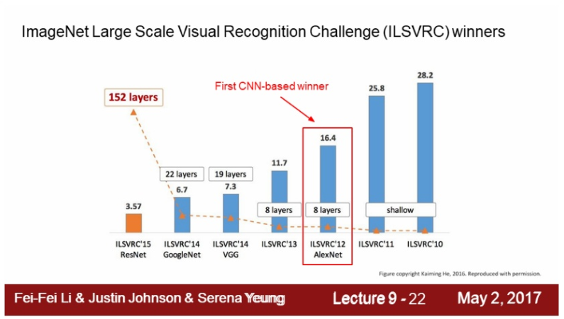

# Abstract

- deep convolution neural network를 학습시켜 ILSVRC-2010에서 SOTA를 달성하였다.
- 제안하는 뉴럴넷은 convolution, max pooling, fully-connected layer로 구성되어 있으며 60 million 개의 파라미터와 650,00 개의 뉴런으로 구성되어 있다.
- f.c layer에서 오버피팅을 줄이기 위해 dropout을 적용하였다.
- ILSVRC-2012 competition에서도 2위와 큰 격차를 내며 SOTA를 달성하였다.

# 1. Introduction

- 현재 object recognition에서 머신러닝 기법을 사용하는 것은 거의 essential한 방법이 되고 있다.
- 지금까지는 small dataset으로 학습하여 성능을 내는 것이 크게 어렵진 않았다. 그러나 realistic setting에서 문제를 푸는 것은 더 어렵기 때문에 이러한 object들을 잘 인식하기 위해선 larger training set이 필요하다.
- ImageNet과 같이 large dataset을 사용해도 물체를 정확히 분류하는 문제는 쉽지 않다. 따라서 가지고 있지 않은 데이터에 대한 보상차원으로 모델이 많은 prior knowledge을 가지고 있어야 한다.
- standard feedforward neural networks에 비해 CNN은 connection 수가 더 적고 학습도 쉽다. 그렇지만 대용량의 high-resolution 이미지를 학습하는 것은 expensive하다.
- 그러나 현재 GPU 장비의 성장과 highly-optimized 된 2D Convlution을 통해 CNN을 잘 학습시킬 수 있다.
- 본 논문의 주요 contribution은 다음과 같다.
    - 현존하는 가장 큰 CNN을 학습시켜 ILSVRC-2010, 2012에서 SOTA를 달성했다.
    - 제안하는 네트워크는 new, unusual feature를 많이 가지고 있기 때문에 성능을 개선시킬 수 있으며 학습 시간 또한 줄일 수 있다.
    - 제안하는 네트워크의 size로 인해 오버피팅 문제가 발생할 수 있지만 오버피팅 문제를 방지할 수 있는 기법을 적용하였다.
    - 5개의 convolution layer와 3개의 fully-connected layer를 사용하였다. 또한 어떤 convolution layer의 파라미터 개수가 모델 전체의 파라미터 개수 중 1% 이하의 비중만 차지할만큼 적은 수의 파라미터만 있을 때 해당 레이어를 없애버렸을 때 오히려 성능이 더 악화되었다는 것을 발견하였다. ⇒ 앞단의 convolution layer는 상대적으로 적은 수의 파라미터만 존재하는데 이러한 레이어들의 파라미터 개수가 적다고 쓸모 없는 게 아님. 그만큼 앞단에서 low-level feature를 잘 추출하는 것이 중요함

# 2. Dataset

- 이미지넷 데이터셋은 15 million 개 이상의 라벨링된 high-resolution 이미지로 대략 22,00개의 카테고리가 존재한다. ILSVRC challenge는 ImageNet dataset의 subset으로 약 1,000개 카테고리가 존재하며 각 카테고리당 대략 1,000개의 이미지가 있다.
    - training images: 1.2 million
    - validation images: 50,000
    - testing images: 150,000
- ILSVRC-2010은 test set label이 있는 유일한 버전이기 때문에 해당 데이터셋으로 대부분의 실험을 진행함
- 이미지넷에선 2개의 error rate를 통해 성능을 측정함
    - Top-1 error: 모델이 가장 높게 예측한 값이 정답인가?
    - Top-5 error: 모델이 예측한 상위 5개 레이블 중에서 정답이 있는가?
- 이미지넷은 image resolution이 서로 다르기 때문에 constant input dimension을 위해 256x256으로 다운샘플링함
- 이미지의 각 픽셀에서 평균값을 빼는 전처리 과정만 사용하였다.

# 3. The Architecture

- 네트워크 아키텍처는 아래 그림 2와 같다.
- 학습가능한 레이어는 총 8개의 레이어로 구성되어 있다. conv layer 5개, f.c layer 3개

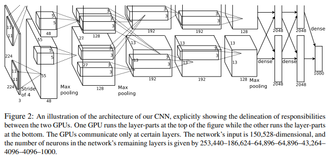

### 3.1 ReLU Nonlinearity

- 이 당시에는 activation function으로 tanh를 많이 사용함. 그러나 tanh는 학습속도가 느리다는 단점이 있기 때문에 AlexNet에선 ReLU를 activation function으로 사용하였다.
- ReLU, tanh

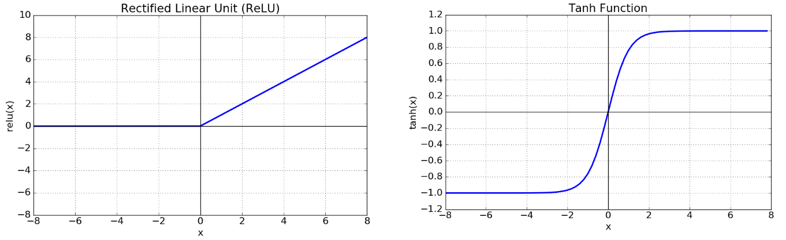

- CIFAR-10 dataset으로 training error rate이 25% 도달하는 지점을 비교했을 때 ReLU가 더 빠르다는 것을 보여줌

    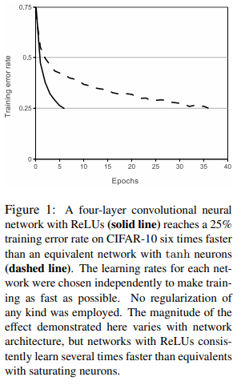

### 3.2 Training on Multiple GPUs

- 당시 사용했던 GPU는 GTX 580으로 메모리가 3GB밖에 되지 않는다. 따라서 하나의 GPU로 네트워크를 학습시키기 어렵기 때문에 2개의 GPU를 병렬적으로 사용한다.
- layer 2에서 layer 3으로 갈 때는 두개의 GPU 모두 모든 kernel map을 입력 받음. 그 이후에는 다시 병렬적으로 수행
- 이러한 구조가 cross-validation에서 문제가 될 수 있지만 amount of computation 측면에서 더 효율적임

### 3.3 Local Response Normalization

- ReLU를 사용하면 input normalization이 굳이 필요 없지만 Local Response Normalization을 통해 generalization을 높일 수 있다.

    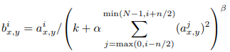

- ReLU는 output값이 항상 0 이상인 값이 나온다. Conv, Pooling에서 어떤 특정 값이 주변 값보다 클 때, 주변 픽셀에 영향을 미치게 된다. tanh보다 ReLU는 이러한 영향이 더 커진다. 이러한 부분을 방지하기 위해 인접한 채널에서 같은 위치에 있는 픽셀 n개를 통해 정규화 하는 것을 LRN이라 한다.
- 현재는 BN이나 다른 Normalization기법으로 인해 거의 사용 안함
    - a: activity of a neuron
    - b: normalized activity
    - i: i번째 kernel
    - (x, y): position
    - n: adjacent kernel maps at the same spatial position
    - N: total number of kernels in the layer
    - k=2, n=5, alpha=1e-4, beta=0.75: hyper-parameters

### 3.4 Overlapping Pooling

- 커널의 크기 z x z라 하고 stride를 s라 할 때  s = z인 경우 우리가 아는 일반적인 non-overlapping pooling이 된다. s < z인 경우 overlapping pooling이 되며 overlapping pooling을 사용했을 때 성능이 좀 더 개선되었다.

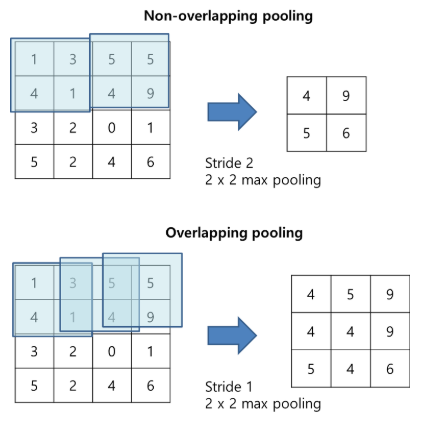

### 3.5 Overall Architecture

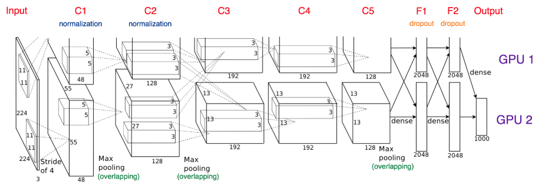

# 4. Reducing Overfitting

### 4.1 Data Augmentation

- horizontal reflection
    - 256x256이미지로부터 224x224 이미지 패치를 랜덤하게 cropping하고 이를 학습에 사용
    - 테스트 시, 4개의 각 corner와 1개의 center에서 5개의 224 x 224 패치를 뽑아내고 이를 다시 horizontal reflection하여 총 10개의 패치를 만든다.
    - 모델이 10개의 패치에 대해 prediction한 값을 평균내어 최종 prediction 값으로 사용함

    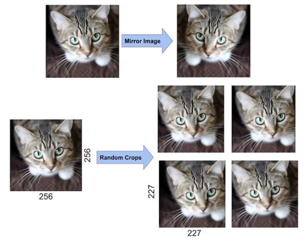

- PCA color augmentation
    - 각 이미지의 RGB pixel 값에 대해 PCA를 수행하여 평균 = 0, 표준편차 = 0.1 크기를 갖는 랜덤변수 곱한 후 원래의 pixel 값에 더해줌
    - 주성분 분석, PCA(Principal Component Analysis)란  분포된 데이터들의 주성분을 찾아주는 방법. 아래와 같은 2차원 좌표평면에 n개의 점 데이터가 타원형으로 분포되어 있을 때 이 데이터들의 분포 특성을 2개의 벡터로 가장 잘 설명하는 것을 의미한다. 즉 e1, e2 두개의 벡터로 데이터 분포를 설명하는 것으로 e1의 방향과 크기, e2의 방향과 크기를 알면 이 데이터 분포가 어떤 형태인지 파악할 수 있다. 여기서 주성분 벡터는 서로 수직이다.

        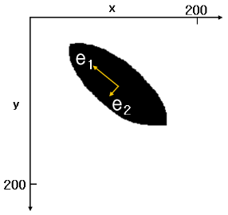

    - 주성분 분석은 데이터 하나 하나에 대해 분석하는 것이 아니라 하나의 분포에 대해 주성분을 분석하는 것이다. 3차원 데이터에 대해선 3개의 벡터가 나온다.
    - PCA를 이미지에 적용했을 때, 이미지는 224x224차원의 벡터로 볼 수 있으므로 224x224 차원에서 n개의 점들을 통해 PCA를 수행하면 224x224개의 벡터를 얻을 수 있다.

    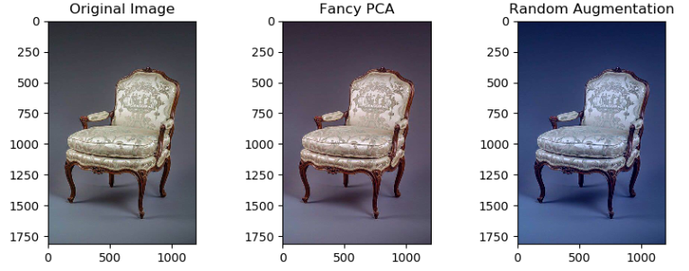

### 4.2 Dropout

- dropout probability 0.5 사용
- 특정 뉴런이 다른 뉴런에 의존하지 않기 때문에 뉴런의 co-adaption을 줄일 수 있음

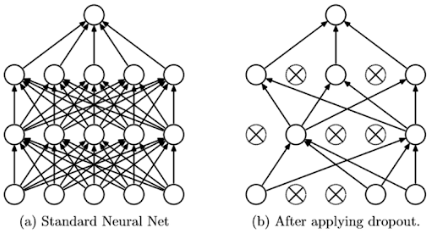

# 5. Details of learning

- SGD, batch size 128
- weight decay를 통해 모델의 training error를 줄임
- validation error가 개선되지 않을 때 learning rate을 1/10로 줄임
- GTX 580 3GB GPU 2개로 training set 전체를 90 epochs 돌렸으며 대략 5~6일 정도 걸림

# Results

- ILSVRC-2010 test set 결과, top-1, top-5 error에서 SOTA 달성

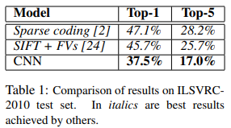

- ILSVRC-2012 validation, test 결과

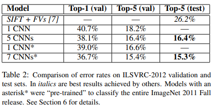

- ILSVRC-2012 dataset의 경우 test set label을 모르기 때문에 모든 모델에서 결과를 제시하진 못 함.
- 제안하는 CNN은 Top-5(val)에서 18.2%를 기록함
- 그 외에 5, 7 CNN은 모델 여러 개를 사용하고 이 prediction 값의 평균낸 것
- asterisk 달려있는 건 2011 dataset으로 사전학습한 뒤에 fine-tuning

### 6.1 Qualitative Evaluations(정성적 평가)

- AlexNet은 GPU 2개를 병렬적으로 놓고 트레이닝함, 각 GPU line에서 학습된 커널을 시각화해보니 서로 다른 특성을 학습한 결과를 보임
- 컬러정보와 무관한 edge를 검출하는 경우 / 이미지의 color pattern을 뽑아내는 경우

    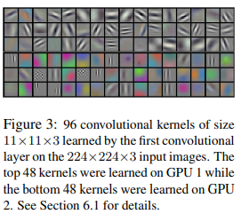

- Figure 4의 Left, 대체적으로 top-5 prediction에서 정답 class가 포함되어있음
- 또한 top-prediction의 label들 역시 정답 class와 비슷한 클래스로 예측함
- object가 이미지 중앙에 없는 경우도 잘 예측함
- Figure 4의 right, 첫번째 column은 test image, 나머지 6개 column은 해당 test image와 가장 유사한 training 이미지를 뽑은 것
    - test, train 두 이미지의 feature activation vector(4096차원)를 추출한 뒤 Euclidean Distance가 작은 것을 선택. (4096차원의 vector끼리 L2 distance를 일일이 계산하는 건 너무 비효율적이기 때문에 실제로는 binary code로 압축해서 수행함)
    - 실제 이미지의 픽셀 level에선 test 이미지와 선택된 train 이미지의 L2 Distance는 작지 않다. 예를 들면, 코끼리, 강아지 사진을 보면 같은 object일지라도 pose의 형태가 다양하기 때문이다. 그럼에도 불구하고 같은 class의 이미지를 잘 뽑아내는 것을 보면 visual knowledge가 잘 학습된 것을 의미함

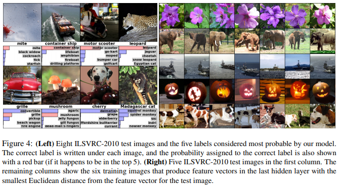

# 7. Discussion

- 제안하는 Large Deep CNN이 순수한 supervised learning으로 SOTA 성능을 달성함
- 실험의 간결화를 위해 unsupervised, pre-training 기법을 사용하지 않았으며 제안하는 네트워크에 이러한 기법을 적용했을 때 성능이 더 개선될 것으로 기대함

# References

[https://bskyvision.com/421](https://bskyvision.com/421)

[https://medium.com/@pechyonkin/key-deep-learning-architectures-alexnet-30bf607595f1](https://medium.com/@pechyonkin/key-deep-learning-architectures-alexnet-30bf607595f1)

[https://pixelatedbrian.github.io/2018-04-29-fancy_pca/](https://pixelatedbrian.github.io/2018-04-29-fancy_pca/)

[https://darkpgmr.tistory.com/110](https://darkpgmr.tistory.com/110)

[https://m.blog.naver.com/PostView.nhn?blogId=laonple&logNo=220818841217&proxyReferer=https%3A%2F%2Fwww.google.com%2F](https://m.blog.naver.com/PostView.nhn?blogId=laonple&logNo=220818841217&proxyReferer=https%3A%2F%2Fwww.google.com%2F)

[https://reniew.github.io/12/](https://reniew.github.io/12/)
