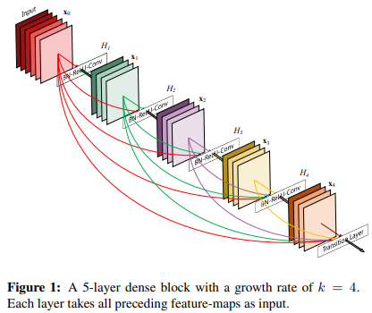
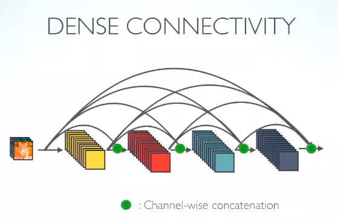
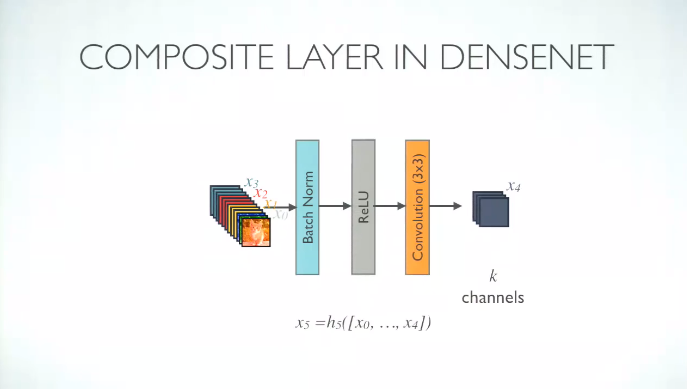
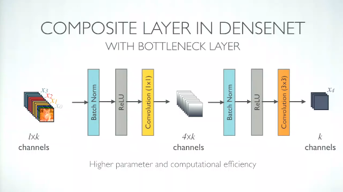
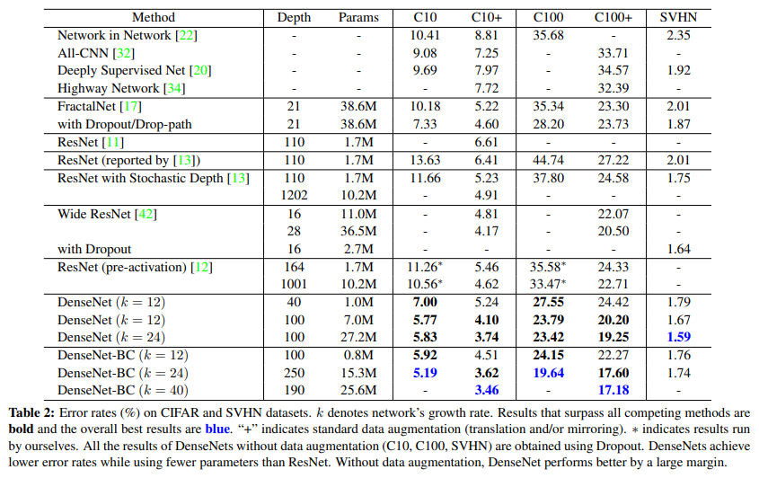
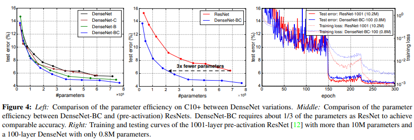
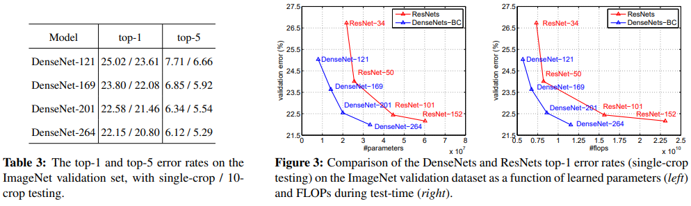
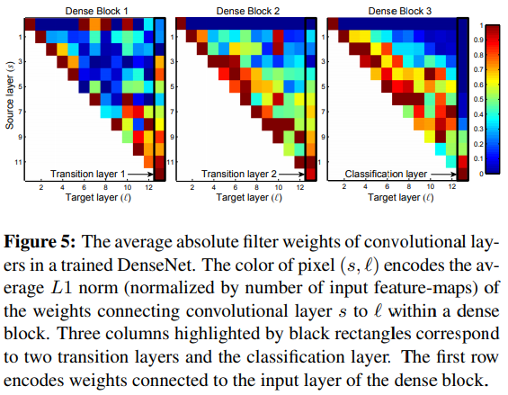

# Densely Connected Convolutional Networks

# Abstract

- feed forward 방식으로 레이어를 연결한 DenseNet이라는 새로운 아키텍처를 제안한다.
- 이전 레이어의 모든 feature map이 다음 레이어로 입력된다.
- DenseNet은 gradient vanishing, strengthen feature propagation, encourage feature reuse, reduce the number of parameters 측면에서 큰 장점을 갖는다.
- DenseNet은 less computation으로 STOA를 달성함

# Introduction

- CNN이 깊어지면서 feature information, gradient가 많은 레이어를 지나가면서 vanish되는 문제가 발생함
- 이러한 문제를 해결하기 위해 ResNet, Highway Networks, FractalNet 등등.. 많은 네트웍들이 제안되었지만 이러한 approach들이 가지고 있는 한 가지 특징은 early layer에서 later layer로 가는 short path를 사용했다는 점
- 그러나 본 논문에서는 기존의 short path pattern을 distill하고 네트워크의 레이어 사이에서 information flow가 원활히 이루어지도록 각 레이어를 모두 연결한 connectivity pattern을 사용함
- 각 레이어는 이전의 모든 레이어에서 나온 feature map을 입력으로 받으며, 자신의 output feature map을 이후에 있는 모든 레이어에 전달하는 구조

    

- ResNet에선 feature map끼리 summation했지만 DenseNet에선 feature concat
- L번째 레이어는 이전 레이어에서 온 L개의 input을 입력으로 받게 되고 자신의 feature map을 자기 뒤에 있는 L-l개의 레이어에 전달해줌. 따라서 네트워크에 총 L개의 레이어가 존재할 때 L(L+1)/2개의 connection이 존재하게 됨
- 이러한 dense connectivity pattern은 traditional CNN보다 파라미터 수가 적으며 중복된 feature map을 재학습할 필요가 없어진다.
- 또한 DenseNet의 구조는 information flow를 개선하여 네트워크에서 gradient가 사라지는 문제를 방지하여 학습이 쉬워진다.

# Related Work

- Highway Network는 bypassing path를 통해 100개 이상의 레이어를 사용하는 deep model에서도 학습이 효과적으로 이루어지게 함
- 다양한 task에서 뛰어난 성능을 보여준 ResNet에서 레이어를 1202개까지 늘렸을 때 오히려 성능이 떨어졌음. stochastic depth에서는 ResNet-1202를 학습하면서 랜덤하게 특정 레이어를 dropping시켜 성공적으로 학습하였음. 이 결과로 1202개 레이어에서 모든 레이어가 반드시 필요한 것이 아니며  이렇게 많은 레이어를 사용하는 것은 redundancy가 커지게 되는 문제가 있다는 것을 말해줌
- 다양한 approach들이 있지만, DenseNet은 레이어를 deep하게 쌓거나 wide한 아키텍처로 인해 representational power가 떨어지는 것이 아닌 네트워크 내에서 feature reuse를 통해 condensed된  모델을 만들어 파라미터 수를 줄이고 쉽게 학습할 수 있는 방향을 선택함
- 다른 레이어들에서 학습된 feature map을 서로 concat하는 것은 variation을 증가시킴.
- Inception에서도 다른 레이어서 나온 feature를 연결하는 구조를 취하는데, DenseNet이 훨씬 심플하며 효율적인 구조임

# DenseNets

### Dense Connectivity

- Denotement
    - x_{0} = single image
    - non-linear transormation(BN, ReLU, Pooling, Conv 등..)

        $$non-linear\ transformation = H_{l}(\cdot) \\output\ of \ l^{th} \ layer = x_{l}$$

- ResNet은 skip connection에서 온 feature와 non-linear transformation feature끼리 summation하지만 이러한 방식은 네트워크에서 information flow가 지연될 수 있음
- 레이어 간의 information flow를 improve하기 위해 resnet과 다른 dense connectivity를 제안함

$$x_l = H_l([x_0, \ x_1,..., \ x_{l-1}])$$

- x0, x1, ...xl-1은 0번째 레이어부터 l-1번째 레이어의 feature map을 모두 concat한 feature map. 이러한 dense connectivity 구조를 취하기 때문에 제안하는 네트워크 아키텍처의 이름을 DenseNet이라 부름

### Composite function

- composite function H_l을 BN, ReLU, 3x3 conv 순서대로 사용
     

### Pooling layers

- concatenation operation은 feature map의 width, height dimension이 일치해야 함
- DenseNet의 dense connectivity는 dense block내에서 이루어지며 spatial size를 down-sampling하기 위해 dense block 사이에 transition layer를 추가함
- transition layer는 BN, 1x1 conv, 2x2 avg pooling

### Growth rate

- input layer의 feature map을 제외하고 convolution layer에서 만들어지는 feature map의 채널 수를 조절하기 위한 하이퍼파라미터 growth rate
- 각 레이어에서 k개의 feature map을 만들어내도록 함. 모든 conv layer에서 사용되는 필터의 개수를 k개로 고정시킴. DenseNet에선 이전 레이어의 모든 feature map을 concat하기 때문에 뒤로 갈수록 feature map의 채널 수가 많아짐.

### Bottleneck layers

- 각 레이어에서 채널 수가 k개인 output feature map을 만들어냄. k가 작은 값이더라도 레이어가 쌓일 수록 채널 수가 굉장히 많아지기 때문에 채널 수를 조절하기 위한 bottleneck layer를 사용.

    

- 1x1 conv에서 채널 수가 growth rate*4인 feature map을 만들고 3x3 conv에서는 growth rate만큼 채널 수를 가지는 feature를 뽑음

    

- bottleneck layer에서 BN-ReLU-Conv(1x1)-BN-ReLU-Conv(3x3)를 사용하는 버전을 DenseNet-B라고 부름. DenseNet-B(Bottleneck)

### Compression

- model의 compactness를 improve하기 위해 transition layer에서 feature map size를 조절함.
- dens block에서 m개의 feature map이 나왔다면 transition layer에선 θm개의 output feature map을 generate함
- θ값은 0 < θ ≤ 이며, θ=1인 경우 feature map의 채널 수는 바뀌지 않음
- θ < 1인 버전을 DenseNet-C(Compression)라고 하며, 실험에선 θ=0.5로 설정함
- DenseNet-B와 DenseNet-C를 합친 버전을 DenseNet-BC라 부름

### Implementation Details

- 이미지넷을 제외한 모든 데이터셋에서는 dense block이 3개인 DenseNet을 사용하였으며 모든 dense block 안에서 반복되는 레이어 수는 같음
- first dense block으로 들어가기 전에 input image는 3x3 convolution layer를 한번 거침
- 마지막 dense block하고 나서 global average pooling 및 softmax classifier로 연결
- 실험에 사용하는 DenseNet-BC는 4개의 Dense Blcok으로 구성, {L = 100,  k = 12}, {L = 250, k = 24}, {L = 190, k = 40}

# Experiments

### Classification Result on CIFAR and SVHN

- DenseNet-BC (L=190, k=40) 모델이 CIFAR-10, CIFAR100 datasest에서 SOTA를 달성함
- SVHN dataset에서도 ResNet 보다 더 좋은 성능을 보여줌
- SVHN dataset에서 Depth가 250인 모델이 100인 모델보다 성능이 떨어지는 결과를 보임. 이는 SVHN classification이 상대적으로 easy한 task이기 때문에 deep model이 training set에 오버피팅 된 것으로 보임
- bottleneck layer와 compression을 사용하지 않은 일반 DenseNet에서 depth와 k가 커질수록 성능이 개선되는 결과를 보임. 이는 DenseNet 구조가 bigger and deeper model에서 증가된 representational power를 잘 utilize할 수 있기 때문
- 파라미터 수를 비교했을 때 ResNet이나 FractalNet보다 더 적은 파라미터로 높은 성능을 달성함. 이는 파라미터 측면에서도 DenseNet이 효율적이고 특히 DenseNet-BC를 사용하면 파라미터를 더욱 효율적으로 줄일 수 있음

- 아래 Fig 4, right C10+ dataset에 대한 training, test loss

    

- Middle) 같은 수준의 accuracy를 달성한 지점에서 DenseNet은 ResNet보다 1/3가량 더 적은 파라미터만 사용했음에도 불구하고 같은 성능을 냄
- DenseNet-BC (L=100, k=12)는 1001개의 레이어를 사용한 ResNet-1001보다 90%적은 파라미터만 사용하였음에도 불구하고 비슷한 test error 결과를 보임
- DenseNet의 효율적인 파라미터 사용이 오버피팅되는 문제를 방지해주는 효과가 있음

- ImageNet Classification에서 DenseNet의 depth와 growth rate을 바꿔가며  ResNet과 비교

    

- 공정한 비교를 위해 데이터 pre-processing, optimization setting 등을 똑같이 세팅하여 실험
- ResNet과 비슷한 성능을 내는 수준에서 비교했을 때, 파라미터나 연산량이 훨씬 효율적임

# Discussion

### Implicit Deep Supervision.

- DenseNet이 잘 되는 이유는 각 레이어들이 shorter connection으로 loss function으로부터 additional supervision을 갖기 때문
- 다시 말해, DenseNet은 "deep supervision"과 같은 역할을 수행할 수 있음.
    - deep supervision이란 Deep 뉴럴넷에서 classifier를 여러 개 두어 성능을 올리는 것 정도로 해석함
- Deeply-supervised nets(DSN)에서 모든 히든 레이어에 classifier를 추가하여 intermediate layer들이 discriminative feature를 더욱 잘 학습하게 만들기 때문
- DenseNet은 classifier가 transition layer를 통해 모든 레이어에 supervision을 전달해주기 때문에 deep supervision과 비슷한 역할을 하며 singe classifier만 사용하기 less complicate하다.

### Stochastic vs. deterministic connection.

- stochastic depth regularization이란 네트워크에서 레이어를 일정하게 drop하는 기법으로 dropout과 비슷하게 일정 확률로 특정 레이어를 drop시켜 주위에 있는 다른 레이어와 연결되게 만드는 것
- 이러한 connectivity pattern이 DenseNet과 비슷한 면이 있음. 궁극적으론 차이가 있지만 랜덤하게 끊어진 레이어가 다른 레이어들에 연결되는 패턴이 DenseNet의 dense connectivity 패턴과 비슷하기 때문

### Feature Reuse.

- Target layer(l), Source layer(s)가 있을 때, (ℓ, s)는 레이어 l이 이전 레이어 s에서 나온 정보를 얼마나 많이 사용하는지 나타냄
- 예를 들어, (12, 1), (12, 2), (12, 3)처럼 target layer와 source layer의 거리가 먼 경우 상대적으로 값이 작지만 (12, 9), (12, 10), (12, 11)은 값이 큼
- The color of pixel encodes the average L1 norm of the weights connecting convolutional layer s to  ℓ

    

- early layer에서 추출된 feature가 deep layer에 잘 전달됨
- transition layer도 이전 dense block에서 추출된 feature를 잘 살려서 다음 레이어에 전달하는 것으로 보아 information flow가 원활히 이루어짐
- Dense Block 2, 3에서 첫번째 레이어들은 transition layer output에 영향을 미치는 정도가 낮아 transition layer는 redundant feature를 다루게 되는 경향이 있다.
- Classification layer는 전반적으로 entire dense block의 feature를 사용하지만 classification layer와 인접한 레이어의 weight가 밝은 것으로 보아 classifier는 high-level feature에 더 집중하는 경향이 있음

# Conclusion

- Dense connectivity 구조를 적용한 DenseNet이라는 새로운 CNN아키텍처를 제안함
- DenseNet의 레이어가 수백개가 되더라도 학습에 문제가 없었고 DenseNet의 파라미터가 증가할수록 overfitting이나 degradation 문제없이 accuracy가 증가함
- fewer parameters and less computation으로 SOTA를 달성함
- 제안하는 simple connectivity rule로 DenseNet은 identity mapping, deep supervision, diversified depth등 여러 특성을 integrate함.
- 이를 통해 네트워크 전체에서 feature reuse를 할 수 있고 성능을 높일 수 있음

# References

[https://www.youtube.com/watch?v=-W6y8xnd--U](https://www.youtube.com/watch?v=-W6y8xnd--U)
