# EfficientNet: Rethinking Model Scaling for Convolutional Neural Networks

# Abstract

- CNN에서 depth, width, resolution를 조절하여 모델을 scaling하고 better performance를 낼 수 있는 방법을 연구
- depth, width, resolution 3가지 요소를 scaling하는 새로운 scaling method를 제안
- 제안하는 방법을 사용하여 이전 CNN보다 정확도도 높고 효율성도 높은 EfficientNet이라는 새로운 아키텍처를 제안함
- 실제 inference에서 8.4x smaller, 6.1x faster 하면서도 ImageNet dataset에서 SOTA를 달성

    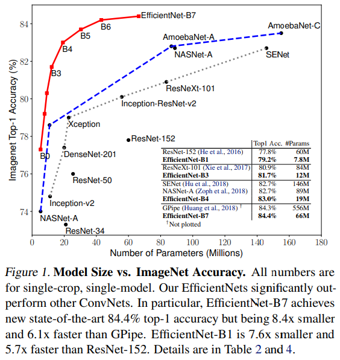

# Introduction

- 기존 연구에선 CNN의 depth, width, input-resolution 같은 요소를  scaling하여 성능을 올리고자 하는 시도가 많이 있었음. 그러나 이러한 방법들은 depth, width, input resolution의 3가지 요소를 동시에 고려한 것이 아님.
- 1가지 요소만 조절하는 것보다 2~3가지 요소를 같이 조절하는 것이 더 좋겠지만 optimal model을 찾는 것이 쉽지 않음
- 따라서 본 논문에서는 width/depth/resolution 3가지 요소를 조절하여 accuracy와 efficiency 두마리 토끼를 잡을 수 있는 방법을 연구함.

    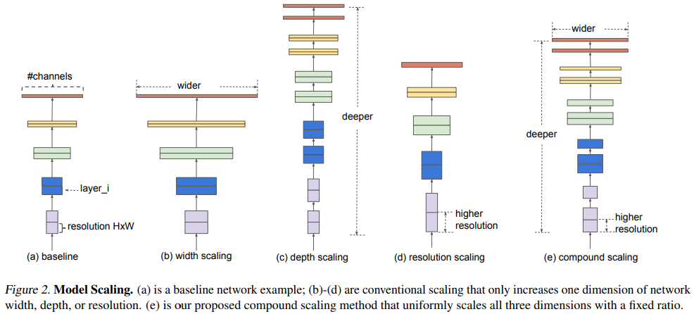

- width/depth/resolution 3가지 요소를 랜덤하게 찾는 것이 아니라 fixed scaling coefficient를 사용하여 uniformly 하게 scaling하는 compound scaling method를 제안함
- 만약 input image size가 커지면 receptive field를 늘리기 위해 더 많은 레이어를 사용해야하고 더 많은 pattern을 뽑아내기 위해 채널 수도 늘려야 한다. 따라서 어느 한가지 요소만 scaling 하는 게 아니라 compound scaling method가 필요함

# Compound Model Scaling

### Problem Formulation

- Convolution layer = F, input tensor = X, output tensor = Y로 정의했을 때 ConvNet N은 F를 반복하여 만든 모델로 정의할 수 있다.

    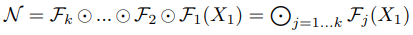

- 대부분의 ConvNet에서는 convolution layer를 반복하여 하나의 Stage 혹은 Block을 만들고 이러한 stage나 block을 여러번 반복하는 구조로 네트워크를 만든다. 따라서  ConvNet을 아래와 같이 정의할 수 있다. (stage i에서 레이어 F를 L번 반복)

    

- 일반적인 ConvNet은 best layer architecture F를 찾는 것이 목표였지만, model scaling은 사전에 F를 정의해놓고 네트워크의 length(L =layer 수), width(C = Channel 수), resolution(H, W = height, width)를 늘려가며 최적의 구조를 찾는다.
- F를 fix 해놔서 model scaling 문제가 좀 더 간결해질 수 있지만 여전히 L, C, H, W의 design space가 너무 크기 때문에 design space를 줄이기 위해 모든 레이어가 constant ratio에 따라 uniformly하게 스케일링되도록 제한하였다. 따라서 논문의 target은 주어진 resource constraint에서 모델의 accuracy를 최대화하는 optimization problem으로 정의할 수 있다.

    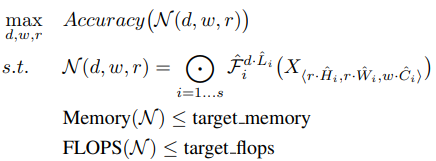

- 여기서 d, w, r은 네트워크의 depth, width, resolution이다.
- 아래의 요소는 사전에 정의된 Table 1의 baseline network를 사용한다.

$$\hat{F_i}, \ \hat{L_i}, \ \hat{H_i}, \ \hat{W_i}, \ \hat{C_i} $$

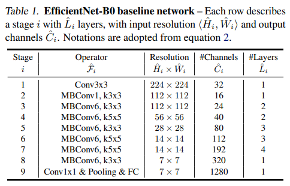

### Scaling Dimensions

- Scaling single dimension

    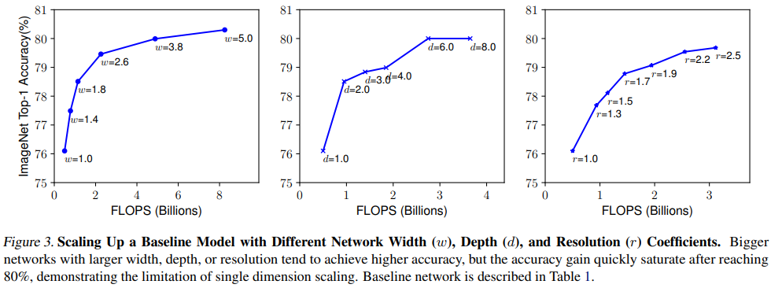

- Depth만 늘렸을 때
    - 네트워크의 depth를 늘리는 것은 richer and more complex feature를 capture하여 성능을 높이는 방법이지만 vanishing gradient 같은 문제로 인해 학습이 어려움
    - 네트워크의 depth를 계속 늘렸을 때 accuracy가 saturate 되는 현상이 나타남. depth를 늘린다고 반드시 성능이 올라가는 것이 아님

- Width만 늘렸을 때
    - width를 scaling하는 것은 일반적으로 small size model에서 많이 쓰는 방법
    - wider network가 more fine-grained feature를 잘 capture할 수 있고 학습도 쉽지만 extremely wide but shallow network는 high level feature를 잘 capture하지 못 하며  네트워크의 width가 더욱 wider할수록 accuracy가 빠르게 saturate 되는 현상이 나타남

- Resolution만 늘렸을 때
    - input image resolution이 커지면 CNN은 fine-grained pattern을 더 잘 capture할 수 있기 때문에 accuracy가 높아짐. 최근에 SOTA를 찍었던 GPipe는 480x480 resolution을 사용하였고, 600x600 같이 high resolution을 사용하는 모델도 있음
    - higher resolution일수록 accuracy가 높아지는 결과를 보여주지만 very high resolution의 경우 accuracy가 올라가는 정도가 줄어듦. (r=1.0은 224x224, r=2.5는 560x560)

- Observation 1 - single dimension만 scaling해도 성능이 올라감, 그러나 bigger model은 개선되는 정도가 작음

### Compound Scaling

- depth, resolution을 아래 4가지 케이스로 고정시켜놓고 width scaling

    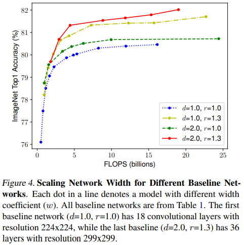

- d, r을 1로 두고 width만 scaling하면 accuracy가 빠르게 saturation됨
- deeper & higher resolution에서 width를 scaling했을 때 accuracy 성능이 가장 좋았음.
- Observation 2 - better accuracy & efficiency를 위해선 네트워크의 모든 dimension(depth, width, resolution)을 balance하게 scaling하는 것이 필요하다.
 
 
 
 
- 이전에 네트워크의 depth, width를 arbitrarily하게 scaling하는 연구가 있었지만 노가다로 찾는 건 너무 cost가 크다. 따라서 본 논문에서는 새로운 compound scaling method를 제안한다.
- 제안하는 방법은 사용자가 compound coefficient 𝝓를 가용할 수 있는 resource 내에서 control하는 것이다.
- grid search로 찾은 depth, width, resolution을 α, β, γ라 했을 때 (α · β^2· γ^2) 값이 2가 되도록 scaling한다.

    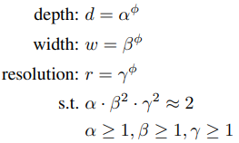

- β와 γ에만 제곱을 취하는 이유는 depth를 n배 늘렸을 때 FLOPs는 n배 증가하지만 width와 resolution은 n^2배 증가하기 때문이다.
- 예를 들어, input tensor size가 100x100x32이고 3x3 Conv, 32를 한다고 해보자.
- normal convolution operation에서 computational cost는 100x100x32x3x3x32가 된다.
- 여기서 depth를 2배 늘리면 해당 연산을 한 번 더 하는 것이기 때문에 FLOPs가 2배가 된다.
- 만약 width를 2배 늘린다고 하면 input tensor size가 100x100x64, 3x3 Conv 64를 연산하는 것과 같으므로 이 때의 연산량은 100x100x64x3x3x64가 되어 width를 2배 늘리는 경우 FLOPS는 4배 증가한다.
- 마찬가지로 input resolution(width, height)를 2배 늘리면 200x200x32, 3x3 Conv 32가 되고 여기서 연산량은 200x200x32x3x3x32가 되어 FLOPS는 4배 증가한다.
- 또한 (α · β^2· γ^2) 값이 2가 되도록 하는 것은 𝝓값에 따라 전체 FLOPS가 2의 거듭제곱꼴로 증가하도록 한 것.

# EfficientNet Architecture

- model scaling에서 baseline network의 layer operation인 F는 scaling하지 않으므로 적절한 baseline network를 사용하는 것 또한 매우 중요하다. 여기서는 MnasNet을 사용한다. MnasNet은 Accuracy와 FLOPs 2가지 요소를 고려하여 optimization한 모델이기 때문 (MnasNet 저자가 Efficient 논문 저자임)
- MnasNet에서 사용했던 search space와 동일한 search space를 사용하며 아래 식을 optimization goal로 정의한다.

$$ACC(m)\times [FLOPS(m)/T]^w$$

- 여기서 ACC(m), FLOPS(m)은 모델 m의 accuracy, FLOPS를 의미한다.
- T는 target FLOPS이며 w는 -0.07로 w가 accuracy와 FLOPS 사이의 trade-off를 control하는 하이퍼파라미터
- 특정한 hardware device를 두고 inference를 비교하는 것이 아니기 때문에 기존의 MnasNet과는 달리 latency는 고려하지 않았다.
- 이렇게 찾은 baseline model을 EfficientNet-B0라 한다.

    

- EfficientNet-B0에서 핵심이 되는 main block은 mobile inverted bottleneck인 MBConv block이며 여기에 squeeze-excitation block을 추가하였다.
 
 
 
 
- baseline EfficientNet-B0를 사용하여 compound scaling method를 아래 2단계로 수행한다.
- STEP 1: 처음에는 𝝓를 1로 고정시켜놓고 사용할 수 있는 resource가 2배 정도 있다고 가정하여 α, β, γ값을 small grid search를 이용하여 찾는다. EfficientNet-B0에서 찾은 best α, β, γ 값은 α = 1.2, β = 1.1, γ = 1.15이며,  (α · β^2· γ^2) 값은 약 1.92로 constraint인 2를 넘지 않는다.
- STEP 2: 위에서 찾은 값으로 α, β, γ를 고정해놓고 𝝓 값을 다르게 하여 EfficientNet-B1 부터 B7까지 찾음

    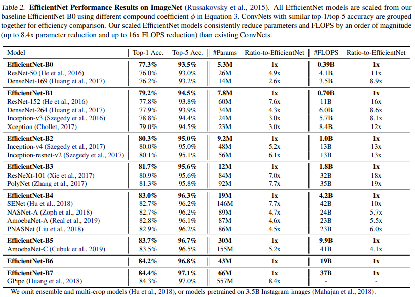

# Experiments

- ImageNet - MobileNet과 ResNet에 scaling method를 적용

    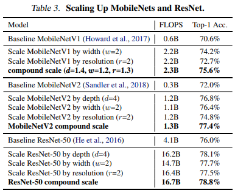

- single dimension scaling method보다 compound scaling method 했을 때 성능 개선이 더 잘됨
- 본 논문에서 제안하는 compound scaling method가 기존 CNN 모델에서도 잘 작동하며 효과적임을 증명함
 
 
 
 
- 실제 inference 속도가 얼마나 개선 되었는지 비교

    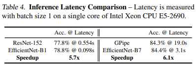
 
 
 
 
- Transfer Learning 했을 때 performance

    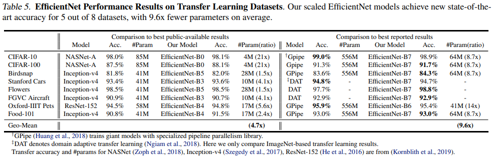

    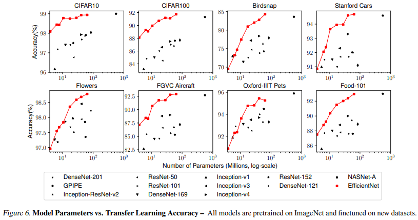

- 기존 모델들에 비해 EfficientNet이 평균적으로 4.7배 적은 파라미터 수를 가짐
- best reported result 비교에서, 총 8개의 dataset 중 5개 dataset에서 성능 향상이 있었으며 파라미터 수는 평균적으로 9.6배 더 적게 사용함
- parameter와 accuracy를 비교한 그래프에서, 일반적으로 EfficientNet의 성능이 일정하게 향상되는 결과를 보여주었으며 같은 파라미터 수에서 기존 모델과 비교했을 때 accuracy가 더 높음

# Discussion

- single dimension scaling보다 compound scaling method가 얼마나 효과적인지 비교(ImageNet)

    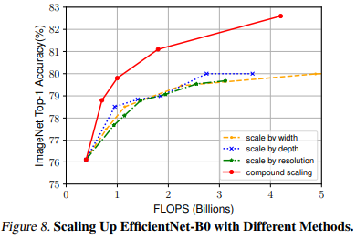

- compound scaling이 accuracy, FLOPS 두가지 측면에서 더 효과적임
- 따라서 제안하는 compound scaling이 single dimension scaling보다 더 좋다.
 
 
 
 
- Class Activation Map으로 시각화하여 해석

    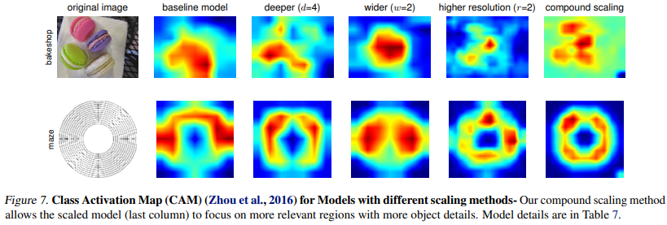

- compound scaling이 object와 관련된 relevant region에 더 집중하는 모습을 보임

# Conclusion

- 본 논문에서는 systematically하게 CNN의 depth, width, resolution을 scaling하는 방법을 제안함
- 제안하는 compound scaling은 매우 효과적이며, 기존 모델의 efficiency를 유지하면서 target resource 내에서 CNN을 쉽게 scaling할 수 있음
- 제안하는 방법은 mobile-size의 작은 Efficient model도 효과적으로 scaling 할 수 있으며 기존 모델과 비교했을 때 parameter, FLOPS를 줄이면서도 accuracy는 SOTA를 달성함. 또한 transfer learning에서도 잘 작동하는 결과를 보여줌

# References

[https://norman3.github.io/papers/docs/efficient_net](https://norman3.github.io/papers/docs/efficient_net)

[https://youtu.be/Vhz0quyvR7I](https://youtu.be/Vhz0quyvR7I)
