# Feature Pyramid Networks for Object Detection

# Abstract

- feature pyramid 방식은 서로 다른 multi-scale에서 object를 찾기 위한 방법이지만 추가적인 연산이 필요하다.
- 본 논문에선 deep CNN 구조에서 multi-scale pyramidal hierarchy를 적용한 feature pyramid network(FPN)를 제안한다.
- Faster R-CNN에 FPN을 적용했을 때 COCO detection에서 single model로 SOTA를 달성함.
- 제안하는 방법은 single GPU에서 6 FPS로 실행가능하며 multi-scale object detection에서 정확하고 실용적인 solution이라 할 수 있음

# Introduction

- **Featurized image pyramid**
    - Featurized image pyramid 방식은 image를 다양한 scale로 조절하여 multi-scale image들을 입력으로 하여 feature를 추출하는 방식이다. 따라서 scale이 작은 image는 상대적으로 작은 feature map이 만들어지고 scale이 큰 image는 상대적으로 큰 feature map이 만들어진다.
    - 이렇게 만들어진 서로 다른 feature map들을 이용하여 predict하게 됨. 요즘엔 잘 안쓰임

        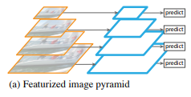
 
 
 

- **Single feature map**
    - CNN이 scale variance에 robust하기 때문에 single scale feature를 이용하는 Singe feature map방식이 있음.
    - robust하다는 장점이 있지만 multi-scale을 사용하지 않기 때문에 accurate result 측면에서 성능이 떨어짐

        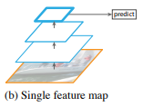
 
 
 
- **Pyramidal feature hierarchy**
    - CNN 레이어의 중간 중간 spatial resolution이 다른 feature를 가져와서 각 feature 마다 predict하는 pyramidal feature hierarchy 방식이 있음. (대표적인 예로 SSD)
    - 이 방식은 multi-scale을 사용하지만 앞쪽 레이어의 feature는 뒷쪽 레이어에서 feature보다 depth가 작기 때문에 feature map들 간의 semantic gap이 발생하게 됨.
    - SSD의 경우 low-level의 feature를 사용하지 않기 때문에 feature hierarchy 구조에서 high-resolution feature map을 사용하지 않음. 따라서 small object를 검출하는 성능이 떨어질 수 있음.

        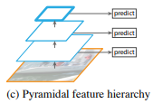
 
 
 
- **Feature Pyramid Network**
    - 이 논문의 goal은 CNN의 feature hierarchy 구조를 살리면서 feature pyramid가 모든 scale에서 strong semantic하게 만드는 것. 이를 위해 상대적으로 strong semantic한 정보를 담고 있는 low-resolution feature와 그렇지 않은 high-resolution feature를 top-down + lateral connection 방식으로 combine함
    - 따라서, single scale image로 모든 level에서 rich semantic한 feature pyramid를 만들 수 있게 된다.

        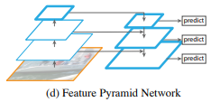
 
 
 
    - 기존에도 top-down + skip connection구조를 이용한 비슷한 아키텍처들이 있음. 기존 모델들은 하나의 high-level feature map을 만들어서 이 feature map을 prediction에 사용함.
    - 이와 반대로 FPN에서는 각 level에서 독립된 feature을 이용하여 prediction하며 이러한 구조는 모든 scale이 end-to-end로 학습됨

    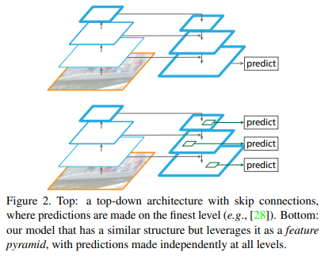

# Feature Pyramid Networks

- FPN은 single-scale image를 input으로 하여 multiple level에서 resizing된 feature map을 출력할 수 있는 아키텍처임. 또한 FPN의 process가 backbone network의 구조에 독립적이기 때문에 다양한 feature extraction network를 사용할 수 있다.
- 제안하는 pyramid 구조는 bottom-up, top-down pathway, lateral connection 등을 사용한다.

### Bottom-up pathway

- bottom-up pathway란 CNN에서 feed-forward 방식의 computation을 말함. CNN에서는 여러 레이어를 사용하여 feature map을 만들어내는데 feature pyramid구조에서 하나의 pyramid level은 CNN의 각 stage로 정의할 수 있음.
- 각 stage에서 last layer의 output feature map들을 reference set으로 만들고 reference set에 있는 feature map이용하여 pyramid 구조를 만듦. stage의 last layer를 사용하는 이유는 더 깊은 레이어일수록 the strongest feature이기 때문.
- 논문에선 ResNet을 Backbone으로 하며, pyramid를 만들기 위해 각 stage에서 last residual block의 output feature인 conv2, conv3, conv4, conv5를 사용함 {C_2, C_3, C_4, C_5}. conv1은 large memory footprint로 인해 제외함.

### Top-down pathway and lateral connections

- top-down pathway는 high level feature를 up-sampling을 통해 공간적으로 higher resolution feature를 만드는 과정이라 볼 수 있음. higher pyramid level에 있는 feature들은 semantically stronger feature.
- 즉, feed-forward에서 만들어진 high-level feature를 lateral connection을 통해 bottom-up pathway의 feature과 combine하여 feature를 enhance
- lateral connection은 bottom-up pathway와 top-down pathway의 두 feature를 merge하는 역할을 하며 이 때 두 feature는 서로 같은 size임
- low-level의 bottom-up feature map은 sub-sampling된 횟수가 상대적으로 적기 때문에 localization의 성능을 높일 수 있음
- 구체적인 merge 방식은 아래 그림 3과 같으며, add연산을 하기 위해 top-down pathway의 feature를 2배 up-sampling하며 bottom-up pathway feature는 channel dimension을 맞추기 위해 1x1 conv를 수행

    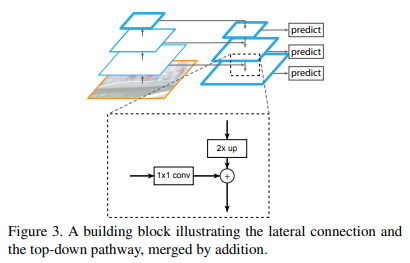
 
 
 
 
- 아래 그림이 설명을 매우 잘해놔서 이 그림만 봐도 될 정도.
- bottom-up에서 C2, C3, C4, C5를 feature를 만듦, C5는 다시 top-down에서 up-sampling하기 위한 feature로 사용됨.
- M5를 만들기 위해 C5에 1x1 conv
- M4를 만들기 위해 M5를 2배 up-sampling하고 C4에 1x1 conv하여 channel dimension 맞춘 뒤 element-wise add. M3, M2는 이 process 반복
- 이렇게 만들어진 M2, M3, M4, M5가 prediction에 바로 사용되는 게 아니라 3x3 conv를 한 뒤에 final feature map {P2, P3, P4, P5}을 만듦. 3x3 conv를 한번 더 하는 이유는 up-sampling으로 인한 aliasing 효과를 줄이기 위함. 또한, P2, P3, P4, P5는 classifier와 regressor를 공유하여 사용하기 때문에 3x3 conv에서 channel 수를 256으로 사용함.
- (그림에선 M5에 3x3 conv 적용 안 하는 것으로 나오는데 코드 찾아본 결과 M5에도 3x3 conv 수행함)

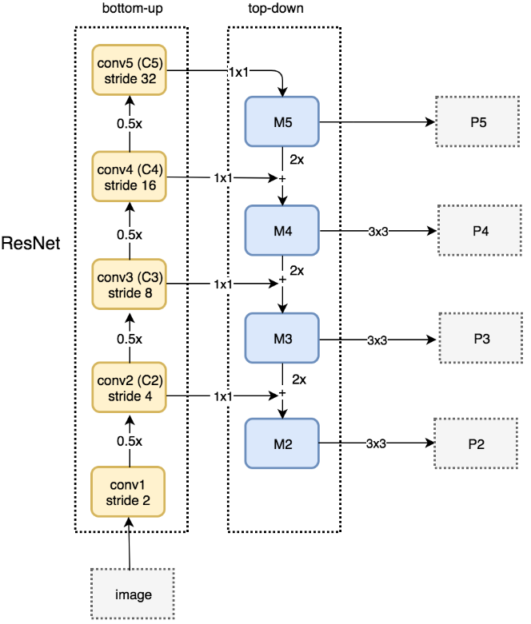
 
 
 
 
# Applications

### Feature Pyramid Networks for RPN(Region Proposal Network)

- RPN에서는 feature extraction으로 추출된 conv feature map에 3x3 sliding window를 사용하여 각 지점에서 object/no object의 binary classification과 anchor box좌표에 대한 regression을 수행한다.
- binary classification과 regression은 2개의 sibling 1x1 convolution으로 수행되며 이 부분을 network의 head라 부른다.

    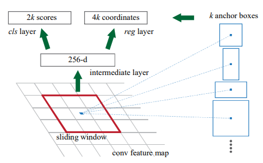

- RPN은 single-scale feature map을 이용하여 위 process를 수행하지만 FPN을 이용하여 multi-scale feature에서 RPN이 적용되도록 함. 각 pyramid feature level에서 3x3 conv와 2 sibling 1x1 conv를 사용하여 기존 RPN의 head를 똑같이 구현함
- FPN의 feature map을 사용하게 되면 각 pyramid level의 feature를 이용하게 되므로 반드시 multi-scale anchor box를 사용할 필요는 없으며, 각 level에서 sing scale anchor를 할당함.
- {P2, P3, P4, P5, P6}에서 사용되는 anchor의 크기는 {32^2, 64^2, 128^2, 256^2, 512^2}이며 multiple aspect ratio anchor를 사용하기 위해 {1:2, 1:1, 2:1}의 비율로만 조정함. 따라서 전체 pyramid 구조에서 총 15개의 anchor만 존재함. (anchor 크기가 저렇게 큰 이유는 입력 크기가 800x800임, P6는 P5를 2배 sampling한 것)
- 각 anchor에서 ground truth와의 IoU를 계산하여 해당 anchor가 positive label인지 negative label인지 할당함. gt와의 IoU가 가장 크거나 0.7이상인 경우 positive label이 되며 0.3미만은 negative label이 됨
- 또한, RPN의 head에 있는 parameter들은 모든 pyramid level에서 공유된다. parameter들이 공유되지 않게 실험했을 때도 비슷한 accuracy를 보였음. 따라서 제안하는 pyramid 구조는 모든 pyramid level에서 비슷한 semantic level을 공유하고 있음을 의미함.

### Feature Pyramid Networks for Fast R-CNN

- 이번에는 Fast R-CNN에 FPN을 적용해본다. Fast R-CNN의 핵심은 RoI Pooling이며 RoI Pooling은 single scale feature map에서 수행된다. 따라서, Fast R-CNN에 FPN을 적용하기 위해선 각 pyramid level에서 서로 다른 scale의 RoI를 할당한다.
- 아래 공식은 RPN에서 만들어진 RoI의 크기에 따라 어떤 pyramid level에서 RoI Pooling을 수행할 것인지 결정하는 것. w, h는 RPN에 의해 그려진 RoI의 width, height (아래 수식에서 양옆에 사용된 기호는 대괄호가 아니라 소숫점 내림 연산)

    $$k = \lfloor k_0 + log_2(\sqrt{wh}/224) \rfloor$$

- 224는 ImageNet pre-training size이며 k_0는 target level이다. ResNet 기반의 Faster R-CNN에서는 C_4 크기의 single-scale feature map을 사용하므로 여기서 k_0를 4로 설정한다.
- 만약 k=3이라면 해당 RoI는 P3 feature map을 가지고 RoI Pooling을 적용함

    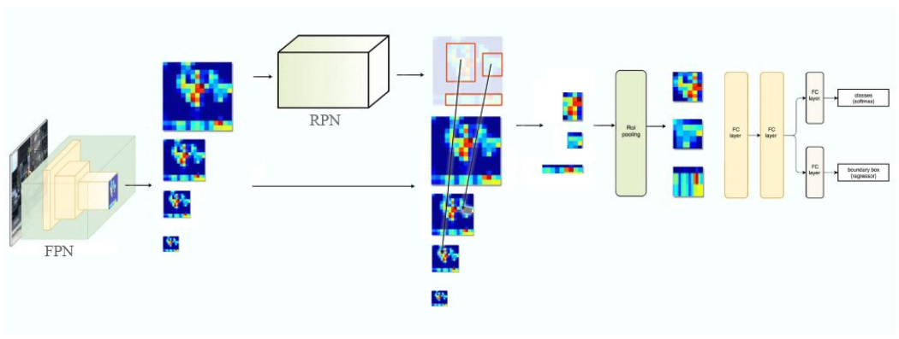

- RoI Pooling을 통해 feature를 7x7 크기로 만들고 1024 f.c layer를 2개 붙인 다음  classification layer와 bounding box regression layer에 연결함

# Experiments

### Region Proposal with RPN

- COCO에서 Average Recall을 평가함. AR_s, AR_m, AR_l은 small, medium, large object를 의미하며 AR^100, AR^1k는 proposal의 개수. "feature" column은 head 부분과 연결되는 feature map

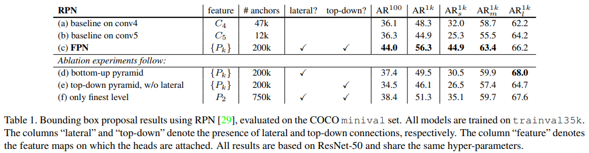

- 윗쪽 row에서 baseline on conv4, 5는 RPN을 어느 feature map에서 수행할 것인지 나눈 것.  (a), (b) 둘다 hyper-parameter와 anchor{32^2, 64^2, 128^2, 256^2, 512^2}의 크기는 서로 같음. (a), (b)는 feature pyramid 구조 아님.
- (b)가 (a)에 비해 이렇다 할 advantage가 없음. 즉 single higher-level feature map만으론 resolution과 strong semantic 사이의 trade-off가 잘 이루어지지 않는다.
- FPN(c)을 적용했을 때 AR^1k가 8point가량 증가하였고 small object AR도 크게 증가하였음. 따라서 제안하는 FPN을 사용했을 때 object scale variation에 대해 robust한 결과를 보여줌

### How important is top-down enrichment?

- (d)는 top-down pathway없이 bottom-up pathway에서 lateral connection을 이용하여 feature pyramid 구조를 만든 모델.
- (d)는 RPN과 비슷한 성능을 보여줌, FPN보다는 떨어짐.
- top-down pathway를 사용하지 않고 bottom-up pathway에서 만들어진 pyramid feature들은 각 level간의 semantic gap이 크기 때문에 결과가 좋지 않은 것으로 추측

### How important are lateral connections?

- (e)는 top-down feature pyramid 방식인데 1x1 lateral connection을 사용하지 않은 모델.
- top-down pyramid 구조이기 때문에 strong semantic feature를 갖지만 이러한 feature들이 down-sampling되고 up-sampling되는 빈도가 많기 때문에 feature의 location이 부정확해질 수 있음
- location of feature는 finer level의 bottom-up feature에서 lateral connection을 통해 top-down map으로 전달되기 때문에 lateral connection을 사용하지 않으면 location 정보의 정확도가 떨어질 수 있다.
- 결과적으로 (e)는 FPN에 비해 AR^1k score가 10point가량 뒤떨어짐

### How important are pyramid representations?

- 여러 pyramid level의 feature를 사용하는 것이 아니라 하나의 feature만 사용했을 때(P2)
- single-scale baseline과 비슷하게 P2 feature map에서만 anchor를 할당함. (f)는 (a), (b)보단 성능이 좋음. 이는 RPN이 고정된 window size로 sliding 하지만 여러 pyramid level로 부터 만들어진 feature map에서 scanning하는 것이 scale variance 측면에서 더 robust하기 때문. 어쨌거나 FPN보다는 성능이 안 좋음
- P2의 spatial size가 매우 크기 때문에 상당히 많은 750k 개의 anchor를 사용했음에도 불구하고 성능이 개선되지 않았다는 점에서 단순히 anchor 개수가 많다고 성능이 올라가는 것은 아님

### Object Detection with Fast/Faster R-CNN

- proposal 방법을 Table 1의 (c)에 사용된 proposal로 fix해놓고 비교함

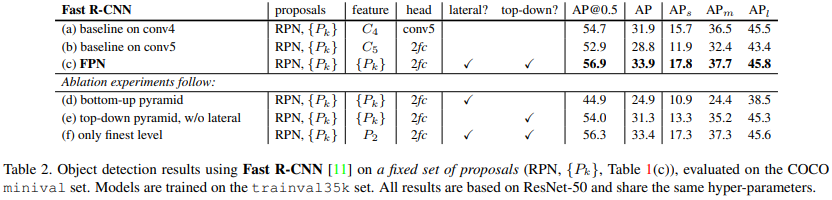

- (a)는 C_4 feature map에 conv layer를 추가하여 head로 연결, 나머지는 "feature" column의 feature map에 2f.c layer 연결
- (a), (b)보다 (c)에서 모든 성능 개선이 이루어짐. 제안하는 feature pyramid 방식은 region-base object detector에서도 효과적임을 보여줌

### Faster R-CNN (on consistent proposals)

- baseline (a), (b) (multi-scale anchor box)가 기존의 Faster R-CNN보다 AP@0.5 성능이 좋음. 그 이유는 600x600이 아닌 800x800 image를 input으로 사용했다는 점, 이미지 하나에서 512개의 RoI를 사용했다는 점, 4개가 아닌 5개의 multi-scale anchor를 사용했다는 점, 테스트 시 이미지 당 1000개의 proposal을 사용했다는 점에서 성능이 향상됨

    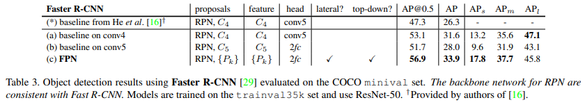

# Extensions: Segmentation Proposals

- FPN을 Segmentation에도 적용했을 때

    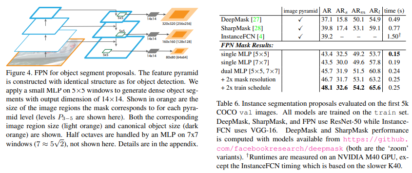

# Conclusions

- CNN 안에 feature pyramid 구조를 만드는 심플한 framework을 제안함
- 다양한 실험과 competitions에서 FPN을 사용했을 때 성능이 증가함을 보여줌. 따라서 제안하는 feature pyramid solution은 image pyramid 같이 추가적인 computing 필요 없이도research, application에 적용할 수 있는 효과적인 solution임
- 또한 Deep CNN은 strong representational power와 scale variation에 대한 robustness를 가지고 있지만 pyramid representation을 사용하여 multi-scale problem을 다루는 것이 중요하다는 것을 보여줌

# References

[https://medium.com/@jonathan_hui/understanding-feature-pyramid-networks-for-object-detection-fpn-45b227b9106c](https://medium.com/@jonathan_hui/understanding-feature-pyramid-networks-for-object-detection-fpn-45b227b9106c)
