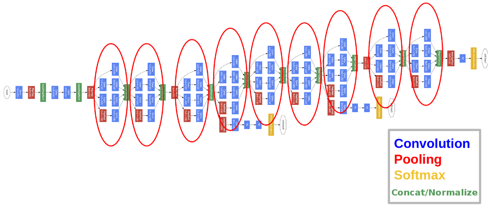
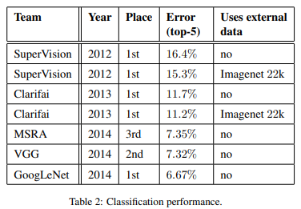

# Going Deeper with Convolutions

# Abstract

- Inception이라는 새로운 Deep CNN 아키텍처를 제안한다.
- image classification, detection에서 SOTA를 달성했다.
- 네트워크 안의 computing resource가 효율적으로 이뤄지도록 개선하였다.

# **Introduction**

- 제안하는 GoogLeNet은 ILSVRC-2014에서 AlexNet보다 12배 적은 파라미터 개수로 훨씬 좋은 성능을 냄
- efficient deep neural networks을 제안한다.
- 여기서 "deep"이란 단어의 의미는 2가지를 갖는다.
    - Inception module이라는 새로운 모듈을 제안한다.
    - 말 그대로 네트워크의 depth 증가를 의미한다.

# Related Work

- 최근 CNN을 설계하는데 있어서 레이어를 더 깊게 쌓아 올리는 구조가 하나의 트렌드가 되고 있다.
- 일반적으로 연속된 conv layer를 사용하며 추가적으로 normalization or max-pooling 레이어를 추가한다.
- "Robust object recognition with cortex-like mechanisms"에서는 multiple scale을 다루기 위해 서로 다른 사이즈의 고정된 Gabor filter series를 사용하였다.
- 본 논문에서는 이러한 방법을 참고하여 네트워크를 설계하였지만 Inception 모델의 모든 필터는 학습된다는 점에서 차이가 있다.
- Network in Network는 뉴럴넷의 representational power를 끌어올리기 위한 방법 중 하나로 1x1 conv를 사용하여 depth를 증가시킨다.
- 그러나 Inception에서 1x1 conv는 2가지 목적을 갖는다.
    1. computational bottlenecks을 줄이기 위한 dimension reduction module로 사용한다. 
    2. 네트워크의 depth를 증가시킬뿐만 아니라 performance penalty없이 네트워크의 width 또한 조절할 수 있다. 여기서 네트워크의 width란 각 레이어의 unit 수를 의미한다.

# Motivation and High Level Considerations

- 네트워크의 depth, width를 늘리는 것은 성능을 향상시킬 수 있는 쉬운 방법 중 하나지만 2가지 문제점을 가지고 있다.
    1. 네트워크가 커질수록 파라미터수가 증가하게 되며 이는 네트워크가 training set에 오버피팅될 수 있는 문제가 된다.
    2. 네트워크가 커질수록 computational resource가 증가하게 된다. computational resource는 무한하지 않으므로 computational resource가 efficient distribution될 수 있도록 해야 한다.
- 위와 같은 문제를 해결하는 근본적인 방법은 sparsity를 더 증가시키는 것이다. 즉, f.c layer를 sparse한 layer로 대체하고, convolution layer도 더 sparse하게 바꾸는 것이다.

# Architectural Details

- 네트워크 내에서 sparsity를 높이고 Dense한 Matrix 연산을 통해 컴퓨터가 효율적으로 연산하게 한다.
- 네트워크의 sparse 구조가 더 성능이 높다. (Dropout), 그러나 컴퓨터의 연산은 Dense할수록 빠르다는 특징이 있다. 두가지 특징을 잘 고려하여 설계한 것이 Inception module

- 위와 같은 구조에서 computational cost가 너무 커진다는 문제가 있음 이를 보완하기 위해 3x3, 5x5 conv 이전에 1x1 conv를 사용하여 channel 수를 조절하도록 함

# GoogLeNet

- activation function으로 ReLU
- #3x3 reduce, #5x5 reduce는 해당 컨볼루션 연산을 하기 전에 1x1 convolution을 먼저 사용한 것
- 전체 레이어는 22개로 구성(pooling 포함하면 27개),  block 내부까지 일일이 다 계산하면 대략 100개
- f.c layer만 사용하는 게 아니라 average pooling도 사용, top-1 acc 개선됨

- auxiliary classifier를 네트워크 중간에 삽입하여, lower stage에서도 back-propagation이 잘 이루어지도록 함
- Inception에서는 네트워크가 매우 깊기 때문에 Gradient Vanishing 같은 문제가 발생할 수 있다. 이러한 문제를 방지하기 위해 네트워크 중간에 2개의 auxiliary classifier를 두어 네트워크 중간에서도 Back propagation을 하였다.
- 전체 loss 계산시 auxiliary classifier에서 나온 loss는 0.3을 곱하여 더해진다.
- inference 시 auxiliary classifier는 사용하지 않는다.

# Experiments

- training과 testing에서 아래와 같이 진행함
    - Training
        - 동일한 GoogLeNet 모델 7개를 만들어서 독립적으로 트레이닝한 뒤 앙상블 기법을 사용함
        - 7개 모델 모두 같은 initialization, learning rate policy을 사용함
    - Testing
        1. 이미지를 4가지 scale로 resizing함  256, 288, 320, 352
        2. left, center, right square를 구함
        3. 위에서 구한 square에서 다시 top, center bottom 방향으로 square를 구함
        4. center와 4개의 corner 위치에서 224x224로 cropping함
        5. horizontal flip
        - 위와 같은 data augmentation을 거치면 이미지 하나에서 총 4x3x6x2 = 144개의 이미지를 얻을 수 있음
        - 최종 softmax 확률값은 multiple crop들의 평균

- Classification performance, GoogLeNet이 SOTA를 달성함
- 2012년에 제안된 SuperVision보다 error rate을 절반이상 줄임

 
 
 
- 모델의 개수, crop수를 다르게 하여 비교한 결과
- 단일 모델의 경우 top-1 validation error rate이 제일 낮은 모델을 선택함

# Conclusions

- optimal sparse 구조를 통해 뉴럴넷의 성능을 개선시킴
- shallower and narrower 모델에 비해 computational cost가 크게 증가하지 않았음에도 불구하고 높은 성능을 냄
- object detection에서 context, bounding box regression을 수행하지 않아도 좋은 성능을 냄
- 제안하는 sparser architecture는 feasible, useful idea

# References

[https://www.oreilly.com/library/view/learning-tensorflow/9781491978504/ch04.html](https://www.oreilly.com/library/view/learning-tensorflow/9781491978504/ch04.html)

[https://sike6054.github.io/blog/paper/second-post/](https://sike6054.github.io/blog/paper/second-post/)

[https://kangbk0120.github.io/articles/2018-01/inception-googlenet-review](https://kangbk0120.github.io/articles/2018-01/inception-googlenet-review)
