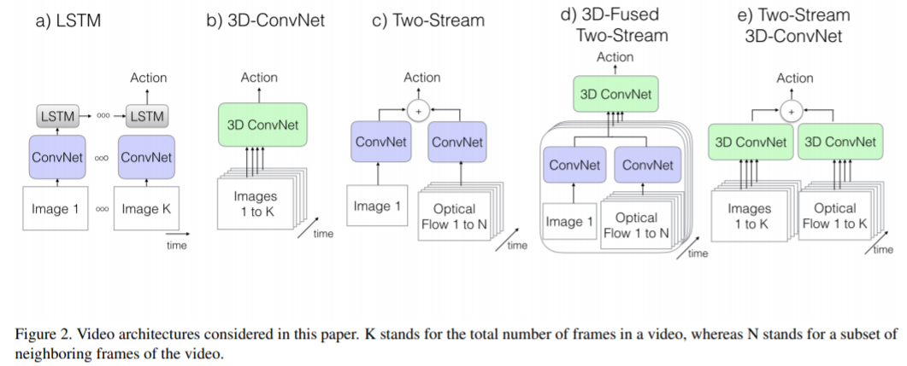
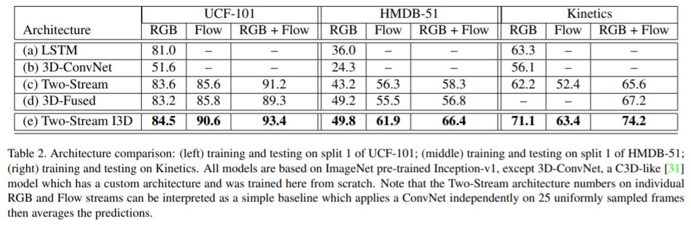
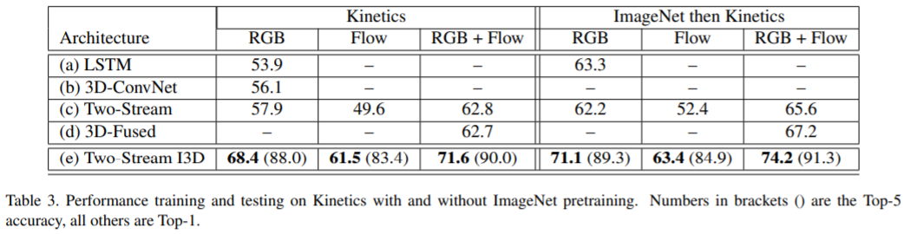
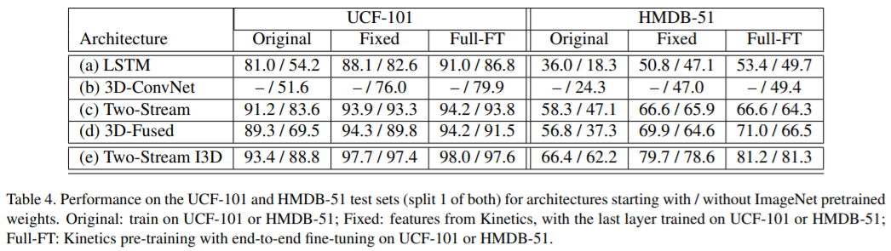
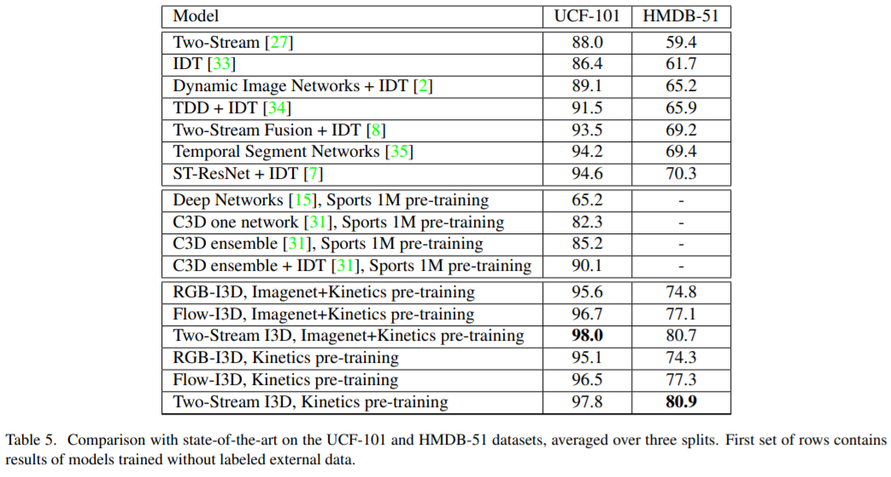

# Quo Vadis, Action Recognition? A New Model and the Kinetics Dataset
 
 

# Abstract

- Video action classification에서 UCF-101, HMDB-51 dataset을 주로 사용한다. 이러한 dataset은 large scale dataset이 아니며 video recognition에서는 imagenet같은 large scale dataset이 부족했다.
- 본 논문에서는 400개 human action class를 갖는 Kinetics dataset을 제안하고 기존의 SOTA 아키텍처들을 해당 dataset으로 평가했을 때 성능이 얼마나 나오는지, Kinetics dataset pre-training 시킨 뒤 smaller benchmark dataset으로 학습시켰을 때 성능이 얼마나 향상되는지 분석한다.
- 또한 기존의 image classification에서 잘 만들어진 2D CNN(Inception v1)을 기반으로 하여 Two-stream Inflated 3D ConvNet(I3D)라는 새로운 네트워크를 제안한다.  I3D는 기존의 2D CNN의 filter와 pooling kernel들을 3D로 확장하였으며 비디오에서 spatio-temporal feature를 잘 추출할 수 있다.

# 1. Introduction

- 기존에 ImageNet으로 학습된 classification 모델을 다른 task나 domain에서 적용하면 다양한 benefit을 얻을 수 있었다. 그렇다면 video domain에서 action classification network를 충분히 large한 dataset으로 학습시키고 다른 temporal task나 dataset에 적용했을 때 비슷한 효과를 볼 수 있을까?
- 본 논문에서는 video domain에서도 imagenet과 같은 large scale dataset을 활용하기 위해 Kinetics Human Action Video Dataset이라는 새로운 large scale dataset을 제안한다.
- 이를 이용하여 기존에 제안되어왔던 action recognition model들을 Kinetics dataset으로 pre-training시키고 HMDB-51, UCF-101 dataset으로 fine-tuning했을 때 아키텍처마다 차이는 있었지만 모든 모델에서 성능이 improve되었다.
- 위와 같은 finding에 기반하여, Kinetics dataset으로 pre-training 하여 높은 성능을 낼 수 있는 I3D라는 새로운 모델을 제안한다. 제안하는 모델은 기존의 classification SOTA 아키텍처를 기반으로 하여 conv, pooling layer의 filter를 3차원으로 확장하였으며 이는 자연스럽게 spatio-temporal feature를 추출할 수 있게 한다.
- Kinetics dataset으로 제안하는 I3D를 pre-training 시켰을 때 SOTA를 달성하였다.

# 2. Action Classification Architectures

- 기존에 많이 사용되었던 video architecture들을 비교해본다.

    

### 2.1. The Old I: ConvNet+LSTM

- High performance image classification network를 이용하여 video frame에서 feature extractor로 사용할 수 있다. 따라서 ConvNet을 이용하여 각 frame에서 feature를 추출하고 각 prediction들의 그 결과를 pooling하여 video를 classification한다.
- 그러나 이러한 approach는 temporal structure를 완전히 ignore 해버리는 단점이 있다. 즉 temporal 정보를 무시하기 때문에 문을 여는 행동인지 닫는 행동인지 제대로 구분할 수 없다.
- 이를 보완하기 위해 last pooling layer 이후 LSTM을 추가하여 temporal 정보를 capture한다.

### 2.2. The Old II: 3D ConvNets

- 2D CNN 대신 3D CNN을 사용하면 spatial feature뿐만 아니라 temporal feature도 추출할 수 있다.
- 그러나 2D CNN과 비교했을 때 파라미터가 너무 많아져서 학습이 어렵고 오래걸리는 문제가 발생할 수 있다. 또한 3D CNN을 사용하면 기존에 ImageNet으로 pre-training 된 모델을 활용할 수 없다.

### 2.3. The Old III: Two-Stream Networks

- Old I에서 ConvNet 뒤쪽에 LSTM을 추가하여 temporal feature를 추출하고자 했으나 이는 low-level motion feature를 잘 capture하지 못 한다는 단점이 있다. low-level motion feature는 매우 중요하지만 이를 multiple frame에서 추출하고 backpropagation하기 위한 cost 역시 매우 크다.
- 따라서 Two-Stream 방식에선 RGB frame과 optical flow frames를 2-stream 입력으로 넣고 모델을 spatial 정보와 temporal 정보를 나눠서 추출하기 때문에 performance도 좋고 train, test 과정 또한 효율적이다.

### 2.4. The New: Two-Stream Inflated 3D ConvNets

- 본 논문에서 제안하는 새로운 Two-Stream 아키텍처이며 기존에 ImageNet으로 pre-training된 2D CNN의 파라미터를 활용할 수 있다. 네트워크 구조는 2D filter를 3D filter로 확장한 것으로 3D CNN이므로 RGB stream에서 temporal feature를 추출할 수 있게 된다.
- 제안하는 모델에 optical flow stream을 추가하였을 때 성능이 크게 향상되었다.

### Inflating 2D ConvNets into 3D.

- Image classification에선 이미 효과적인 2D CNN 모델들이 존재하며 이러한 모델들이 만들어지기까지 굉장히 많은 시행착오를 거쳤다. 이러한 시행착오를 spatio-temporal model에서도 똑같이 경험할 필요 없이 기존에 좋은 2D CNN 모델을 3D CNN에 이용하자는 것이 논문의 아이디어.
- 심플하게 2D filter의 차원을 NxN → NxNxN을 확장하여 temporal feature를 추출할 수 있게 변형했다.

### Bootstrapping 3D filters from 2D Filtres.

- 아키텍처 구조는 그대로 가져가고 2D filter를 3D filter로 확장시킨 것이기 때문에 pre-trained ImageNet model의 학습 파라미터를 사용할 수 있다.
- 3D filter는 2D filter에 시간 축을 추가하여 확장한 것이므로, 2D filter의 weight값을 3D filter의 시간 축을 따라 복사하고 이를 1/N로 rescaling 한다.

### Pacing receptive field growth in space, time and network depth.

- 비디오는 인접한 frame끼리 유사하기 때문에 모든 frame이 독립적이면서 유의미한 정보를 담고 있다고 보기 힘들다. 그래서 pooling이나 conv layer에서 temporal stride를 얼마로 줄 것인지가 매우 중요한 요소이다.
- 실험에서 first two pooling에선 temporal pooling을 수행하지 않는 것이 더 나았기 때문에 커널의 크기를 1x3x3, time stride를 1로하여 temporal 정보가 손실되지 않게 유지한다.

### Two 3D Streams.

- I3D는 RGB를 입력으로 하는 네트워크와, optical flow를 입력으로 받는 네트워크인 two stream network로 구성되어 있으며 두 네트워크를 개별적으로 학습시키고 두 prediction 결과를 average하여 사용한다.

# 3. The Kinetics Human Action Video Dataset

- Kinetics dataset은 human action에 초점을 두고 만들어진 dataset이며  drawing, drinking, laughing, punching ... 등의 class로 나누어져 있다.
- 또한 몇몇 action들은 fine-grained하기 때문에 이를 구별하기 위해선 temporal reasoning이 필요하다. (예를 들어 배영, 평영, 접영은 모두 수영을 하는 동작이지만 이를 구별하기 위한 temporal reasoning이 필요함)
- 총 400개의 human action class로 구성되어 있으며 각 클래스마다 400개 이상의 clip이 존재한다. clip은 대략 10초 정도 재생된다.

# 4. Experimental Comparison of Architectures

- RGB frame만 사용하는 경우 / optical flow만 사용 / RGB frame과 optical flow 둘다 사용
- 모든 데이터셋에서 제안하는 Two-Stream I3D가 가장 높은 성능을 달성하였으며 RGB + Optical flow를 같이 사용했을 때 모델의 성능이 더 높아진다.

    

- Kinetics보다 UCF-101의 성능이 더 잘 나옴. Kinetics dataset이 class수도 4배가량 많고 clip수도 더 많음. Kinetics가 HMDB-51보다 성능이 더 잘나옴, HMDB-51은 학습 데이터의 수가 부족하고 clip들이 같은 scene에서 다른 action을 하는 경우가 있기 때문
- Kinetics와 달리, UCF-101, HMDB-51 dataset에선 RGB만 사용하는 것보다 optical flow만 사용했을 때 더 성능이 잘 나옴. Kinetics에선 camera motion이 다양하기 때문에 motion stream을 학습시키는 것이 더 어려움

- Pre-trained imagenet model을 사용했을 때 성능이 더 높아짐

    

# 5. Experimental Evaluation of Features

- UCF-101, HMDB-51 dataset evaluation

    

- Original: Kinetics pre-training 사용 x
- Fixed: Kinetics dataset으로 pre-training 후, 마지막 레이어만 fine-tuning 나머지 모든 레이어는 freezing
- Full-FT: Kinetics dataset으로 pre-training 후, end-to-end fine-tuning
- with ImageNet pretrained / without ImageNet pretrained

- pre-training으로 학습 시켰을 때 모든 모델에서 성능이 improve 되었음. I3D에서 significant한 성능 향상이 이루어진 이유는 high temporal resolution을 사용하기 때문. 즉, fps 25인 비디오에서 64 frame을 샘플링하기 때문에 fine-grained temporal action feature를 잘 추출할 수 있음. 이와 달리 frame sampling이 적은 경우 Kinetics dataset으로 pre-training 시켰을 때 효과가 크지 않음.
- two-stream 모델은 ImageNet이나 Kinetics으로 pre-training 하지 않아도 성능이 잘 나온다. 이는 two-stream model 특성 상 flow stream이 있기 때문에 accuracy가 잘 나오고 overfitting 되는 경향도 적다.
- Kinetics로 pretraining 하는 것이 ImageNet으로 pretrainig하는 것보다 더 낫다.

### 5.1. Comparison with the State-of-the-Art

- SOTA 모델들과의 비교

    

- Two-stream pre-training I3D가 SOTA를 달성
- Kinetics pre-trained I3D는 Sports 1M pre-trained C3D 보다 성능이 잘 나온다. C3D 또한 video dataset으로 학습했지만 I3D 아키텍처가 더 better하며 Kinetics dataset의 퀄리티가 더 좋기 때문

# 6. Discussion

- 논문에서 "이미지넷처럼 비디오 도메인에서도 transfer learning을 사용하면 benefit을 얻을 수 있을까?" 라는 질문으로 시작하였고, 제안하는 Kinetics dataset을 사용한다면 상당한 benefit이 있음이 명확해졌다. Kinetics dataset으로 pre-training 시키고 UCF101 or HMDB-51 같은 비슷한 도메인의 데이터셋으로 fine-tuning 했을 때 매우 큰 효과가 있었음.
- 그러나 Kinetics dataset으로 pre-training 시키는 것이 video segmentation, video object detection, optical flow computation 등 다른 비디오 task에서도 benefit이 있을지는 추가적인 연구가 필요하다.
- 또한 I3D라는 efficient video architecture를 제안하였지만 comprehensive exploration을 수행한 것도 아니고 action tube나 attention mechanism 같이 human actor에 focus할 수 있는 테크닉을 적용하지도 않았다. space와 time 간의 relationship을 분석하고 중요한 정보를 잘 capture하기 위한 연구가 많이 진행되고 있으므로 이러한 테크닉을 적용하면 great value가 될 것이다.
