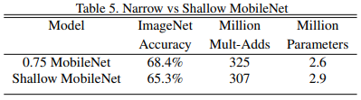
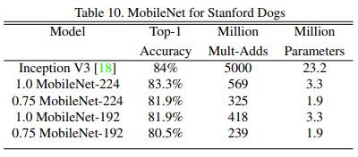

# MobileNets: Efficient Convolutional Neural Networks for Mobile Vision Applications

# Abstract

- mobile, embedded vision application를 위한 효율적인 모델 MobileNet을 제안한다.
- MobileNet은 depth-wise separable convolution에 기반한 streamlined 아키텍처
- latency와 accuracy 사이에서 효율적으로 trade off할 수 있는 simple한 hyper-parameter 2개를 제안한다.
- MobileNet은 object dtection, finegrain classification, face attribute, large scale geo-localization 등 다양한 분야에서 좋은 성능을 보여줌

# Introduction

- AlexNet이후로 CNN은 다양한 vision 분야에서 사용되고 있다. 모델의 accuracy를 높이기 위해 레이어를 더욱 깊게 쌓아 네트워크의 depth를 늘리는 것이 일반적인 트렌드가 되어왔다.
- Deep한 네트워크를 설계하여 accuracy를 개선하는 것은 모델의 size, speed와 같은 efficiency 측면에서 볼 때 문제가 될 수 있다.
- real world에서는 computer resource가 제한적이기 때문에 문제가 더 커질 수 있다.
- 본 논문에서는 small, low latency model을 설계하기 위한 방법을 통해 효율적인 네트워크 아키텍처를 제안한다.

# Prior Work

- 최근에도 small and efficient neural network를 설계하기 위한 연구가 있지만 기존의 방법들은 pretrained network를 압축하거나 small network를 directly하게 학습시켰던 두 분류로 나눌 수 있다.
- 본 논문에서는 제한된 latency, size 안에서 small network를 구체적으로 설계할 수 있는 아키텍처를 제안한다.
- 제안하는 MobileNet은 latency를 최적화하면서 small network를 만드는 것에 초점을 맞춘다.

# MobileNet Architecture

### Depthwise Separable Convolution

- MobileNet은 depthwise separable convolution에 기반한 모델로 depthwise separable convolution은 depthwise convolution과 1x1 convolution(pointwise convolution)으로 분해할 수 있다.
- depthwise convolution은 각 input channel에 대해 single filter를 사용하여 컨볼루션 하는 연산이다.
- 1x1 convolution을 사용하여 depthwise convolution의 output을 combine한다.
- standard convolution에서 1-step으로 이루어진 연산을 2-step의 2 layer로 나눈 것이 depthwise separable convolution이다.
- standard conv 대신 이러한 factorization conv를 사용하면 computation cost와 model size를 많이 줄일 수 있다.
- Figure 2는 standard convolution layer와 depthwise conv, 1x1 convolution의 차이

    

- **Standard Convolution**
    - Output feature map G (standard convolution)

        $$G_{k,l,n} = \Sigma_{i,j,m} K_{i,j,m,n} \cdot F_{k+i-1, l+j-1, m}$$

    - Standard convolution computational cost

        $$D_K \cdot D_K \cdot M \cdot N \cdot D_F \cdot D_F$$

        - D_K: 커널의 width, height
        - D_F: input의 width, height
        - M: input feature의 depth
        - N: output feature의 depth( = filter 개수)
        - 따라서 computational cost는 M, N, D_K, D_F에 따라 multicatively하게 증가한다.

- **Depthwise convolution**
    - Output feature map G

    $$\hat{G}_{k,l,m} = \Sigma_{i,j}\hat{K}_{i,j,m} \cdot F_{k+i-1,l+l-1,m}$$

    - Depthwise convolution computational cost

        $$D_{K} \cdot D_{K} \cdot M \cdot D_{F} \cdot D_{F}$$

    - Detphwise convolution은 standard convolution에 비해 매우 효율적이라 볼 수 있음
    - 그러나 input channel마다 계산하기 때문에 다음 레이어로 전달하기 위해 feature map을 combine 해주는 작업이 필요함. 이 작업을 1x1 conv를 통해 수행
    - 따라서 Depthwise Separable convolution의 cost는 다음과 같다.

        $$D_{K} \cdot D_{K} \cdot M \cdot D_{F} \cdot D_{F} + M \cdot N \cdot D_{F} \cdot D_{F}$$

    - Depthwise Separable convolution과 Standard convolution의 computation 차이

        $$\frac{D_{K} \cdot D_{K} \cdot M \cdot D_{F} \cdot D_{F} + M \cdot N \cdot D_{F} \cdot D_{F}}{D_{K} \cdot D_{K} \cdot M \cdot N \cdot D_{F} \cdot D_{F}} = \frac{1}{N} + \frac{1}{D_{K}^{2}}$$

        - 만약 3x3 conv를 사용하면 standard convolution에 비해 8~9배 가량 computation cost를 줄일 수 있음.

### Network Structure and Training

- MobileNet 아키텍처

    

- 첫번째 conv layer에서는 일반적인 conv 사용하고 그 이후는 모두 dw conv
- Conv layer이후 BN+ ReLU사용

    

- Donw sampling은 first conv 레이어와 stride가 2인 dw conv에서 이루어짐

- Dpethwise Conv써서 computation cost를 많이 줄인 것은 맞지만 단순히 연산량만 줄이는 것으로 네트워크를 정의하는 것은 부족한 부분이 있음. 즉, 이러한 operation이 효율적으로 구현되어 잘 작동하는 것도 매우 중요함
- 실제 컴퓨터에선 sparse matrix 연산보다 dense matrix 연산이 더 빠르다. MobileNet에서 각 레이어가 차지하는 연산 중 90% 이상이 dense한 1x1 conv로 이루어져있기 때문에 MobileNet은 최적화된 general matrix multiply function으로 구현될 수 있음
- for문을 사용하지 않고 컨볼루션 연산을 효율적으로 구현하기 위해 3차원을 2차원 matrix로 변환하여 계산함.

    

- 위와 같은 방법은 feature map과 filter를 GEMM(General Matrix Multiply)연산을 위해 메모리를 reordering하는 작업이 필요함
- 그러나 1x1 convolution은 reordering이 필요 없으며 directly하게 GEMM을 적용할 수 있음

- MobileNet의 레이어에서 발생하는 연산량과 파라미터 비중

    

- MobileNet은 TensorFlow, RMSProp을 사용하였으며 모델을 학습시킬 때 regularization이나 data augmentation 같은 테크닉을 많이 사용하지 않음.
- 상대적으로 small model이기 때문에 오버피팅이 일어날 가능성이 더 적기 때문.
- 그 대신 weight decay(L2 regularization)를  depthwise filter에 사용하지 않거나 매우 작은 값으로 적용하는 것이 더 중요함. (애초에 파라미터 수가 별로 없기 때문에)

### Width Multiplier: Thinner Models

- MobileNet 아키텍처가 small and low latency한 아키텍처이지만 실제론 더 작거나 빠른 모델이 필요할 수 있음
- smaller하고 less computationally expensive model을 설계하기 위한 width multiplier라는 simple한 파라미터 α를 제안함
- α의 역할은 네트워크 thin하게 만들어 cost를 줄임
- 쉽게 말해 α는 input의 채널 수를 조절하여 cost를 더 줄이는 것
- Depthwise separable convolution에 width multiplier인 α가 적용됐을 때 computational cost

    $$D_K \cdot D_K \cdot \alpha M \cdot D_F \cdot D_F + \alpha M \cdot \alpha N \cdot D_F \cdot D_F$$

- α는 0~1사이의 값인 1, 0.75, 0.5, 0.25 4가지 값을 사용함
- α=1인 경우 Width Multiplier를 적용하지 않은 것과 같으며 α<1인 경우 MobileNet이 reduce됨
- Width Multiplier 다른 모델에도 쉽게 적용할 수 있으며 reasonable accuracy 성능을 내면서 model을 더 작게 만들어줌, 즉 latency와 size 사이의 trade off

### Resolution Multiplier: Reduced Representation

- computational cost를 줄여주는 두번째 파라미터인 Resolution multiplier ρ를 제안함
- 쉽게 말해 ρ는 input image의 사이즈를 줄여서 cost를 줄이는 것.
- Width & Resolution Multiplier가 적용됐을 때의 computational cost

    $$D_K \cdot D_K \cdot \alpha M \cdot \rho D_F \cdot \rho D_F + \alpha M \cdot \alpha N \cdot \rho D_F \cdot \rho D_F$$

- ρ 또한 0~1사이의 값이며 ρ=1일 때는 resolution을 줄이지 않는 것과 같음
- ρ 값에 따라 224, 192, 160, 128의 4가지 resolution을 사용함

- 제안하는 하이퍼 파라미터인 width & resolution multiplier를 사용했을 때 cost

    

# Experiments

### Model Choices

- MobileNet에서 standard conv를 썼을 때와 dw conv 사용한 모델 비교

    

- 정확도는 약 1% 정도 차이나지만 연산량, 파라미터 수에서 cost가 많이 줄어듦

- Width Multiplier를 적용했을 때와 그냥 레이어 수만 줄인 Shallow MobileNet과의 비교

    

- Shallow model은 baseline MobileNet에서 layer 5개 뺀 거
- 연산량과 파라미터 수는 얼추 비슷하게 맞춤. 따라서 efficient model을 만들기 위해선 레이어 수를 줄이는 것이 아니라 우리가 제안하는 width multiplier를 사용하는 것이 더 좋다.

### Model Shrinking Hyperparameters

- Input resolution은 그대로 두고 Width Multiplier 사용했을 때 비교

    

- Width Multiplier 값이 작아질 수록 accuracy가 줄어듦

- Width Multiplier는 그대로 두고 Resolution Multiplier를 다르게 줬을 때

    

- Width Multiplier와 같이 Resolution Multiplier 값이 작아질수록 accuracy 감소

- Width Multiplier, Resolution Multiplier를 동시에 적용했을 때 accuracy와 연산량 사이의 trade off

    

- Width Multiplier = {1, 0.75, 0.5, 0.25}
- Resolution Multiplier = {224, 192, 160, 128}
- 총 16개 모델을 비교함,  log linear하게 증가함

- Accuracy와 parameter 사이의 trade off

    

- MobileNet과 VGG, GoogleNet과의 비교

    

- MobileNet은 VGG와 비슷한 성능을 내면서도 연산량과 파라미터를 32배, 27배 줄임
- GoogleNet보다 정확도가 더 높으면서 연산량, 파라미터 측면에서도 효율적임

- MobileNet에 Width & Resolution Multiplier를 적용하고 다른 모델과 비교

    

- α=0.5, resolution= 160을 사용
- AlexNet, SqueezeNet보다 accuracy가 높으면서 cost가 적음

### Fine Grained Recognition

- Stanford Dog dataset에서 실험

    

- nosiy web data로 pretrain한 뒤에 Stanford Dog dataset으로 finetuning
- MobileNet이 매우 적은 cost로도 기존 모델과 비슷한 성능을 냄

### Large Scale Geolocalization

- 해당 이미지가 지구의 어느 위치에서 찍혔는지 분류하는 문제

    

- 이미지를 각 grid cell로 나누어 데이터를 만듦
- InceptionV3를 backbone으로 사용한 PlaNet에서 MobileNet을 backbone으로 사용하였더니 성능이 더 잘나오거나 떨어진 경우도 있었지만 cost 측면에서 훨씬 효율적이고 Im2GPS보다 outperform

### Face Attributes

- face attribute classification task에도 적용

    

- MobileNet과 knowledge distillation 기법을 적용하여 얼마나 시너지가 나는지 분석
- multi-attribute datset으로 학습된 large face attribute classifier를 baseline으로 사용(해당 모델에 대한 구체적인 정보는 모르겠음)
- knowledge distillation을 통해 mobilenet 모델이 대량의 데이터셋으로부터 학습된 large model을 모방할 수 있음
- MobileNet이 cost를 훨씬 줄이면서도 더 높은 성능을 보여줌

### Object Detection

- object detection evaluation (MS-COCO dataset)
    
    
- SSD, Faster-RCNN 두 framework에서 Backbone net을 다르게 하여 비교함
- 두 framework에서 comparable한 성능을 보여주었으며 네트워크의 computational complexity, size를 더 효율적임
    
- 얼굴 이미지들 간의 face similarity 측정하여 비교하는 FaceNet

    

- 1e-4 Accuracy? FaceNet 논문에서 나오는 FAR(False Accept Rate)이라는 값을 1e-4로 두고 정확도를 비교
- Face attribute와 마찬가지로 MobileNet을 distillation을 사용하여 학습

# Conclusion

- depthwise separable convolution에 기반한 MobileNet이라는 새로운 모델을 제안함
- 효율적인 모델을 설계하기 위한 방법을 제시함. width/resolution multiplier를 통해 accuracy와 모델의 size, latency 사이에서 reasonable한 trade off
- 다양한 task에서 다른 모델들과 비교했을 때도 MobileNet 효과적임을 증명함

# References

[https://www.slideshare.net/ssuser5ac863/cnn-76076595](https://www.slideshare.net/ssuser5ac863/cnn-76076595)
