# Deep Residual Learning for Image Recognition

# Abstract

- Deep neural net은 학습시키기 어렵다는 문제가 있다. 그러나 본 논문에서는 residual learning framework을 통해 깊은 신경망도 잘 학습시킬 수 있다.
- 제안하는 residual network는 optimize가 쉽고 상당히 깊은 depth를 가지는 뉴럴넷에서도 성능을 낼 수 있다.
- VGG보다 8배 많은 152개의 레이어를 사용했음에도 성능이 좋았다. (레이어 수는 훨씬 많지만 실제 Complexity 측면에선 오히려 ResNet이 VGG보다 lower complexity)
- Classification뿐만 아니라 detection, localization, segmentation등 다양한 task에서 SOTA를 달성했다.

# 1. Introduction

- Deep 뉴럴넷은 low/mid/high level의 enrich feature를 만들어낼 수 있다는 점에서 좋은 성능을 보여주고 있다. 따라서 신경망의 depth는 매우 중요한 요소라 할 수 있다.
- 그렇다면 레이어를 많이 쌓아올리는 것은 네트워크를 더 쉽게 학습시킨다고 볼 수 있을까?
    - Degradation(gradient vanishing, gradient exploding)이라는 문제가 있다.
        - Gradient vanishing은 gradient값이 너무 작아서 네트워크를 제대로 학습시키지 못하는 문제를 말한다. 이 문제는 입력값에 비해 출력값이 너무 작은 space로 맵핑될 때 발생할 수 있으며 레이어가 깊어질수록 발생하는 문제이다. activation function으로  sigmoid or tanh 함수를 사용할 때 발생할 수 있음
        - Gradient exploding은 gradient vanishing과 반대로 gradient 값이 너무 커져서 발산해버리는 문제
        - Layer를 더 많이 사용했는데 degradation으로 인해 오히려 error가 더 높음

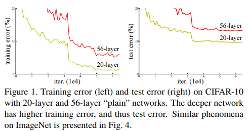

- 네트워크의 depth를 늘리는 것은 이러한 degradation 문제를 일으킨다. degradation문제는 모델의 오버피팅으로 인해 발생하는 것이 아니라 레이어를 더 많이 쌓아올려 모델의 training error가 더 커지게 만든다. 즉 degradation은 training 과정에서 네트워크를 최적화하기 어렵게 만든다고 볼 수 있다.
- shallower 모델과 deeper 모델을 가정했을 때 deeper model에 제안하는 identity mapping 레이어를 추가하면 deeper model의 성능이 shallower model보다 더 높아질 수 있다.
- 따라서 본 논문에서는 degradation problem을 해결하기 위한 deep residual learning framework를 제안한다.

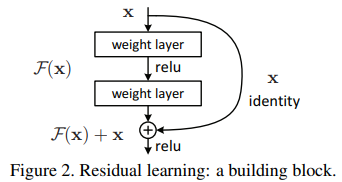

- x는 input, F(x)는 일반적인 Conv, BN, relu 같은 레이어를 거친 것을 의미한다. F(x)에 shortcut connection으로 x를 더해주어 F(x)가 아닌 F(x)+x를 다음 레이어로 전달한다. 여기서 shortcut connection이란 하나 이상의 레이어를 skipping하는 걸 말한다.
- Deep residual net은 단순하게 레이어만 쌓아올린 plain network보다 최적화가 쉽고 성능이 더 높다. 또한 네트워크의 depth가 증가하더라도 좋은 performance를 낼 수 있다.

# 3. Deep Residual Learning

### Residual Learning

- 기존의 뉴럴넷은 아래 왼쪽 그림과 같이 레이어를 쌓아 입력 x값이 target값 y를 잘 맵핑하는 H(x)를 찾는 것이 목표였다.

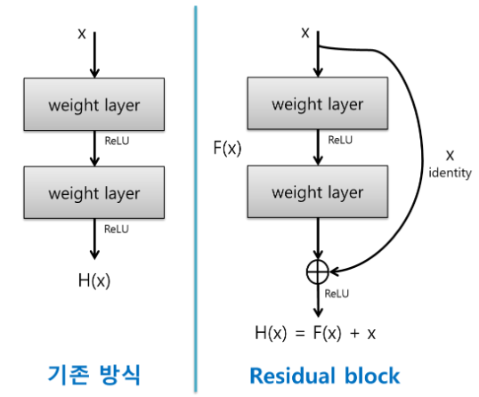

- 그러나 Residual block에선 H(x)가 F(x) + x가 된다. (여기서 F(x)는 weight layer와 ReLu를 의미한다.)
- Residual block에서 x는 F(x)와 element-wise add연산이 이루어지기 때문에 x는 변하지 않는 값으로 볼 수 있다. 만약 H(x) = F(x) + x에서 F(x)가 0이라면 H(x) = x가 되고 입력값과 출력값이 같아지게 된다. 그러므로 F(x)가 0에 가까울만큼 매우 작은 값이라면 H(x)는 입력 x와 매우 비슷하다고 볼 수 있다.
- 따라서 ResNet에선 적절한 H(x)를 찾는 것이 아니라 적절한 residual function F(x) = H(x) - x를 찾는 것이 목표가 된다. 여기서 H(x) - x를 residual(잔차)라 부르며 이 값이 최소가 되도록 학습하기 때문에 Residual learning이라 부른다. 또한 이러한 element-wise add연산은 추가적인 파라미터를 필요로 하지 않기 때문에 Complexity를 증가시키지도 않는다.
- 따라서 학습의 방향이 어느정도 정해져있고(?) back-propagation 과정에서 기울기가 사라지지 않기 때문에 gradient vanishing 문제를 방지할 수 있다.

- 논문에서 제안하는 residual block은 아래 수식 (1)과 같이 정의할 수 있다.
    - 여기서 x, y는 input, output이며 function F는 Conv, relu Conv를 의미한다.

$$y = F(x, {W_i}) + x. \qquad (1)  \newline\   \\ F = W_2\sigma(W_1x) $$

- 한가지 주의해야할 점은 F + x는 element-wise addition 연산이기 때문에 dimension이 일치해야 한다. dimension이 일치하지 않는 경우 linear projection을 사용하여 dimension을 맞춰준다.

$$y = F(x, {W_i}) + W_sx.\qquad (2)$$

### Network Architectures

- 네트워크 간 비교에서 VGG19, Plain net, ResNet34를 비교한다.
- Residual block에서 element-wise add 연산은 dimension이 서로 일치해야 하기 때문에 채널 수가 다른 경우 1x1 conv를 통해 채널 수를 맞춰준 뒤 add연산한다.
- ResNet의 shortcut connection은 identity mapping으로 element-wise add연산을 수행하기 때문에 dimension이 일치해야 한다. 아래 그림에서 실선은 일반적인 shortcut connection이고 점선의 경우 dimension이 일치하지 않기 때문에 dimension을 증가시켜 연산한다.
- dimension을 증가시키기 위한 방법으로 2가지를 고려해볼 수 있음
    1. zero padding을 이용하여 dimension을 맞춰줌 (이 경우 추가적인 파라미터는 없음)
    2. 1x1 convolution을 이용하여 dimension을 맞춰줌. (shortcut connection으로 오는 x에 1x1 conv를 사용하여 dimension matching하는 걸 projection shortcut이라 부름)

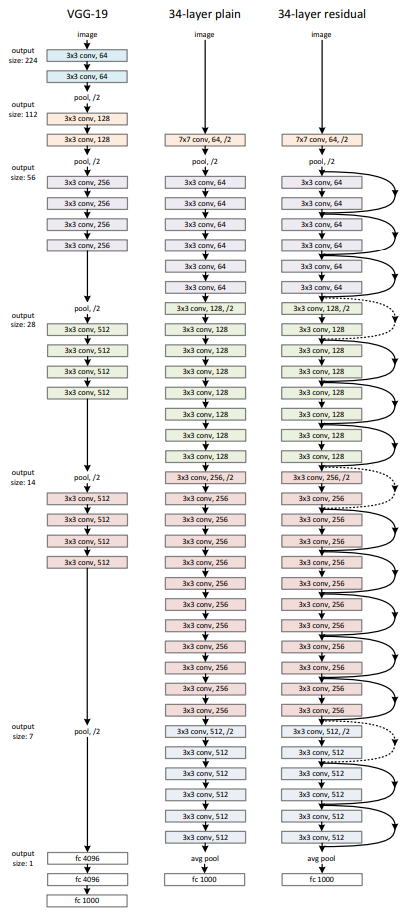

- ResNet 아키텍처 구조

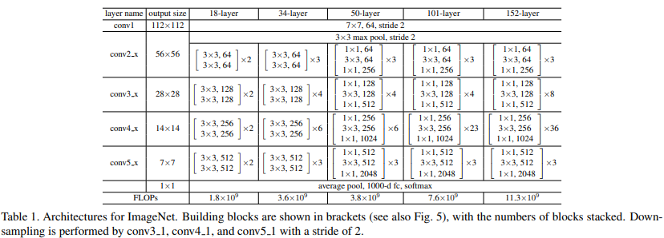

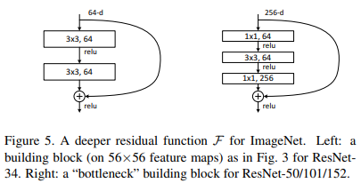

# 4. Expriments

### Plain Networks.

- ImageNet error, 얇은선 = training error, 굵은 선 = validation error
- Plain Network의 경우(아래 그림 왼쪽) 레이어를 더 많이 사용했을 경우 error가 더 높았다.
- 그러나 논문에서 제안하는 Residual block을 적용했을 경우 레이어가 더 많은 모델의 성능이 더 높은 것을 확인할 수 있다.
- 이 실험에서 plain network의 성능이 안 좋은 이유는 degradation문제가 아니고 단지 제안하는 solution을 적용했을 때 잘 작동한다는 것을 보여주는 결과임

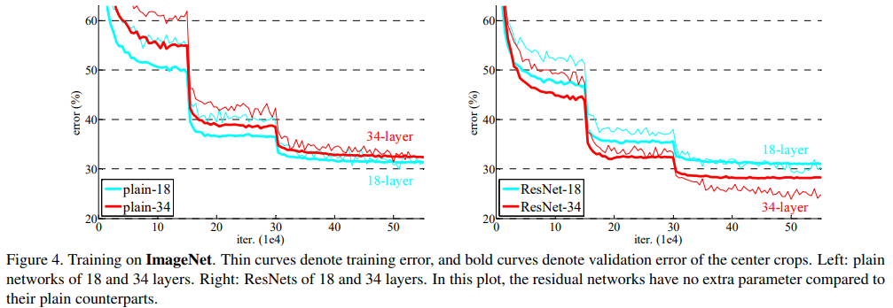

### Residual Networks.

- 3가지 major observation
    1. ResNet-18보다 ResNet-34가 training error도 낮고 validation data에 대해서 일반화가 더 잘되는 걸 볼 수 있다. 이는 ResNet이 degradation 문제를 잘 잡아주고 네트워크의 depth를 늘렸을 때도 좋은 성능을 얻을 수 있다는 걸 의미한다.
    2. plain-34, ResNet-34를 비교했을 때 ResNet의 성능이 더 높으며 이는 residual learning이 deep 모델에서 잘 작동하며 효과적임
    3. plain-18, ResNet-18을 비교했을 때 성능면에서 크게 차이가 나지 않는다. 그러나 ResNet의 수렴이 훨씬 빨랐다. ResNet의 최적화가 더 빠르고 쉽다.

    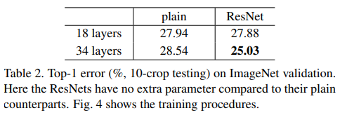

### Identity vs. Projection Shortcuts.

- short connection으로 element-wise add연산을 할 때는 dimension이 일치해야 한다. dimension이 일치하지 않는 경우 이를 맞춰주기 위해 linear projection을 사용한다. Table 3에서 ResNet-A, B, C는 서로 다른 유형의 linear projection을 사용하였다.

    A. zero-padding shortcut: dimension을 늘리기 위한 경우에 사용

    B. projection shortcut: dimension을 늘리기 위한 경우에만 사용하고 나머지 shortcut에선 일반적인 identity mapping 사용

    C. 모든 shortcut을 projection (모든 shortcut connection이 projection shortcut이라는 뜻인듯)

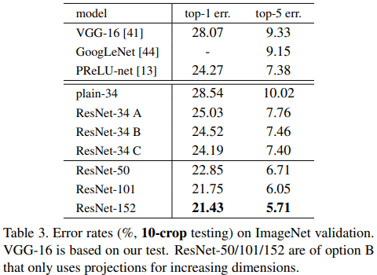

- A, B, C 모두 plain-34보단 성능이 좋다.
- B는 A보다 조금 더 better하다. A의 zero-padded dimension, 즉 0으로 채워진 부분은 residual learning이 아니기 때문
- C는 B보다 조금 좋긴하지만 projection shortcut에 의해 추가적인 파라미터가 발생한다는 단점이 있다. 따라서 projection shortcut은 더 이상 사용하지 않는다.
- Identity shortcut은 parameter free하다는 점도 중요함

### Deeper Bottleneck Architectures.

- Deeper Network의 경우 오른쪽과 같은 bottleneck design을 적용한 residual block을 사용한다.
- 여기서 1x1을 사용하는 이유는 cost를 줄이기 위해 dimension을 줄이고 이후 element-wise add 연산을 위해 다시 dimension을 맞춰주기 위해 사용한다.
- 이러한 구조가 projection shortcut 구조보다 더 효율적임

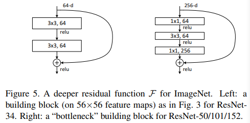

- ResNet의 레이어를 101, 152개 사용했을 때도 VGG와 비교했을 때 오히려 lower complexity

### CIFAR-10 and Analysis

- 다른 모델들과 비교했을 때
- ResNet-110은 evaluation을 5번 한 거라서 평균, 표준편차까지 기록됨

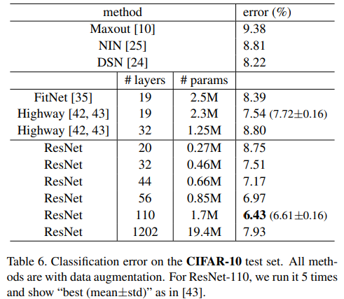

- ResNet이 plain network보다 error rate이 낮음
- 레이어를 1200개까지 늘려봤는데 training error는 비슷한데 testing error가 더 높게 나옴
- CIFAR-10은 상대적으로 small dataset이기 때문에 레이어를 1202개까지 사용할 필요가 없다고 봄

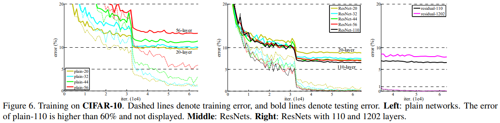

### Object Detection on PASCAL and MS COCO

- Table 7에선 Faster R-CNN의 backbone을 VGG16에서 ResNet-101로 바꿨을 때 결과. VGG보다 ResNet을 썼을 때 mAP가 더 높음
- Table 8은 COCO validation 결과로 VGG보다 더 높은 성능을 보임
- mAP@.5는 IoU를 0.5로 했을 때 mAP를 의미함
- mAP@[.5, .95]는 IoU를 0.5부터 0.95까지 0.05씩 증가시켜 총 10개 케이스에 대한 IoU를 구하고 이를 평균낸 값

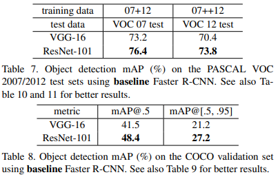

### Object Detection Improvements

- Object detection의 성능을 높이기 위해 3가지 technique을 적용함
- Box refinement
    - Faster-RCNN에서 final output은 regressed box이며 이 box는 proposal box와 different하다. 따라서 regressed box로부터 새로운 feature를 pooling하여 새로운 classification score와 regressed box값을 도출함. 총 300개의 new prediction을 구하고 IoU가 0.3인 Non-Maximum suppression을 적용
- Global context
    - global context를 combine하는 것. 이미지가 주어졌을 때 global Spatial Pyramid Pooling을 적용. pooled feature가 RoI layers로 들어간 뒤 global context feature를 뽑아내고 global feature를 classification, box regression layer로 입력함
- Multi-scaling testing
    - testing에서만 multi-scaling을 적용함. 학습된 모델로 image pyramid에서 {200, 400, 600, 800, 1000} 크기의 feature를 추출. 인접한 사이즈의 feature를 2개 선택하여 RoI pooling과 이후 레이어들을 거친 뒤, maxout을 사용하여 merge함

- baseline model보다 box refinement, context, multi-scale testing을 적용했을 때 성능이 개선됨
- class별로 AP를 계산했을 때 거의 모든 class에서 성능 개선이 이루어짐

    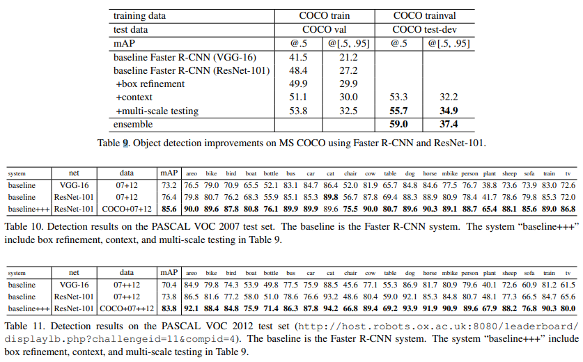

### References

[https://bskyvision.com/644](https://bskyvision.com/644)
