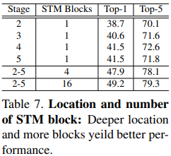

# STM: SpatioTemporal and Motion Encoding for Action Recognition

# Abstract

- Spatiotemporal feature와 motion feature는 video action recognition을 위한 매우 중요한 정보
- 최근 SOTA 모델들은 3D CNN을 이용하여 spatio-temporal feature와 motion feature를 학습하기 위해 2 stream 방식을 많이 사용함
- 본 논문에서는 2D framework를 사용해서 spatio-temporal feature와 motion feature를 효율적으로 인코딩할 수 있는 방법을 제안함
- 제안하는 STM block은 spatio-temporal feature를 추출하기 위한 CSTM(Channel-wise SpatioTemporal Module)과 motion feature를 추출하기 위한 CMM(Channel-wise Motion Module)로 구성됨
- ResNet을 backbone으로 하여 기존의 residual block을 STM block으로 교체함. 따라서 구조가 심플하면서도 효과적임
- temporal-related dataset과 scene-related dataset에서 기존 SOTA 모델보다 높은 성능을 달성함

# Background knowledge: Optical flow란?

- 연속된 두 frame 사이에서 첫번째 frame의 pixel이 두번째 frame에서 어느 위치로 이동했는가에 대한 motion 정보를 vector를 이용하여 나타낸 것

    

- 모든 점에 대한 vector를 그리기 힘들고 제대로 알아보기 힘들기 때문에 일반적으론 HSV color map을 이용하여 표현함
- Hue(색상), Saturation(채도), Value(명도)
- Hue(색상)을 사용하여 direction을 표현
- Saturation(채도)를 사용하여 magnitude를 표현

    

- [https://www.youtube.com/watchv=Z_t0shK98pM&list=PL_skMddDjnzq1wDI3t2cH9hlK6wBBapeA&index=14](https://www.youtube.com/watch?v=Z_t0shK98pM&list=PL_skMddDjnzq1wDI3t2cH9hlK6wBBapeA&index=14)

# Introduction

- 기존의 action recognition모델들은 크게 two-stream 방식을 사용하는 모델과 3D CNN을 사용하여 spatio-temporal feature를 동시에 추출하는 모델, 2가지로 분류할 수 있음.
- 3D CNN이 spatio-temporal feature를 잘 추출할 수 있지만 성능을 더 끌어올리기 위해 optical flow(motion feature)를 같이 사용하는 경우가 있음
- 그렇기에 spatio-temporal feature와 motion feature는 action recognition에서 상호보완적이라 할 수 있음. 그렇지만 3D CNN이나 two-stream 구조 등은 real application에서 사용하기엔 computing cost가 크다는 단점이 있음.
- 따라서 본 논문에서는 3D conv나 optical flow 등을 사용하지 않고, 2D CNN framework에서 SpatioTemporal and Motion feature를 integrate할 수 있는 STM network를 제안함. 제안하는 모델은 구조가 심플하면서도 효과적이다.
- CSTM에선 spatio-temporal feature를 추출하고 CMM에선 motion feature를 encoding하여 두 feature를 combine하는 identity mapping을 사용한다.
- 본 논문의 main contribution은 다음과 같다.
    - 2D CNN 안에서 상호보완적이라 할 수 있는 spatio-temporal and motion feature를 encoding 하는 CSTM, CMM 모듈을 제안한다.
    - 제안하는 STM Network는 기존의 ResNet 아키텍처를 기반으로 약간의 cost만 늘어나지만 매우 심플하면서 효과적이라 할 수 있음
    - 실험에서 spatio-temporal and motion feature를 동시에 integrate하는 방법을 통해 성능을 높일 수 있다는 걸 보여줌.

# Approach

- 본 논문의 technical approach는 CSTM과 CMM이라는 새로운 모듈은 제안하여 spatio-temporal feature와 motion feature를 효과적으로 추출하겠다는 것.

### Channel-wise SpatioTemporal Module

- CSTM은 rich spatial and temporal feature를 효율적으로 추출할 수 있는 모듈. 특히, temporal-related action recognition에서 performance를 높일 수 있음
- input feature map으로 5 dimension (N, T, C, H, W)이 들어오고 (NHW, C, T) 차원으로 reshape한 뒤 T dimension에서 channel-wise 1D Conv를 수행함.

    ⇒ 여기서 (N, T, C, H, W) 5차원 input을 (NHW, C, T)로 reshape하는데 NHW를 하나의 dimension으로 묶어버리는게 잘 이해가 안감. (N, HW, C, T)가 되어야 맞는 거 아닌가 생각했는데 논문에서 명확하게 (NHW, C, T)로 언급하고 있어서 추후 확인하여 보강할 예정.

- 일반적인 convolution대신 channel-wise convolution을 사용하는 이유는 채널마다 semantic information이 다르기 때문. 따라서 각 channel마다 서로 독립적인 conv filter들이 학습되게끔 하기 위해 channel-wise conv를 사용함.
- 또한 channel-wise conv를 사용하면 computation cost를 줄일 수 있는 효과가 있음. 전체 채널을 G(groups)로 나누었을 때 computation cost가 G배 감소함. (group convolution)
- 1D Conv의 kernel size는 3, 1D Conv 수행한 뒤 2D Conv를 하기 위해 다시 Reshape하여 3x3 2D Conv로 local-spatial 정보를 추출함
- 1D Conv는 temporal information을, 2D Conv는 spatial information을 추출하기 위해 사용

- 아래 Figure 1을 보면 CSTM이 spatiotemporal feature를 잘 학습했다는 걸 알 수 있음. CSTM의 output feature map(third row)을 보면 background가 아니라 사람의 손 같이 action의 main part가 되는 요소에 더 집중함

    

### Channel-wise Motion Module

- lightweight인 CMM(Channel-wise Motion Module)을 사용하여 인접한 frame에서 motion pattern을 추출
- CMM을 사용하면 optical flow를 사용하지 않는다는 점에서 효율적인 방법이라 할 수 있음. CMM을 통해 motion representation을 더 키워서 action recognition의 성능을 높임
- 따라서 optical flow를 계산해야 하는 pre-computed 과정이 필요 없으며, 심플하게 비디오의 RGB frame만 이용하여 motion 정보를 추출함
- input feature map (N x T x C x H x W)이 입력으로 주어지는데 computation cost를 줄이기 위해 1x1 conv를 먼저 수행하여 채널 수를 1/16로 줄임.
- 그런 다음, 연속된 2 feature map마다 feature level motion information을 추출함. 예를 들어, F_t, F_t+1 (t시점에서의 feature map과 t+1시점에서의 feature map)이 있을 때, t+1 시점의 feature에 2D Conv를 한번 해준다음 F_t+1에서 F_t를 subtract함
- 여기서 T는 video clip을 만들기 위해 전체 비디오 프레임에서 추출한 프레임 수. 따라서 F_t부터 F_t+1, F_t+2 ... 까지 총 T개의 feature map이 존재함. 인접한 두 프레임끼리 subtract하여 feature map을 만들기 때문에 총 T-1개의 feature map이 만들어짐
- 기존의 input feature와의 temporal size를 맞춰주기 위해 마지막 time step motion information에 zero 값을 사용. 그런 다음 모든 feature map을 concat한 뒤 1x1 conv 수행
- 제안하는 CMM을 통해 motion feature를 추출할 수 있게 됨. motion feature는 spatio-temporal feature와 상호보완적인 관계이기 때문에 두 feature를 사용하면 model이 효과적으로 행동을 인식할 수 있게 됨.

### STM Network

- 위에서 제안한 CSTM, CMM을 combine하여 STM block을 만듦. STM Network는 ResNet 아키텍처를 기반으로 하기 때문에 기존의 residual block을 STM block으로 모두 교체함

    

- STM block에선 CMM, CSTM으로 가기 전에 1x1 conv를 먼저 수행함. feature의 채널 수를 줄여 cost를 줄이기 위한 목적
- CSTM과 CMM을 통해 나온 각 feature map을 element-wise sum연산한 뒤 다시 1x1 conv를 통해 channel 수를 늘려서 STM block의 input feature map과 element-wise sum.
- 실험에서 concat하는 것보다 sum하는 것이 더 성능이 좋았기 때문에 concat대신 summation연산 사용.

# Experiments

### Datasets

- 실험에 사용되는 데이터셋은 크게 2가지 카테고리로 분류됨.
    1. temporal-related dataset (Something-Something v1 & v2, Jester)
    2. scene-related dataset (Kinetics400, UCF-101, HMDB-51)
- temporal-related dataset에서 object의 temporal motion interaction은 action을 이해하는 중요한 key point. 대부분의 action들은 이러한 temporal relationship을 고려해야 제대로 인식할 수 있음. 아래 Figure 4, Top 부분의 이미지를 보면 시간 순으로 봤을 때 뚜껑을 여는 것처럼 인식하지만 역순으로 보면 뚜껑을 닫는 것으로 볼 수 있음. 따라서 temporal 정보는 정확하게action을 인식하기 위한 매우 중요한 요소라 할 수 있음.
- scene-related dataset에선 background information이 action을 인식하기 위한 많은 정보를 담고 있음. 따라서 scene-related dataset에선 temporal relation의 중요도가 temporal-related dataset에 비해 상대적으로 떨어짐. 말 타는 action의 연속된 frame이 있지만, 굳이 여러 frame을 보지 않고 한 장의 frame만 보고도 무슨 action을 하는지 인식할 수 있음. 따라서 background 혹은 object만 보고도 행동을 인식할 수 있음
- Figure 4에서 temporal-related data와 scene-related data의 차이를 보여줌. 논문에서 제안하는 method는 spatio-temporal 정보와 motion 정보를 효과적으로 추출하기 위해 설계되었기 때문에 temporal-related dataset에 더 적합하다고 볼 수 있음. 그러나 scene-related dataset에서도 competitive result를 보여줌.

    

### Implementation Details

- **Training**
    - 비디오 전체 프레임을 T segment로 나눔. 각 segment에서 랜덤하게 1 frame씩 sampling하여 input sequence를 만듦. 따라서, input sequence는 T개의 frame으로 구성됨
    - Data augmentation 적용: corner cropping, scale-jittering
    - 224x224로 resizing
    - network의 input size는 N x T x 3 x 224 x 224.
        - N = batch size
        - T = 비디오에서 샘플링된 프레임 수 (8 or 16)
    - ImageNet pre-trained model로 초기화한 모델 사용
    - CSTM의 temporal channel-wise 1D Conv에서 feature의 전체 channel을 quarter로 나누고 first quarter에선 kernel을 [1,0,0]으로 초기화, last quarter에선 [0,0,1]로 초기화, 나머지 중간 quarter들은 [0,1,0]으로 초기화함
    - CMM은 random initialization
- **Inference**
    - 256x256 size로 3개 crop한 뒤, 224x224로 다시 resize.
    - video에서 frame추출할 때, 각 segment에서 랜덤하게 추출하기 때문에 총 10개의 clip을 만들어서 개별적으로 softmax score 출력 후 final prediction은 평균내어 사용

### Results of Temporal-Related Datasets

- Table1. Something-Something v1 & v2 dataset에서 SOTA 모델과 비교

    

- baseline model인 TSN과 비교했을 때 v1 & v2에서 제안하는 STM의 top-1 accuracy가 훨씬 높은 성능을 보여줌.
- S3D-G, ECO, I3D+GCN는 3D CNN 기반의 모델, TRN, MFNet, TSM은 2D CNN 기반의 모델
- STM 8 frame은 optical flow를 사용하면서 frame도 더 많이 사용하는 모델이랑 비교했을 때도 SOTA 성능을 달성함
- STM 16 frame은 validation set에서 best performance를 보여주었고 test set에서 top-1 accuracy는 살짝 낮음
 
 
 
 
- Table 2. Jester dataset

    

- STM 8/16 frame은 모든 지표에서 SOTA 달성

### Results on Scene-Related Datasets

- Table 3. Kinetics-400 dataset, SOTA 모델과 비교. 여기선 STM 16 frame

    

- 앞서 말했던 것처럼 Scene-related dataset은 temporal-related dataset과 차이가 있다.
- Kinetics dataset의 action은 연속된 frame이 아닌 특정 frame만 가지고 그 안에 있는 scene or object 정보를 통해 어떤 action을 하는지 인식할 수 있다. 따라서 temporal modeling을 하지 않는 모델들도 괜찮은 성능을 낸다.
- 본 논문에서 제안하는 STM은 temporal-related action recognition에 좀 더 focus를 두고 있음. 그럼에도 불구하고 optical flow까지 사용했던 I3D와 성능이 크게 차이나지 않는다. 또한 3D CNN기반의 methods보다 높은 성능을 낸다.
 
 
 
 
- Table 4. UCF-101, HMDB-51 dataset

    

- HMDB-51 dataset에서 ImageNet으로 pre-train시킨 모델과 Kinetics로 pre-train시킨 모델을 비교했을 때 Kinetics dataset으로 pre-train하는 게 훨씬 성능이 좋음
- STM보다 I3D two-stream, TSN two-stream의 성능이 약간 더 좋음. 그러나 I3D, TSN은 optical flow를 추가적으로 사용하지만 STM은 optical flow를 사용하지 않고도 준수한 성능을 냄
- STM을 I3D-RGB과 비교했을 때 UCF-101 dataset에서는 성능이 더 좋음. I3D-RGB가 3D CNN을 기반으로 하기 때문에 STM의 computation cost 효율성이 훨씬 좋음

### Impact of two modules

- STM block은 CSTM과 CMM 두 모듈을 combine하여 사용함. CSTM과 CMM의 성능을 개별적으로 비교해봄. Something-Something v1 dataset으로 비교.

    

- 당연히 STM(CSTM+CMM)을 썼을 때 성능이 제일 높음. CSTM이 temporal fusion 정보를 학습하고 CMM은 motion 정보를 학습하기 때문에 두 모듈을 같이 사용하여 combine하면 richer spatio-temporal & motion feature를 학습할 수 있음.

### Fusion of two modules

- CSTM과 CMM을 combine할 때 summation할 건지 concatenation(channel dimension을 기준으로 concat)할 건지 비교함. concat보다 summation이 더 잘 나옴

    

### Location and number of STM block

- STM block을 ResNet stage의 어느 부분에 넣을건지 혹은 STM block을 여러 번 사용할 건지

- 첫번째 컬럼은 해당 stage에서 STM block을 1개만 사용했을 때의 결과. STM block을 하나만 사용했을 때도 TSN보다 성능이 잘 나오는 걸 알 수 있음
- 또한 STM block을 stage 2보다 stage 5에서 썼을 때 성능이 더 높게 나옴. 그 이유는 temporal modeling은 receptive field가 클 때 전체적인 feature를 capture할 수 있기 때문.
- 그 외에 2, 3, 4, 5 각 stage에서 STM block을 여러 개 사용했을 때 performance가 훨씬 잘 나옴. best model은 각 stage에서 16개씩 사용했을 때 best

### Type of temporal convolution in CSTM

- CSTM의 conv 연산을 channel-wise vs ordinary

    

- Ordinary convolution보다 channel-wise convolution을 사용하는 것이 accuracy, parameter, FLOPs 모든 측면에서 효과적임

### Runtime Analysis

- 제안하는 모델의 속도 평가

    

- 이전 실험에서 봤듯이, 제안하는 STM이 accuracy 측면에서 SOTA를 달성함. 여기서 중요한 것은 STM은 2D CNN 기반이며 3D convolution이나 optical flow를 사용하지 않고도 SOTA를 달성했다는 점
- 따라서 이번에는 STM과 기존의 SOTA모델들의 accuracy와 speed등 여러 지표를 같이 비교하여 평가함
- 동등한 비교를 위해 모든 평가는 single GTX 1080TI GPU를 사용하였으며 sampling frame도 8 or 16으로 맞추고 center crop.
- 속도를 평가할 때 batch size는 16을 사용했고 data loading하는 시간은 제외하였음
- STM(8 frame)을 I3D, ECO와 FLOPs 비교했을 때 연산량이 대략 10배, 2배 적음에도 불구하고 accuracy는 더 높음
- STM(8 frame)을 TSM(16 frame)과 비교했을 때 속도는 약 1.5배 빠르면서 정확도는 2.7%가량 더 높고 연산량도 절반가량 적음
- 종합해보면, 다양한 지표를 가지고 비교했을 때도 제안하는 모델은 성능도 좋고 연산량, 파라미터, 속도 측면에서도 우위를 점하기 때문에 효율적인 모델이라고 평가할 수 있음

# Conclusion

- 본 논문에서 simple하면서 효과적으로 action recognition 문제를 풀 수 있는 방법을 제안함.
- 제안하는 방법은 2D CNN에서 spatio-temporal feature와 motion feature를 동시에 encoding할 수 있음
- 기존의 ResNet 아키텍처를 기반으로 STM network를 만들었으며 3D convolution이나 optical flow를 사용하지 않고도 temporal-related dataset과 scene-related dataset에서 SOTA를 달성하였다.
