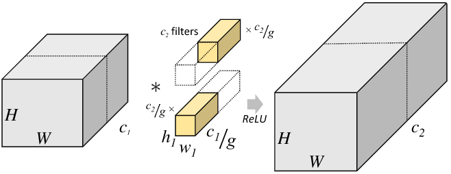

# ShuffleNet: An Extremely Efficient Convolutional Neural Network for Mobile Devices

# Abstract

- extremely computation-efficient CNN 아키텍처인 ShuffleNet을 제안한다.
- ShuffleNet은 pointwise group convolution과 channel shuffle이라는 두 operation을 utilize하여 정확도는 유지하면서 computation cost를 많이 줄였다.
- ImageNet classification & MS-COCO object detection에서 MobileNet보다 더 높은 성능을 달성
- ARM 기반의 mobile device에서 AlexNet와 비교했을 때 comparable accuracy를 유지하면서도 13배 빠른 속도를 냄

# Introduction

- deeper and larger CNN을 설계하여 다양한 vision 문제를 해결하는 것이 하나의 트렌드가 되었다. 대개, 이러한 모델들은 레이어가 100개가 넘어가거나 채널이 1000개가 넘어가기 때문에 computation 측면에서 billoions of FLOPs를 필요로 한다.
- 이와 같은 문제는 드론, 로봇, 스마트폰과 같이 10~100 MFLOPs 정도의 성능을 내는 환경에선 문제가 될 수 있다.
- 따라서 pruning, compressing or low-bit representation 네트워크 아키텍처들이 제안되어왔지만 본 논문에서는 computing range 측면에 초점을 두고 매우 효율적인 새로운 아키텍처를 제안한다.
- 기존의 SOTA를 달성했던 Xception, ResNeXt과 같은 모델들은 1x1 convolution에서 발생하는 비용이 너무 크기 때문에 효율적인 모델이라고 할 수 없다. 따라서 1x1 convolution에서 발생하는 computation complexity를 줄이기 위한 pointwise group convolution을 제안한다.
- 또한 group convolution 사용에서 발생하는 부작용을 방지하기 위해 channel shuffle이라는 operation을 제안한다.

# Related Work

### Efficient Model Designs

- 딥 뉴럴넷의 디자인이 여러 task에서 중요한 역할을 함
- GoogLeNet은 단순히 컨볼루션 레이어를 쌓는 것 대신 complexity를 낮춰서 레이어를 여러 개 쌓아도 complexity가 크게 증가하지 않도록 설계함
- SqueezeNet은 파라미터와 computation을 줄이면서도 accuracy를 유지
- ResNet은 효율적인 bottleneck 구조를 제안하여 성능을 크게 개선함

### Group Convolution

- feature map의 채널을 일정 그룹으로 나누어 각 그룹마다 독립적인 컨볼루션 연산을 수행하는 방식

    

### Channel Shuffle Operation

- group convolution의 사용에서 발생하는 문제를 보완하기 위한 channel shuffle operation을 사용한다.
- 그룹 컨볼루션 레이어 다음에 random channel shuffle을 쓰는 경우가 있는데 잘 사용되지 않았음

# Approach

### Channel Shuffle for Group Convolutions

- Xception, ResNeXt 같은 네트워크들은 효율적인 depthwise separable convolution이나 group convolution을 사용하여 block을 설계하였다. 그러나 이러한 모델들은 1x1 convolution의 complexity를 간과하는 부분이 있다. ResNeXt는 group convolution을 3x3 conv에서만 사용하는데 ResNeXt에서 1x1 conv가 93.4% 가량의 연산량을 차지한다.
- 따라서 ShuffleNet에서는 group convolution을 1x1 convolution에 사용하는 방법을 통해 computation cost를 줄인다.
- 그런데 group convolution layer가 여러 개 쌓이다보면 output feature map의 특정 채널은 input feature map의 특정 그룹에서 나온 것이기 때문에 representation이 약해지고 information flow가 원활하게 이루어지지 않는 문제가 발생한다. Fig 1. (a)
- 그러나 Fig 1. (b)처럼 feature map의 채널 정보가 특정 그룹에서만 얻어지는 게 아니라 여러 개의 다른 그룹에서 얻어진다면 앞서 말한 문제점을 방지할 수 있다. 이러한 연산은 group convolution으로부터 나온 feature map을 여러 개의 sub group으로 나눈 뒤, 각 sub group마다 다음 레이어의 다른 sub group으로 정보를 전달한다.
- 이 연산을 channel shuffle operation이라 한다. 만약 그룹의 수가 g, 각 그룹마다 채널 수가 n개 있을 때, group convolution의 output feature map은 gxn개의 채널을 갖게 된다. 여기서 channel dimension을 (g, n)으로 reshape하면 width x height x channel이었던 텐서가 width x height x groups x n으로 reshape되고 이 텐서에서 groups와 n 축을 permute하여 채널 정보가 셔플링되게 만든다.
- 실제 keras에선 permute_dimensions()를 사용하여 channel shuffle을 수행할 수 있다. [https://www.tensorflow.org/api_docs/python/tf/keras/backend/permute_dimensions](https://www.tensorflow.org/api_docs/python/tf/keras/backend/permute_dimensions)

- channel shuffle operation은 두 컨볼루션 레이어의 그룹 수가 다르더라도 적용할 수 있으며 미분이 가능하기 때문에 end-to-end training을 위한 네트워크 구조에 쉽게 임베딩될 수 있다.
- channel shuffle operation을 통해 group convolution layer를 여러 개 쌓는 네트워크를 더 powerful하게 만들어준다.

### ShuffleNet Unit

- group convolution과 channel shuffle operation의 이점을 살려 ShuffleNet을 구성하는 ShuffleNet Unit을 제안한다. 제안하는 Unit (A)는 bottleneck principle은 ResNet을 참조하여 설계하였으며 3x3 conv layer를 3x3 depthwise convolution으로 대체하였다.
- Unit (B)에서는 Unit (A)의 1x1 conv를 1x1 group conv로 대체하였으며 첫번째 1x1GConv 이후 Channel Shuffle 연산을 사용한다. 아래쪽에 있는 1x1 GConv는 Add 연산을 하기 위해 dimension을 맞춰주는 용도이자 Unit 구조의 간결성을 위해 추가적인 channel shuffle operation은 사용하지 않는다.
- Unit (C)에선 shortcut path로 3x3 Avg Pooling을 사용한 뒤 오른쪽 path와 Concat 연산하여 다음 레이어로 전달한다.
- 일반적인 CNN 구조에선 레이어를 거칠수록 spatial size는 줄어들고 channel 수는 늘리는 형태를 취하며 spatial size를 줄이기 위해 pooling을 feature map의 채널 수를 늘리기 위해 kernel 개수를 늘리지만 ShuffleNet Unit (C)에서는 3x3 Avg Pool, 3x3 DWConv에서 stride값을 다르게 주어 spatial size를 줄이고 concat을 통해 채널 수를 늘리는 방식을 취한다.

    

- Group convolution과 channel shuffle operation을 적용한 ShuffleNet unit의 complexity를 다른 모델의 block과 비교. input size c x h x w, bottleneck channels = m이라 할 때 각 block마다 연산량은 아래와 같으며 ShuffleNet의 연산량이 가장 작다.

    

- 따라서, 주어진 computational budget에서 사용하기에 ShuffleNet이 가장 효율적이다.
- 또한 depthwise convolution이 이론적으론 low complexity지만 실제 low-power mobile device에서 효율적으로 구현하기 어렵다는 점 그리고 computation/memory access 측면에서 다른 dense operation보다 좋지 않다는 문제가 있기 때문에 depthwise convolution은 bottleneck feature map에서만 사용한다.

### Network Architecture

- ShuffleNet의 전체 아키텍처는 아래 Table 1과 같다. ShuffleNet은 위에서 언급한 Shuffle unit은 Stage 2, 3, 4에서 반복되어 사용하였다. bottleneck channel은 1/4을 사용하였다.
- ShuffleNet Unit에서 그룹을 몇개로 사용할지는 pointwise convolution의 sparsity를 조절하는 역할을 한다. 따라서 group 수를 서로 다르게 하고 Complexity(MFLOPs)를 대략 140M으로 비슷하게 맞춰놓은 모델 5개를 사용하여 실험을 진행한다.
    

# Experiments

### Pointwise Group Convolutions

- 1x, 0.5x, 0.25x는 커널의 수를 조절하는 scaling factor. MobileNet의 width multiplier와 비슷

    

- g=1인 경우 group convolution이 적용되지 않은 것과 같음
- 대개 그룹 수를 점점 늘렸을 때 성능이 더 좋아지는 현상을 보임. 그러나 그룹 수를 무조건 늘린다고 반드시 성능이 개선되는 건 아님

### Channel Shuffle vs. No Shuffle

- Channel Shuffle operation을 사용했을 때 /안했을 때

    

- 모든 케이스에서 channel shuffle을 사용하는 것이 더 좋다.
- 또한 그룹의 수가 상대적으로 큰 경우 (g=8) channel shuffle로 인한 성능 향상 폭이 더 크다.

### Comparison with Other Structure Units

- VGG, ResNet 등 SOTA를 찍었던 모델들은 low complexity가 아니기 때문에 해당 모델들과 ShuffleNet의 Complexity를 비슷하게 맞춰놓고 비교함

    

- Complexit를 비슷하게 맞춰놓고 비교했을 때, 제안하는 ShuffleNet의 성능이 더 좋았다.

### Comparison with MobileNets and Other Frameworks

- Efficient model끼리 비교

    

- 다양한 Complexity에서도 ShuffleNet이 MobileNet보다 더 좋은 성능을 냄
- 특히 ShuffleNet은 < 150 MFLOPs의 small model을 설계하는데 초점을 맞추고 있기 때문에 Complexity가 낮은 지표에서도 ShuffleNet이 훨씬 더 좋은 성능을 냄
- Complexity가 40 MFLOPs인 비교에서 ShuffleNet의 레이어는 50개, MobileNet의 레이어는 28개다. 여기서 ShuffleNet의 레이어를 26개로 줄인 모델이 ShuffleNet 0.5x (shallow, g=3)임. 이 모델과 MobileNet을 비교했을 때도 ShuffleNet의 성능이 더 높다는 것은 deep model 보다 shallow model의 성능이 더 좋았다는 것이며 이는 단순히 depth가 아닌 ShuffleNet의 구조 자체가 효율적으로 설계되었기 때문에 더 효과적임을 보여주는 것.

- 다른 모델들과 비교했을 때 Complexity 측면에서 매우 효율적이며 error rate도 더 낮음

    

### Generalization Ability

- ShuffleNet을 object detection에 적용

    

- Detection framework는 Faster-RCNN을 사용
- Input resolution을 다르게 했을 때도 ShuffleNet의 mAP가 더 높음

### Actual Speedup Evaluation

- ShuffleNet의 inference speed evaluation

    

# References

[https://www.slideshare.net/JinwonLee9/shufflenet-pr054/19](https://www.slideshare.net/JinwonLee9/shufflenet-pr054/19)
 
[https://blog.yani.io/filter-group-tutorial/](https://blog.yani.io/filter-group-tutorial/)
