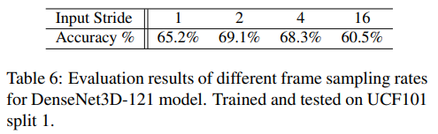

# Temporal 3D ConvNets: New Architecture and Transfer Learning for Video Classification

# Abstract

- fixed temporal convolution kernel depth대신 variable temporal convolution kernel depth를 사용하는 새로운 temporal layer를 제안한다.
- 2D DenseNet을 확장시킨 3D CNN에 새로운 temporal layer를 적용하여 T3D라는 새로운 네트웍을 제안한다.
- HMDB51, UCF101, Kinetics dataset에서 SOTA를 달성함
- pre-trained 2D CNN으로부터 3D CNN의 weight를 stable하게 initialization할 수 있는 transfer learning 방법을 제안함

# 1. Introduction

- 비디오에선 temporal information이 중요한데 이러한 정보를 잘 처리하기 위해 3D CNN을 많이 사용한다.  그러나 기존의 3D CNN은 long-range temporal information을 잘 다루지 못하거나 아래와 같은 문제가 있었다.
    1. 비디오 인식을 위한 3D CNN 아키텍처들은 2D ConvNet보다 더 많은 파라미터를 가지고 있다.
    2. 이러한 모델을 학습시키기 위해선 large labeled dataset이 필요하다.
    3. 성능을 더 높이기 위해 optical flow를 같이 사용하는 경우가 있는데 large scale dataset에선 그만큼 비용이 많이 든다.
- 위와 같은 문제점이 있지만 이를 보완할 수 있는 방법이 있다.
    1. 비디오에서 appearance와 temporal information을 잘 capture할 수 있는 효율적인 아키텍처가 필요하다. 이러한 정보를 잘 capture할 수 있다면 굳이 optical flow를 사용하지 않아도 된다.
    2. 서로 다른 아키텍처 간의 transfer learning을 통해서 네트웍을 처음부터 학습시켜야 하는 부담을 줄인다.
- 이와 같은 부분을 고려하여 deep spatio-temporal feature extractor network를 새롭게 제안한다.
- 제안하는 extractor는 3D conv kernel의 depth를 다양하게 모델링하여 shorter and longer time range에서도 temporal information을 잘 추출할 수 있다.
- 해당 레이어를 Temporal Transition Layer(TTL)이라 부르며 TTL은 서로 다른 temporal depth range로부터 추출된 temporal feature map을 concat하는 구조로 설계되었다. (즉 kernel depthth를 고정된 값으로 사용하지 않고 여러 depth를 가지는 kernel을 사용한다.)
- back-bone network로는 2D DenseNet을 기반으로 하였다. DenseNet에서 기존의 2D Conv, Pooling을 모두 3D로 교체하였다. 논문에서는 이 네트웍을 DenseNet3D로 부른다.
- DenseNet을 선택한 이유는 파라미터 측면에서 효율적이기 때문이며, 기존의 DenseNet에 있던 Transition Layer를 TTL로 교체한 모델을 Temporal 3D ConvNets(T3D)라 부른다.
- T3D는 appearance와 temporal information 정보를 densely, efficiently하게 capture할 수 있으며 이는 short, mid, long-range term에서도 잘 작동한다.
- 또한 3D ConvNet을 large-scale dataset으로 처음부터 학습시키는 건 너무 오래걸리기 때문에 이미지넷으로 사전학습된 2D CNN을 teacher로 두고 랜덤하게 초기화된 3D CNN을 transfer learning으로 학습시킨다.

- 논문의 main contribution은 크게 2가지로 볼 수 있다.
    1. short, mid and long-range에서 temporal information을 잘 capture할 수 있는 TTL을 제안한다.
    2. 3D ConvNet을 효율적으로 학습시키기 위해 사전 학습된 2D CNN을 이용하여 transfer learning으로 학습시킨다.

# 2. Related Work

- 기존의 아키텍처들은 고정된 kernel depth를 사용하기 때문에 long-range temporal information을 잘 다루지 못한다.

    ⇒ 우리는 이러한 문제점을 variable temporal depth를 사용하여 해결한다.

- transfer learning은 뉴럴넷을 효율적으로 학습시킬 수 있는 방법 중 하나인데 우리가 사용하는 transfer learning은 기존의 transfer learning과는 좀 다르다.

    ⇒ 우리는 2D CNN에서 3D CNN으로 supervision을 transfer하는 방식이며 다른 modality에서도 사용할 수 있다.

# 3. Proposed Method

- 우리의 goal은 short, mid long term dynamic을 잘 capture하는 것이며 이를 위해 TTL을 제안한다.
- TTL의 output feature map은 뒷단에 있는 DenseBlock내의 모든 레이어에 입력으로 들어가게 된다.(DenseNet의 dense connectivity 구조)
- 2D CNN에서 3D CNN으로 supervision, knowledge를 transfer learning하여 3D CNN을 처음부터 학습시킬 필요가 없다.

    ### 3.1 Temporal 3D ConvNets

    

    - DenseNet을 기반으로 하기 때문에 구조가 DenseNet이랑 비슷하다. 즉 Dense Block 내에서는 모두 dense connectivity 구조를 가지며 이전 레이어의 모든 feature map을 concat하여 다음 layer로 전달한다.
    - TTL에서는 서로 다른 kernel depth를 가지는 커널을 사용하여 feature를 추출한 뒤 concat하는 구조를 갖는다. channel 축으로 concat하기 때문에 spatial size는 모두 같다.
    - 따라서 TTL은 short, mid, long term dynamic를 잘 capture할 수 있으며 finxed depth를 사용한 커널에 비해 더 중요한 정보를 잘 추출하게 된다.

    ### 3.2 Supervision or Knowledge Transfer

    - 이미지넷으로 사전 학습된 2D CNN을 I, 랜덤 초기화된 3D CNN을 V라 할 때, I → V로 knowledge를 잘 전달하는 것이 목표이다. 따라서 수백만개의 파라미터를 가지는 V를 처음부터 학습할 필요가 없다.
    - 2D CNN에는 video frame을 입력으로, 3D CNN에는 video clip을 입력으로 한다. 해당 frame과 clip이 같은 time stamp를 사용하면 frame과 clip은 결국 같은 정보를 의미하는 것이고 입력으로 들어가는 방식만 frame이냐 clip이냐 차이다.

    

    - 2D, 3D CNN에서 나온 각각의 크기가 1024인 feature vector를 concat하여 2048짜리 vector를 만들고 뒤에 512, 128짜리 f.c layer를 추가한 뒤 마지막에 binary-classifier layer를 사용한다.
    - 주어진 frame pair가 video clip과 동일한 비디오에서 동일한 time stamp로부터 샘플링 된 경우 positive pair가 되고 서로 다른 비디오에서 샘플링된 경우 negative pair가 된다. 그리고 binary classifier는 frame pair가 video clip과 매칭되는지 아닌지 분류한다.
    - back-propagation 동안 2D CNN은 프리징되고 V(3D CNN)만 학습된다. 이런식으로 3D CNN을 stable한 weight initialization 시킨 뒤 target dataset에 대해 fine-tuning했을 때 모델이 target을 빠르게 adapt할 수 있었으며 모델을 처음부터 학습시켜야 한다는 비용이나 부담을 줄일 수 있게 된다.
    - frame과 clip을 샘플링하는 방식에서 positive pair / negative pair가 결정된다. 따라서 binary classifier가 예측한 값은 positive pair인지 negative pair인지 결정된 라벨과 비교하여 loss를 구하는 것 같다.

        ⇒ github에서 transfer learning으로 학습하는 코드가 없어서 틀릴 수도 있음

    # 4. Experiments

    ### 4.1. Architecture Search

    - 적절한 네트워크 아키텍처를 찾기 위해 네트워크의 사이즈, input data의 temporal-depth를 바꿔가며 search함

    

    - 기존의 2D-DenseNet 121, 169 구조를 기반으로 3D convolution을 적용하고 TTL을 추가한 네트워크를 T3D-121, T3D-169로 정의함. 구조는 Table 1과 같다.

    

    - T3D-121, T3D-169를 UCF101 split 1 dataset으로 테스트해본 결과, 3D DenseBlock을 더 많이 사용하는 T3D-169가 조금 더 성능이 좋았음
    - 논문 앞쪽에서는 2D DenseNet에서 2D conv, pooling layer를 3D layer 바꾼 모델을 3D DenseNet이라 부르고, 여기에 TTL을 추가한 모델을 T3D라고 부른다고 했는데 실험파트에서 DenseNet3D는 T3D를 의미함.

    

    - input data의 temporal depth가 activity recognition에서 중요한 key가 되기 때문에 이번에는 input data의 temporal depth를 다르게 주었을 때 성능이 얼마나 차이나는지 비교함.
    - input data의 temporal depth가 더 깊은 경우 성능이 더 좋았음

    

    - 다른 SOTA 아키텍처과 비교하기 위해 ResNet50, Inception 모델의 2D layer를 3D layer로 교체한 뒤 본인들의 아키텍처와 성능을 비교함
    - 역시 T3D가 성능이 가장 좋다.

    ### 4.2. Input Data

    - 적절한 frame resolution, frame sampling rate를 찾기 위한 실험

    

    - frame resolution을 224x224, 112x112로 해봤을 때 역시 resolution이 큰 경우 성능이 더 높았다.
    - 여기서 말하는 DenseNet3D-121은 T3D가 아니고 Table 1의 DenseNet3D-121 모델임..
    - T3D로도 해봤는데 224x224가 더 좋더라
    - 따라서 T3D를 Kinetics dataset으로 학습할 때 224x224 resolution을 사용하였다.

    

    - 이번에는 frame sampling rate에 대한 실험
    - input frame의 temporal stride를 다르게 했다는 거 같은데 이걸 frame sampling rate이라고 부르는게 잘 이해가 안 감.
    - 예를 들어 3D Conv에서 사용되는 커널이 temporal 축에서 sliding 되는 stride를 의미하는 듯?

    ### 4.3. HMDB51, UCF101, and Kinetics Datasets

    

    - 사용하는 Dataset의 정보

    ### 4.4. Implementation Details

    - Training
        - Supervision Transfer: 2D → 3D CNNs
            - SGD
            - mini-batch 32
            - weight decay 1e-4
            - Nesterov momentum 0.9
            - lr=0.1 and decrease by a factor of 10 every 30 epochs
            - maximum epochs is 150
        - Temporal 3D ConvNets
            - train T3D from scratch on Kinetics
            - resize video to 256x256, and then randomly 5 crops of size 224x224
    - Testing
        - decompose each video into non-overlapping clips of 32 frames
        - take 224x224 center-crop

    ### 4.5. Supervision Transfer

    

    - 2D → 3D CNN으로 transfer learning 한 뒤
    - 첫번째 컬럼(Transfer)은 UCF101 dataset으로 fine-tuning
    - 두번째 컬럼(FT-Transfer)은 UCF101, Kinetics dataset 절반으로 fine-tuning

    ### 4.6. Comparison with the state-of-the-art

    

    - Kinetics dataset으로 다른 SOTA 모델들과 비교
    - 논문에서 제안하는 DenseNet3D와 T3D는 ResNet3D-38, C3D보다 더 좋음
    - 그러나 RGB-I3D보다 성능이 뒤떨어짐. 그 이유는 T3D는 video clip이 32 frame인 반면 RGB-I3D는 64 frame을 사용했기 때문에 차이가 있음

    

    - UCF101, HMDB51 dataset으로 비교
    - 본 논문에서 제안하는 T3D, DenseNet3D은 Res3D, C3D보다 더 성능이 좋음

    # 5. Conclusion

    - variable temporal depth를 가지는 kernel을 사용하는 Temporal Transition Layer(TTL)을 새롭게 제안함
    - fixed 3D homogeneous kernel depth를 사용하는 것보다 variable temporal kernel depth를 사용하는 것이 더 효과적임
    - DensNet 아키텍처를 기반으로 Temporal 3D ConvNets(T3D)라는 모델을 설계함
    - 제안하는 TTL의 feature map은 densely하게 propagation되며 end-to-end로 학습됨
    - TTL feature map은 정보의 손실 없이 feature interaction을 더 expressive하고 efficient하게 모델링 할 수 있음
    - T3D를 action recognition dataset으로 evaluate해본 결과 HMDB51, UCF101 dataset에서 SOTA를 달성하였으며 Kinetics dataset에서도 좋은 성능을 보여줌
    - TTL은 다른 3D 아키텍처에도 사용하여 일반화 할 수 있음
    - 아키텍처 간의 transfer learning을 통해 3D CNN을 처음부터 학습시켜야 하는 비용을 줄일 수 있으며 3D CNN을 stable하고 valuable한 weight initialization할 수 있음
