# Traffic Speed Estimation from Surveillance Video

# 2018 AI City Challenge Track 1 Rank
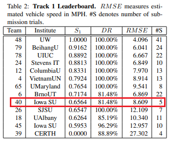

# Abstract

- Faster R-CNN with ResNet101을 이용하여 multi-object detection
- histogram comparison을 이용하여 object tracking
- pixel domain에서 real world의 speed를 구하기 위해 warping method를 적용
- 위 approach를 통해 intersection에서 vehicle speed estimation

# 1. Introduction

- vehicle speed estimating from video data
- **multi-object detection → tracking → converting speed**
    - **Multi-object detection**
        - Faster R-CNN with ResNet 101 as backbone

    - **Tracking**
        - Multi-object tracking(MOT), OpenCV provides tracking algorithms, such as MIL, BOOSTING, TLD, KCF...
        - But, this paper proposes a histogram-based tracking algorithm

    - **Converting speed**
        - Image warping to convert the perspective from one way to another
        - linear perspective transformation warping

# 2. Data description

- Track 1 data description, 2 highway ICs(Interchange) and 2 intersections

    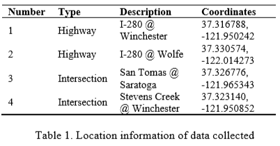

- video resolution is 1920x1080
- All cameras have overhead view

# 3. Methods and results

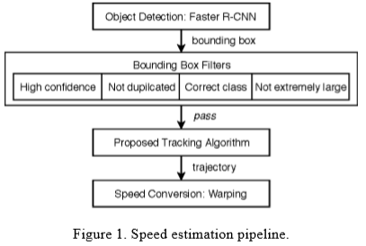

### 3.1. **Object detection**

- challenge에서 주는 training data가 부족하여 pre-trained object detection model을 사용함.
- TensorFlow object detection API에서 제공하는 여러 pre-trained model 중 하나를 선택함. .inference speed와 performance 측면을 고려하여, COCO dataset으로 학습된 Faster R-CNN with ResNet 101을 사용
- COCO dataset에서 "car", "bus", "truck" class만 사용
- false positive를 줄이기 위해 "class filter", "confidence score filter", "duplicated detection filter", and "outlier filter"까지 총 4가지 filter를 적용하고 이를 group filtering algorithm이라 부름

- **Class filter**
    - COCO data에서 차량과 관련된 class는 car, bus, truck 3개뿐이므로 그외 77개 class는 필요없음. 따라서 class filter는 위 3개의 class를 제외한 나머지 class는 걸러내는 역할.
- **Confidence score filter**
    - detection 과정에서 threshold를 0.2로 설정하여 충분한 양의 detection이 이루어지도록 함
- **Duplicated detection filter**
    - IoU threshold 0.3으로 설정하여 중복된 detection을 지움
- **Outlier filter**
    - extremely하게 큰 bounding box가 생길 수 있는데 이러한 box도 지워버림

- **Applying filtering algorithm**
    - (a), (b), (c)에서 멀리 있는 차량에선 중복된 bounding box가 많이 만들어지지만 제안하는 filtering 알고리즘을 통해 이를 보완할 수 있음

        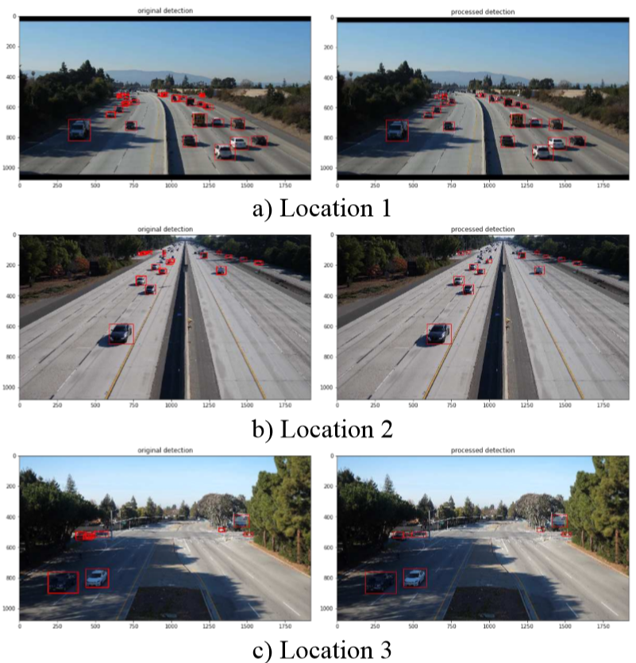

    - 또한 아래 (d)에서처럼 extremely large bounding box가 만들어질 수 있는데 이러한 box들도 사전에 filtering

        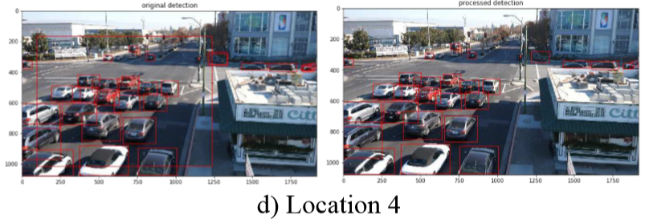

**3.2. Multi-object tracking**

- propose histogram-based tracking algorithm.
- histogram-based tracker는 연속된 frame에서 같은 object를 connect
- 같은 object인지 아닌지 어떻게 판단? → histogram domain에서 minimum Chi-squared distance를 계산하여 frame간의 동일한 object를 tracking

- Tracking Algorithm

    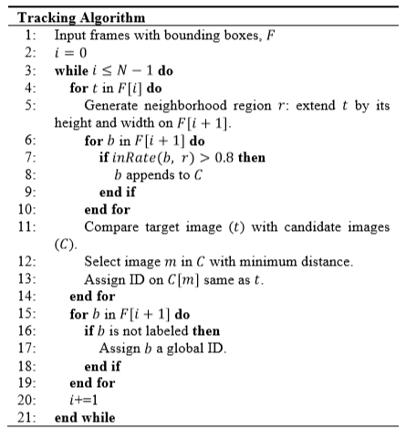
 
 
 
 
- 첫번째 frame에서 object detection으로 bounding box를 그리고 box마다 ID할당. frame 3에서 bounding box ID는 없다고 가정.

    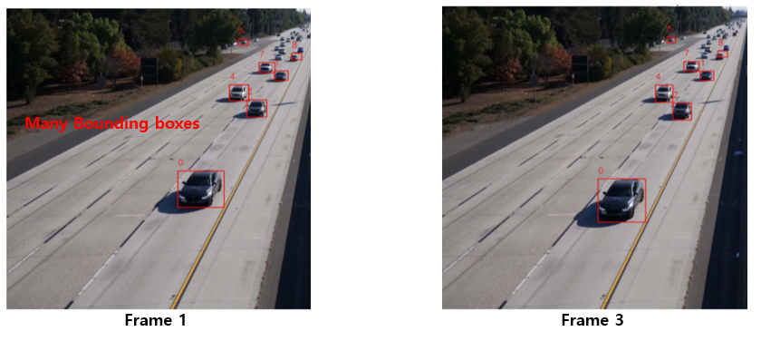
 
 
 
 
- frame 1에서 ID가 4인 b4를 target으로 설정하고 이 차량을 어떻게 tracking하는지 보자.

    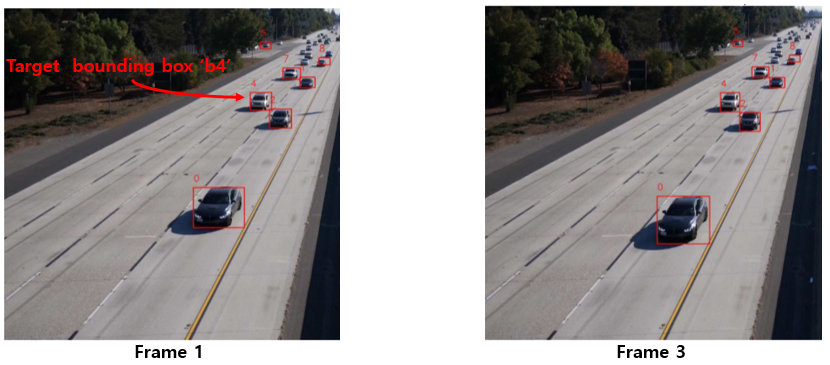
 
 
 
 
- frame 1에서 bounding box 'b4'의 size를 extend시킨 'neighborhood region'을 frame 3에 그린다.

    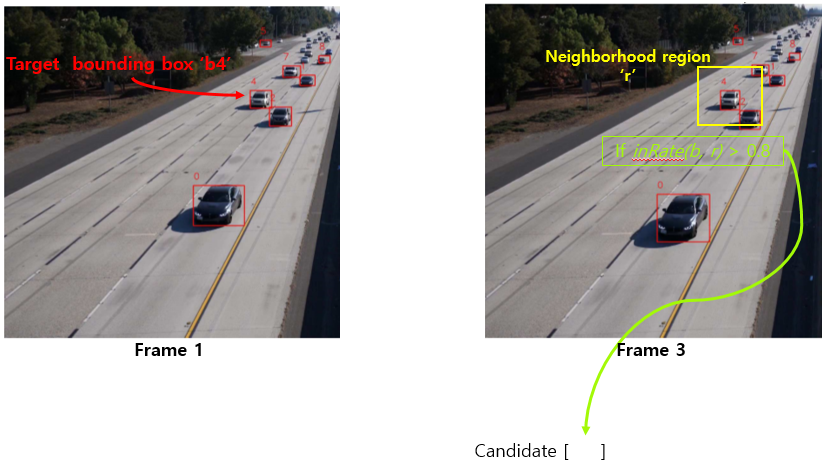
 
 
 
 
- frame 3에서 만들어진 neighborhood region과 80% 이상 겹치는 bounding box들을 candidate로 설정한다. 총 3개의 box가 candidate로 들어갔다고 하자.

    
 
 
 
 
- 여러 candidate 중 하나만 선택해야하므로 frame 1의 target과 frame 3의 candidate 간의 Chi-squared distance를 계산하여 가장 작은 값을 최종 candidate로 선택한다.

    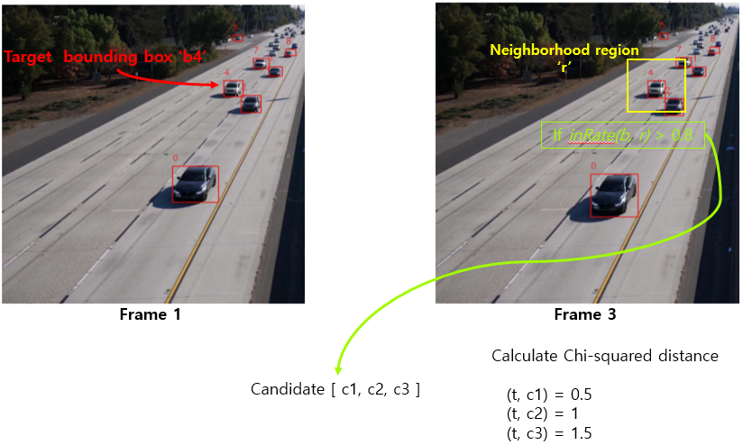
 
 
 
 

- 

    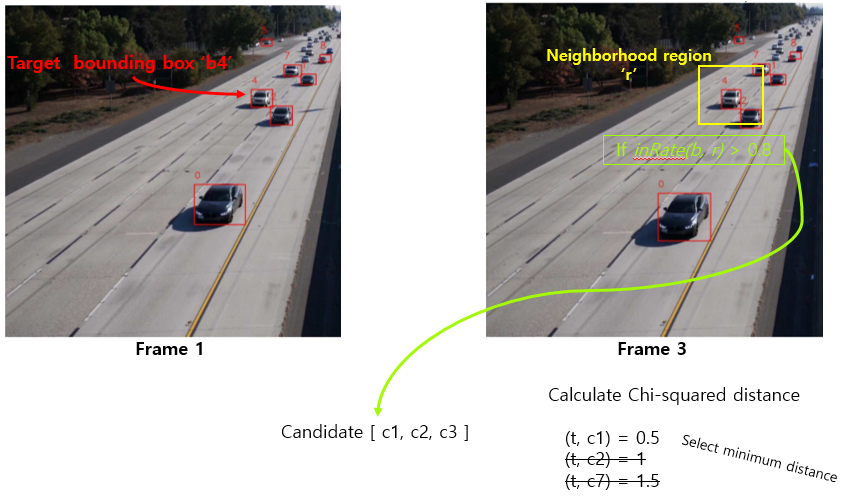
 
 
 
 
- frame 3에서 선택된 최종 candidate에 target이 가지고 있던 ID와 같은 ID를 할당한다.

    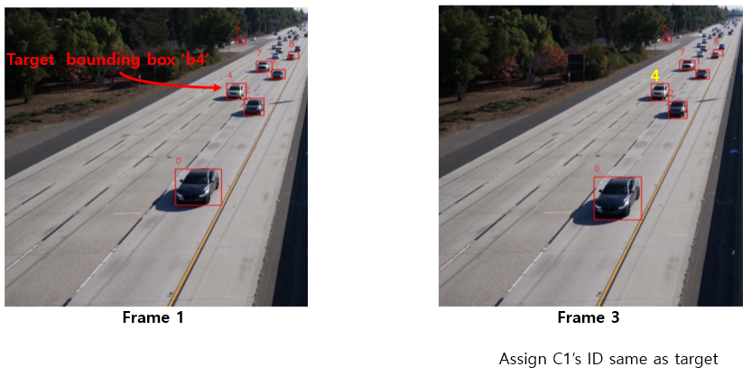
 
 
 
 
- frame 3에 존재하는 모든 bounding box들에 대해 위와 같은 방식으로 ID를 할당한다.
- 만약, ID가 할당되지 않은 경우 frame 1에서 나타나지 않고 frame 3에서 새롭게 나타난 차량으로 보고 새로운 ID를 할당한다.

- Tracking result.

    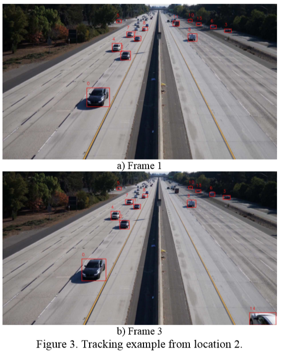

### 3.3. Speed conversion

- pixel domain에서 mile per hour로 speed converting하기 위해 linear perspective transformation warping을 사용함.

    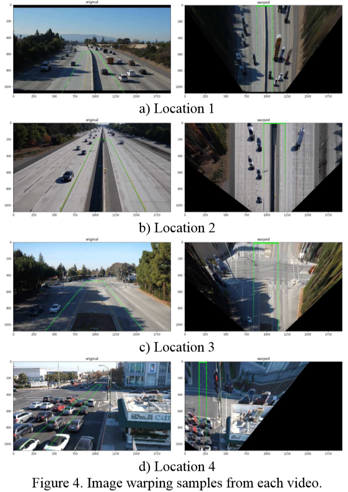

- lane width를 12 feet로 가정(US standard)하여 warping된 lane에서 speed를 계산함. speed conversion result는 5 frame step size(0.167 second)로 moving average를 통해 smoothing
- 논문에선 linear perspective transformation warping method를 사용했는데 이 방법은 도로가 직선이거나 평평하거나 카메라 외곡이 없을 시, 오히려 error가 더 높아지는 원인이 될 수도 있음
- 따라서 warping method가 반드시 필요한 것은 아니며 향후 연구에서 pixel-to-reality calibration method를 사용하여 개선하는 것이 필요.
- 고속도로에선 신호가 없기 때문에 stop-and-go pattern이 거의 나타나지 않고 운전자들이 제한속도에 맞춰 주행한다고 가정할 수 있다. 따라서, linear perspective transformation으로부터 검출된 속도를 essential speed로 볼 수 있다. 또한 scaling method를 적용하여 final detected speed가 고속도로의 제한속도를 잘 따르도록 만든다.
- 고속도로와 달리 intersection에선 신호가 있기 때문에 stop-and-go pattern이 항상 나타난다. 따라서 smoothing method만 적용하고 별도의 processing은 적용하지 않는다. (여기서 말하는 smoothing은 speed conversion에서의 moving average smoothing을 의미하는듯)

# 4. Conclusion

- This study aims to solve the 2018 AI City Challenge Track 1.
- 3-step으로 접근
    1. multi-object detection using Faster R-CNN
    2. multi-object tracking based on histogram comparison
    3. speed conversion using warping with linear perspective transformation
- Detection과 tracking 결과는 plausible하지만 warping으로 인한 error가 발생할 수 있음
- warping으로 인한 limitation을 overcome하기 위해 고속도로 traffic은 free flow condition임을 가정하여 scaling method를 적용
- highway에선 speed estimation performance가 잘 나오는데 적용한 방법은 strict assumption and low scalability 하다는 단점이 있음.
