# You Only Look Once: Unified, Real-Time Object Detection

# Abstract

- YOLO라는 object detection의 새로운 접근법을 제안한다.
- 기존의 방법들은 classifier를 재구성하여 object detection에 적용했지만 YOLO는 class 확률과 bounding box을 하나의 regression 문제로 바라본다.
- 따라서 sing network로 bounding box 위치와 class 확률값을 한 번에 계산한다. 전체 파이프라인이 하나의 네트워크로 end-to-end 방식으로 optimizing 된다.
- 제안하는 아키텍처는 기존의 method보다 매우 빠르며(45 fps) 성능도 높다.

# Introduction

- RCNN 같이 처음에 potential bounding box를 만들어낸 다음에 classifier를 학습시키는 구조는 복잡하기 때문에 느리고 최적화하기도 쉽지 않다.
- YOLO는 object detection을 single regression problem을 바라보고 문제를 해결한다. 이미지 픽셀로부터 bounding box 위치와 class 확률 값을 한 번에 같이 구하는 것이다.
- 하나의 CNN이 multiple bounding box로 predict하고 이러한 bounding box에서의 각 class 확률을 계산한다.
- 따라서 기존의 traditional method에 비해 속도와 성능이 크게 개선된다. 또한 YOLO는 prediction을 할 때 이미지를 global하게 보기 때문에 여러 class에 대한 contextual information을 잘 추출할 수 있다.
- 또한 YOLO는 object의 일반적인 특성을 잘 학습할 수 있다. YOLO를 학습한 뒤 새로운 도메인 (artwork) 이미지로 테스트 했을 때 다른 모델들보다 성능이 좋았다.

# Unified Detection

- YOLO에선 모든 bounding box가 이미지의 모든 class에 대한  prediction으로 이루어진다. (bounding box, class 예측을 동시에)
- 입력 이미지를 SxS grid로 나눈다. 따라서 어떤 object가 특정 grid cell의 중심에 들어가 있다면 해당 grid cell은 특정 object를 detecting 하기 위한 responsible cell이 된다.
- 각 grid cell에서 B개의 bounding box를 예측하며 예측한 B개의 bounding box에 대한 confidence score를 갖는다. confidence score는 Pr(Object) * IOU(truth, pred) 값으로 예측한 bounding box에 object가 있는지 없는지에 대한 확률값과 예측한 bounding box와 GT box 사이의 IOU를 구하여 계산한다. 만약 해당 cell에 object가 존재하지 않는다면 Pr(object)가 0이 되어 confidence score는 0이 된다.
- 각 bounding box는 x, y, w, h, confidence 5개의 값으로 구성되어 있다. (x, y)는 box의 center점을 의미하며 w, h는 width, height를 의미한다.
- 또한 각 grid cell에서는 C 개의 conditional class 확률 값을 예측한다. 따라서 각 cell에서 예측한 bounding box의 개수와 무관하게 모든 grid cell에서는 C개의 class 확률 값이 들어있는 set을 predict하게 된다.
- test 시에는 conditional class 확률값과 bounding box의 confidence 값을 곱하여 구한다.

$$Pr(Class_i|Object) * Pr(Object) * IOU_{pred}^{truth} = PR(Class_i) * IOU_{pred}^{truth}$$

- PASCAL VOC dataset을 기준으로 S=7, B=2를 사용하였다. 해당 데이터셋은 class수가 20개이므로 최종 prediction은 7x7x30 tensor가 된다.  S x S x (B*5 + C)

### Network Design

- YOLO는 single CNN으로 구성된 모델이며 앞단의 convolution layer에선 이미지로부터 feature를 추출하는 역할을 한다. 반면 뒷단의 fully connected layer는 bounding box 좌표값과 class 확률값을 predict하는 역할을 한다.
- 기본 모델보다 속도에 더 초점을 둔 Fast YOLO도 있음 해당 Fast YOLO 모델은 레이어를 9개만 사용하였으며 각 레이어에서도 더 적은 필터를 사용함
- 네트워크의 최종 output은 7x7x30 tensor

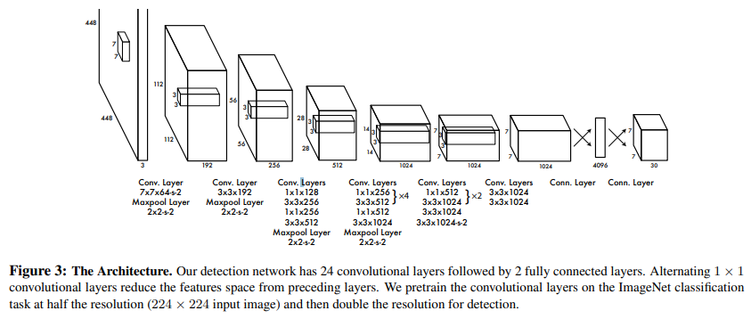

### Training

- 이미지넷 classification dataset으로 pretraining함. pretrainin에서는 앞단의 20개 conv layer만 사용하였으며 conv layer 뒤에 average-pooling, f.clayer를 사용함
- pretraining 후 detection 문제를 풀기 위한 모델로 변환함. 추가적으로 4개의 convolution layer와 2개의 f.c layer를 추가하였으며 추가한 레이어는 랜덤하게 초기화함
- Detection 모델에서는 input resolution을 증가시켜서 사용 224x224 → 448x448
- 마지막 레이어에서 class 확률값과 bounding box 좌표값을 predict함. bounding box 좌표는 이미지의 width, height를 고려하여 normalize함. bounding box의 w, h 좌표값이 0~1사이로 나옴
- bounding box의 center 좌표값 x, y가 특정 grid cell 위치에서 offset 값으로 사용하며 이 값도 0~1
- final layer에서는 linear function, 그외 모든 레이어에서는 Leaky ReLU

- optimizing을 쉽게 하기 위해 sum-squared error 사용. 그러나 단순하게 오차제곱합을 사용하는 것은 localization error값과 classification error값의 영향력이 서로 다르기 때문에 문제가 될 수 있다. 이를 보완하기 위해 bounding box coordinate prediction의 loss를 increase하는 방향으로, confidence prediction loss 값을 decrease하는 방향으로 수정함. (confidence prediction loss 값을 decrease 하는 이유는 해당 cell에 object가 없는 경우 loss가 너무 커지는 문제를 방지하기 위함)

$$\lambda_{coord} = 5  \\  \lambda_{noobj}=.5$$

- sum-squared error에서 bounding box의 크기가 큰 경우와 작은 경우 모두 동일한 가중치를 적용하기 때문에 large bounding box에서의 편차가 상대적으로 중요도가 떨어짐. 이를 반영하기 위해 width, height에 루트를 씌움
- YOLO는 각 grid cell에서 여러 개의 bounding box를 예측한다. 학습 시에 하나의 bounding box는 하나의 object만 찾는 역할을 한다. 여러 bounding box가 동일한 object를 예측한 경우 IOU값이 가장 높은 box를 사용

- YOLO의 Loss function

    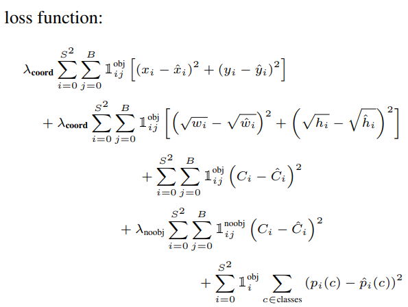

- i = cell
- j = j th bounding box in cell i (각 cell 마다 여러 개의 box를 사용하므로 cell i에서 j번째 box)
- 1_{ij} ^{obj} = cell i의 j번째 box에서 object가 있는 bounding box
- 1_{ij} ^{noobj} = cell i의 j번째 box에서 object가 없는 bounding box
- 1_{i} ^{obj} = object가 있는 cell i
- overfitting 방지하기 위해, dropout(0.5), data augmentation 사용

### Inference

- YOLO single network로 한 이미지에서 총 98개의 bounding box를 predict하기 때문에 R-CNN 같은 classifier 기반의 method보다 훨씬 빠름
- grid design을 통해 bounding box prediction의 spatial diversity가 증가함.  grid cell에 하나의 object가 존재하면 해당 object를 예측하기 위해 하나의 box만 사용하면 됨. (특정 grid cell에 object가 존재하면 그 object는 해당 cell에서 찾기 때문에, R-CNN 처럼 box를 엄청 많이 그릴 필요가 없음)
- 만약 object가 커서 object가 여러 grid cell에 걸쳐서 존재하는 경우 각 grid cell에서 여러 개의 bounding box가 나올테고 이를 Non-maximal suppression을 통해 걸러내기 때문에 잘 찾을 수 있음

### Inference 과정을 다른 자료로 설명

- final output은 7x7x30 tensor이며 각 grid cell은 2개의 bounding box 좌표와 20개 class score

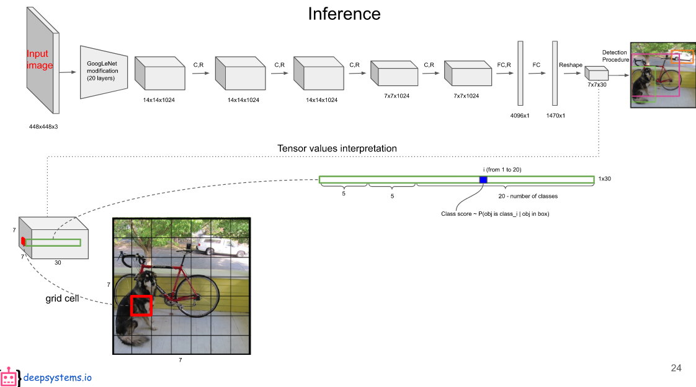

- 2개의 bounding box의 중 무엇을 선택할지는 confidence score를 보고 결정함
- 각 bounding box의 confidence score와 class 확률값을 모두 곱하여 20x1 vector를 구함
- 7x7 grid cell에 총 98개의 bounding box가 만들어지므로 이런식으로 20x1 vector를 98개 구함

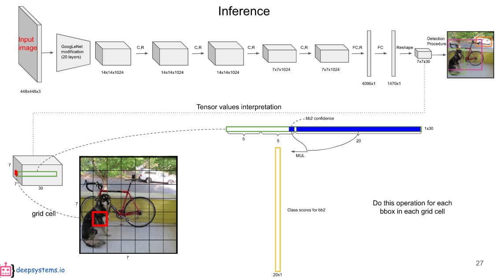

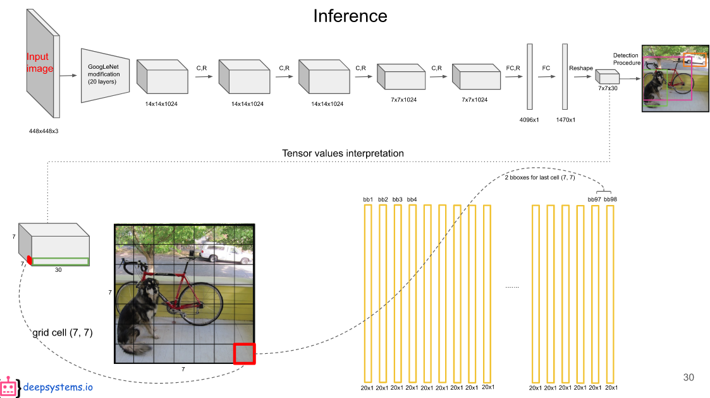

- 예를 들어, 20x1 vector에서 첫번째 원소가 Dog class라고 하면 98개의 bbox에서 dog class에 대한 class 값이 다 들어있을 것이다.
- dog class에 대한 98개의 확률값들 중에서 thresh를 넘지 못하는 값은 0으로 값을 바꾼다.
- 98개의 확률값에 대해 내림차순으로 정렬한다.
- 내림차순 정렬 후 NMS 알고리즘을 적용하여 98개의 값들 중 최종 후보 1개만 선택한다.

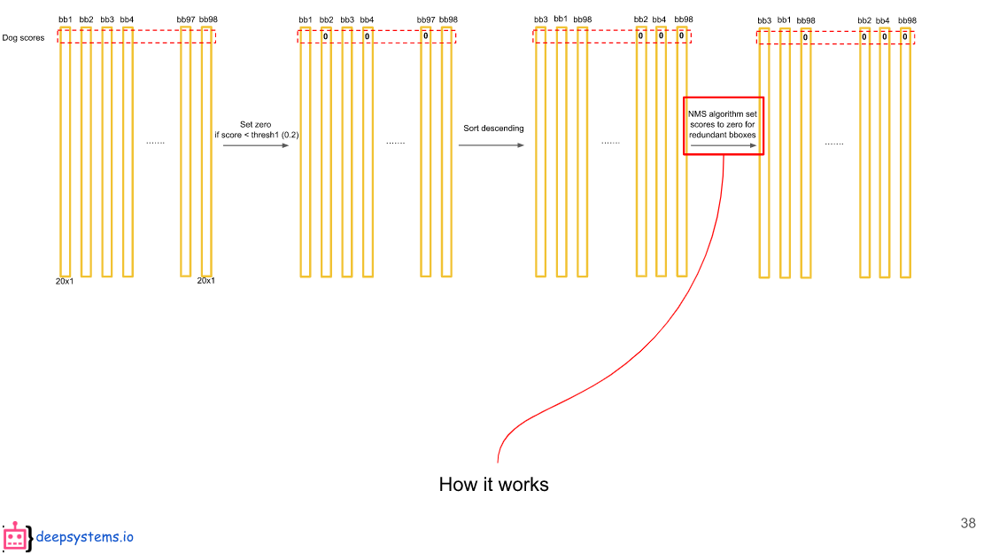

- Non-maximum Suppression 알고리즘이 어떻게 작동하는지 알아본다.
- 임계치를 넘지 못하는 값은 0으로 만들고 내림차순 정렬하면 아래와 같이 정렬될 것이다.
- 여기서 bbox_max(확률값이 가장 높은 box)를 다른 bbox(0이 아닌 box)들과 모두 비교하며 다른 bbox들을 지워나간다.

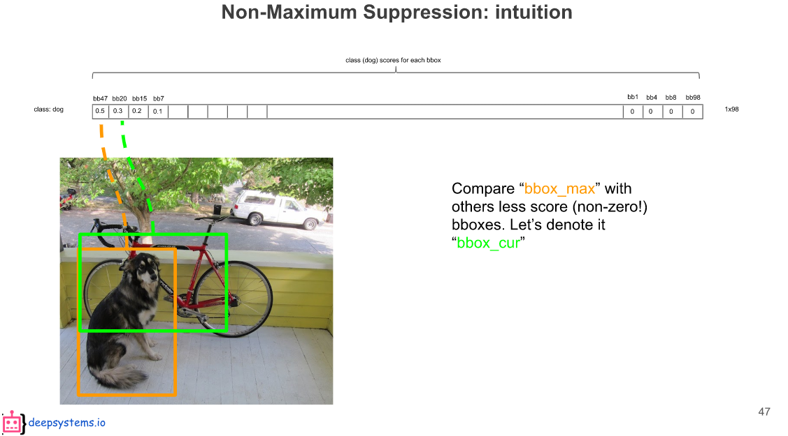

- bbox_max와 bbox_cur(bbox_max와 비교하려는 현재 bbox) 사이의 IOU를 계산하고 만약 이 값이 0.5가 넘으면 서로 같은 class를 예측한 것으로 보고 bbox_cur의 확률 값을 0으로 만들어준다.

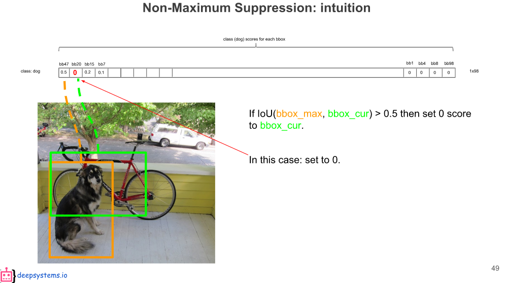

- bbox_max를 다음 bbox_cur과 다시 비교한다.
- 만약 IOU값이 0.5보다 작으면 서로 다른 class를 예측한 것으로 보고 bbox_cur의 확률값을 살려둔다.

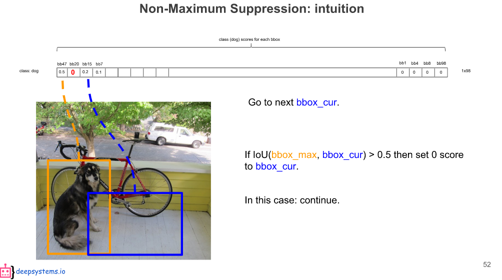

- 위에서 파란색 bb15는 기존의 bbox_max(bb47)와 비교했을 때 IOU가 0.5가 안 넘어서 살려뒀던 box이다. bb15도 똑같이 dog class를 예측했지만 bb47이 예측한 dog와 다른 곳에 있는 dog를 예측한 것으로 보기 때문에 살려둔 것이다.
- 그래서 bb15가 새로운 bbox_max가 되고 이를 뒤에 있는 bbox들과 다시 비교하며 걸러낸다.

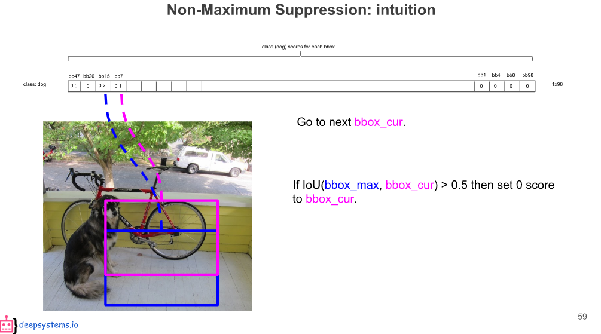

- 이런식으로 모든 class에 대해 NMS 알고리즘을 수행하면 98개의 bbox에서 각 class에 대한 확률값을 같게 될 것이다.
- YOLO에선 하나의 bounding box가 하나의 object만 찾기 때문에 bbox에 들어있는 값들 중 어떤 값을 최종 prediction으로 선택할 건지 골라야 한다.
- 각 bounding box에서 최종 prediction을 선택하는 방법은 다음과 같다.
    1. bonding box에 들어있는 20개의 값들 중에서 가장 score가 높은 값이 예측 class가 된다.
    2. 위에서 선택된 예측 class의 score가 임계치보다 크면 최종 bounding box로 선택하여 bounding box를 draw한다.
    3. 만약 예측 class의 score가 임계치보다 작으면 해당 bounding box는 object를 검출하지 못한 것으로 간주하고 skip한다.

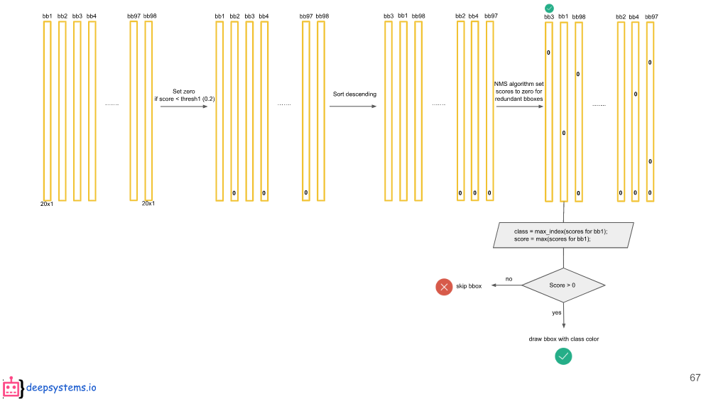

- 위의 작업을 거치면 98개의 bounding box중에서 최종적으로 선택된 box가 아래처럼 그려진다.

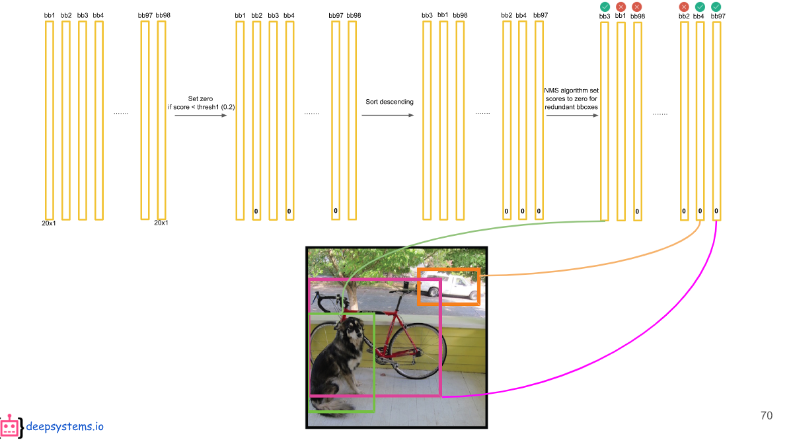

### Limitations of YOLO

- YOLO에선 각 grid cell에서 하나의 class를 찾기 위해 2개의 box를 예측하고 2개의 box 중 confidence score가 더 높은 box를 사용한다. 이러한 spatial constraint는 YOLO의 limitation이 될 수 있다.
- object 여러 개가 붙어 있는 경우, 작은 object들이 그룹을 지어 있는 경우 검출이 어려울 수 있다.
- 또한 bounding box의 크기나 비율이 training data로부터 학습되기 때문에 test image에 대한 일반화가 어려울 수 있다.
- large box와 small box에서의 error를 동일하게 처리하기 때문에 IOU에 더 큰 영향을 미치는 small box error가 부정확할 수 있다.

# Comparison to Other Detection Systems

- YOLO와 다른 모델들의 속도를 비교

    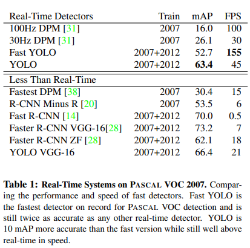

- Fast YOLO는 기존 YOLO보다 레이어를 적게 써서 경량화시킨 모델.
- YOLO는 mAP도 높으면서 압도적인 FPS 성능을 낸 real-time detector

### Deformable parts models(DPM)

- DPM은 object detection에서 sliding window 접근법을 사용한 모델. feature를 추출하고 각 region을 분류하여 bounding box를 예측하는 pipeline이 다 나누어져 있음. 그러나 YOLO는 이러한 부분을 모두 조합한 하나의 sing network를 사용함

### R-CNN

- R-CNN과 R-CNN의 변형 알고리즘들은 sliding window 대신 region proposal을 사용함. Selective Search로 potential bounding box를 생성하고 CNN에서 feature를 추출, SVM이 box들의 score를 계산함. non-max suppression으로 중복된 box들 제거. R-CNN의 pipeline은 여러 stage들을 조합하여 사용하기 때문에 너무 복잡하고 느림. 실제 test image 한장을 inference 하는데 40초가 걸림. 그러나 YOLO는 각 grid cell에서 potential bounding box를 만들어내고 각 box들의 score를 convolution feature를 이용하기 때문에 훨씬 빠름

### Other Fast Detectors

- Fast, Faster R-CNN은 R-CNN의 속도를 개선하는데 초점을 맞춘 모델이지만 real time performance 측면에서 보면 여전히 느림. 여전히 detection pipeline이 여러 component로 구성되어 있기 때문에 YOLO보다 느리다.

### Deep MultiBox

- Selective Search를 사용하지 않고 하나의 CNN에서 RoI를 predict함. MultiBox는 confidence prediction을 single class prediction으로 대체했다는 점에서 single object detection 모델로 볼 수 있음. 그러나 MultiBox는 image patch classification을 필요로 하는 large detection pipeline의 piece이기 때문에 일반적인 object detection 모델로 보기 힘듦

### OverFeat

- 하나의 CNN을 사용하여 localization을 하고 이 localizer가 detection까지 수행하는 모델. OverFeat은 sliding window detection을 효율적으로 수행하지만 여전히 disjoint system이며 localization을 최적화할 뿐 detection performance를 최적화하지는 않는다. OverFeat에서 localizer는 local information만 보기 때문에 global context를 제대로 추론할 수 없고 coherent detection을 위해선 post-processing이 필요함

### MultiGrasp

- YOLO의 grid approach는 regression을 grasp하기 위한 MultiGrasp system과 유사함. 그러나 MultiGrasp은 이미지에서 하나의 object만 존재하는 single graspable region을 prediction하기 때문에 object detection과는 다름 MultiGrasp은 적절한 region을 찾기만 하면 되는 거라서 size, location, object의 boundaries나 class를 예측하지 않음.

# Experiments

### VOC 2007 Error Analysis

- Fast R-CNN과의 error 분석 비교
- Correct: correct class and IOU > 0.5
- Localization: correct class and 0.1 < IOU <0.5
- Similar: class is similar and IOU > 0.1
- Other: class is wrong and IOU > 0.1
- Background: IOU < 0.1

    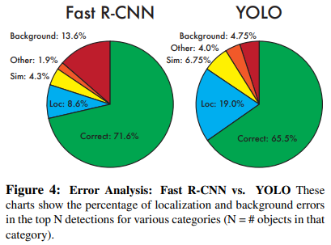

- YOLO는 Fast R-CNN에 비해 localization error가 매우 큼. 정확한 localization 성능이 뒤떨어짐 (training image로만 box의 크기나 비율이 학습되기 때문에 test시에 localization이 부정확할 수 있음 YOLO의 limitation에서 언급한 내용)
- background error(False Positive)에선 YOLO의 성능이 더 높음

### Combining Fast R-CNN and YOLO

- Fast R-CNN의 Background error가 큼. Fast-RCNN과 YOLO를 결합하여 Fast-RCNN이 잘못 예측한 Background bounding box와 YOLO의 Background bounding box를 overlapping 하여 Fast R-CNN의 background error를 개선함

    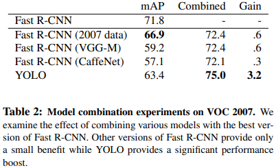

- Combining 했을 때 Fast R-CNN의 mAP가 모두 개선됨.
- 2007 data, VGG-M, CaffeNet은 Fast-RCNN의 다른 버전들.
- 모델 2개를 분리하여 실행했기 때문에 YOLO가 가지는 속도의 이점을 반영할 수는 없음

### VOC 2012 Results

- PASCAL VOC 2012 Leaderboard 결과

    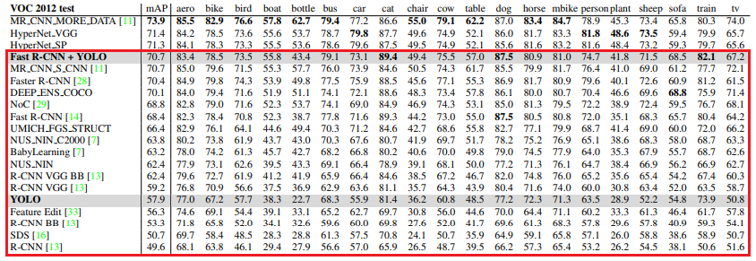

- 제안하는 YOLO의 mAP 성능은 R-CNN VGG랑 비교할만한 정도.
- mAP가 많이 낮은 이유는 small object들을 검출하는데 어려움이 있기 때문
- YOLO + Fast R-CNN 모델이 가장 성능이 좋음

### Generalizability: Person Detection in Artwork

- Picasso Datset, People-Art Dataset에서 YOLO와 다른 Object detection 모델을 비교

    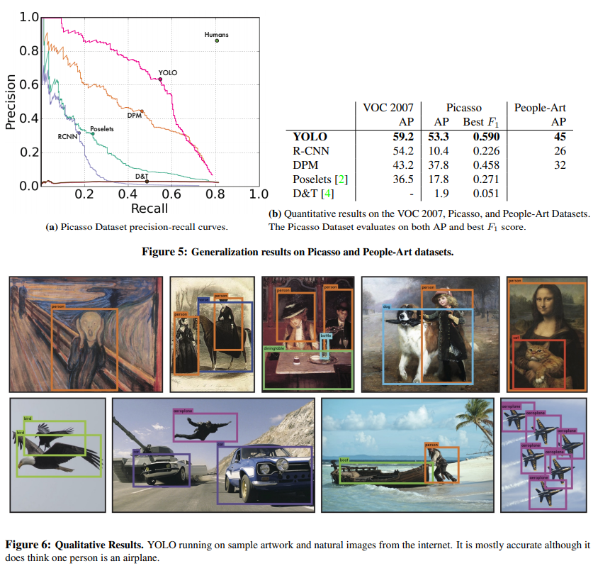

- Artwork dataset에서 YOLO의 성능이 매우 뛰어남
- R-CNN은 selective search에서 natural image에 tuning됐기 때문에 artwork 이미지에 적용했을 때 성능이 떨어짐. 또한 R-CNN의 classifier는 small region만 보기 때문에 성능이 떨어짐
- DPM은 object의 shape, layout 같은 spatial 특성에 강하기 때문에 성능이 잘 나온다.
- YOLO와 DPM의 성능이 좋은 이유는 object와 object가 주로 어디에 위치하는지에 대한 relationship을 모델링하기 때문에 성능이 뛰어남
- art image와 natural image는 pixel level에서는 매우 다르지만, object의 shape이나 size는 비슷하기 때문에 YOLO가 좋은 성능을 낼 수 있음

### Real-Time Detection In The Wild

- YOLO는 매우 빠르고 정확한 object detector이기 때문에 computer vision application에서 ideal하다.
- YOLO를 webcam에 연결하고 실시간 성능을 검증해봄
- YOLO는 이미지를 개별적으로 처리하지만 웹캠에 연결하여 실험했을 때 마치 tracking system처럼 object를 detecting 하는 모습을 보여줌
- Demo [https://pjreddie.com/darknet/yolo/](https://pjreddie.com/darknet/yolo/)

# Conclusion

- object detection을 위한 unified model로 YOLO를 제안한다.
- YOLO는 simple 하면서 이미지 전체를 학습할 수 있다.
- classifier 기반의 접근법과는 달리 YOLO는 single model로 학습된다.
- YOLO는 실시간 object detection에서 매우 뛰어난 성능을 보여주었으며 새로운 domain에서도 일반화가 잘 되는 fast, robust한 object detection model이다.

# References

[https://curt-park.github.io/2017-03-26/yolo/](https://curt-park.github.io/2017-03-26/yolo/)

[https://docs.google.com/presentation/d/1aeRvtKG21KHdD5lg6Hgyhx5rPq_ZOsGjG5rJ1HP7BbA/pub?start=false&loop=false&delayms=3000&slide=id.p](https://docs.google.com/presentation/d/1aeRvtKG21KHdD5lg6Hgyhx5rPq_ZOsGjG5rJ1HP7BbA/pub?start=false&loop=false&delayms=3000&slide=id.p)
