# YOLO 9000: Better, Faster, Stronger

# Abstract

- SOTA, real-time object detection system인 YOLO9000을 제안한다. YOLO9000은 9000개 클래스를 detection할 수 있으며 VOC, COCO dataset에서 SOTA를 달성하였다.
- Faster R-CNN, SSD보다 성능이 좋으면서 속도도 빠르다.
- Detection dataset과 Classification dataset을 동시에 사용하여 모델을 학습시키는 방법을 제안한다.

# Introduction

- Object detection 모델들의 성능과 속도가 개선되며 발전하고 있지만 대부분의 method들이 일부 object들만 인식할 수 있다.
- object detection dataset은 classification datasest에 비해 양이 적고 라벨링하는 cost도 비싸기 때문에 대량의 detection dataset을 calssification dataset과 비슷한 크기로 만들기 어렵다.
- 따라서 기존의 classification data를 활용하여 detection scope를 expand하는 방법을 제안한다.

# Better

- 기존의 YOLOv1은 Fast-RCNN에 비해 localization error도 높고 low recall 문제도 있엇다. YOLOv2에서는 classification accuracy는 유지하면서 recall과 localization을 개선하는 방향에 초점을 맞춘다.
- YOLO의 성능을 개선시키기 위해 아래와 같은 idea들을 조합한다.

    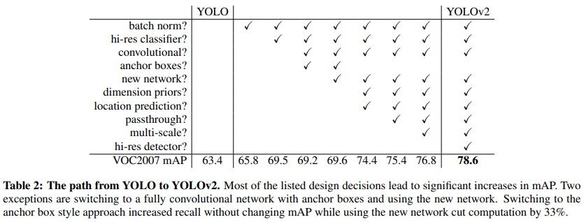

### Batch Normalization

- Batch normalization은 model을 regularize하는 효과가 있기 때문에 모든 convolution layer에서 batch normalization을 적용한다. 또한 batch normalization을 사용하기 때문에 dropout을 사용하지 않는다.

### High Resolution Classifier

- ImageNet 448x448 image로 classification network를 fine tuning한 뒤에, detection network를 학습시킨다.

### Convolutional With Anchor Boxes

- YOLOv1은 bounding box prediction을 위해 f.c layer를 사용하지만 YOLOv2에서는 f.c layer를 없애고 anchor box개념을 사용하여 bounding box를 prediction한다.
- Faster R-CNN의 RPN(region proposal network)은 conv layer만으로 구성되어 있으며 각 앵커박스에서 offset과 confidence를 predict 한다. prediction layer가 conv layer이기 때문에 RPN은 이러한 offset들을 feature map의 모든 위치에서 predict 할 수 있다.
- YOLOv2에서 anchor box개념을 사용하는 이유는 bounding box 좌표 자체를 prediction 하는 것보다 offset을 prediction하는 것이 더 쉽고 네트워크를 쉽게 학습시킬 수 있기 때문이다.
- 또한 네트워크의 입력 resolution을 448x448에서 416x416으로 줄인다. 그 이유는 최종 output feature map을 13x13인 홀수 크기로 만들기 위함이다. 특히 크기가 큰 object일수록 이미지 중앙에 위치하는 경우가 많은데 feature map의 사이즈가 짝수x짝수 였다면 object의 중심점이 4개가 되지만 홀수x홀수인 경우 object의 중심점을 1개의 grid cell로 나타낼 수 있으므로 더 효과적이다.
- YOLOv1은 이미지에서 총 98개의 box를 predict하지만 YOLOv2는 천 개 이상의 box를 predict한다. anchor box를 사용했을 때 mAP가 조금 하락했지만 recall이 향상되었다.

### Dimension Clusters

- YOLO에 anchor box개념을 적용할 때 생기는 이슈는 anchor box들의 크기를 어떻게 정의할 것인지 정해야한다. 이 anchor box들의 적절한 크기를 직접 찾는 건 너무 어렵기 때문에 training set에 있는 bounding box들에 클러스터링을 적용하여 최적의 anchor box를 찾는다.
- 이때 Euclidean distance를 사용하는 일반적인 k-means clustering을 사용하면 박스가 크기가 클 수록 error가 커지기 때문에 distance를 계산하는 metric을 IOU를 이용하여 계산한다.

    $$d(box, centroid) = 1 - IOU(box, centroid)$$

- 만약 centroid와 어떤 box의 IOU가 클수록 그 box는 centroid와의 거리가 작은 것으로 볼 수 있다.
- 이렇게 해서 centroid가 5개, 9개인 경우로 실험했는데 9개인 경우가 평균 IOU는 좀더 높지만 큰 차이가 나지 않기 때문에 anchor box 5개를 사용한다.

    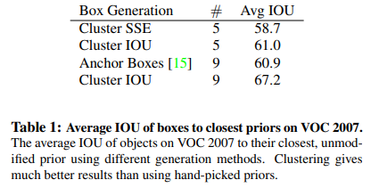

### Direct location prediction

- YOLO에 anchor box개념을 적용할 때 생기는 또 하나의 이슈는 모델의 초기 iteration에서 학습이 instability(불안정)하다는 것이다.
- region proposal network에서는 network가 t_x, t_y를 predict하여 center 좌표 (x, y)를 얼마나 이동시킬 것인지 계산한다.

    $$x = (t_x  \ * \ w_a) - x_a \\ y= (t_y \ * \ h_a) -y_a$$

- 만약 t_x가 1이라면 box를 오른쪽으로, -1이라면 왼쪽으로 shift한다.
- 이러한 formulation은 unconstrained 하기 때문에 box가 이미지에 어느 위치에든지 존재할 수 있게된다. 따라서 적절한 offset값을 찾는데 시간이 오래 걸리는 문제가 있다.
- YOLOv2에서는 순수하게 offset 값을 예측하는 것 대신 YOLO의 approach와 grid cell 위치를 기준으로 좌표를 이용한다. YOLOv2는 offset 값을 sigmoid에 넣어 0~1사이의 값으로 조정한다.
- 네트워크의 output feature map에서 각 grid cell마다 5개의 bounding box를 만들어낸다. 각 box에 대해 t_x, t_y, t_w, t_h, t_o 총 5개의 좌표값을 prediction한다. (c_x, c_y)는 해당 grid cell의 top left 좌표값이며 p_w, p_h는 사전에 정의한 anchor box의 width, height값이다. 따라서 네트워크가 예측한 t_x, t_y, t_w, t_h, t_o 값에 따라 bounding box의 좌표는 아래의 식을 거쳐 구해진다.

    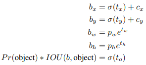

    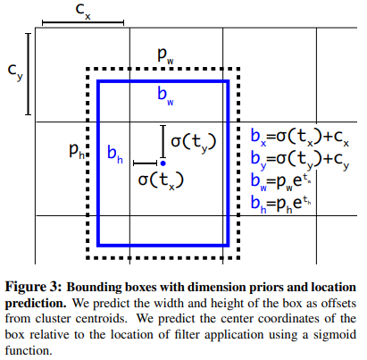

- RPN에서 offset값을 예측했던 방식과 달리 constraint을 주기 때문에 네트워크가 안정적으로 쉽게 학습된다.

### Fine-Grained Features

- SSD나 Faster R-CNN에서 various feature map을 사용했던 것처럼 YOLOv2도 비슷한 방식을 사용한다.
- YOLOv2의 최종 output feature map은 13x13x1024를 사용했지만, 26x26x512 feature map을 passthrough layer로 가져와서 13x13x1024 feature map과 concat한다. 26x26x512 feature map을 13x13x2048로 reshape하여 concat.
- 이 방법을 적용했을 때 1% 가량 성능 향상됨

### Multi-Scale Training

- YOLOv2가 image size에 robust하게 만들기 위해 multi scale training을 적용한다. YOLOv2의 기본 입력 resolution은 416x416이지만 10 batch마다 랜덤하게 새로운 resolution을 선택하여 학습한다. resolution 크기는 320~608이며 32씩 커진다. {320, 352, ..., 608}

    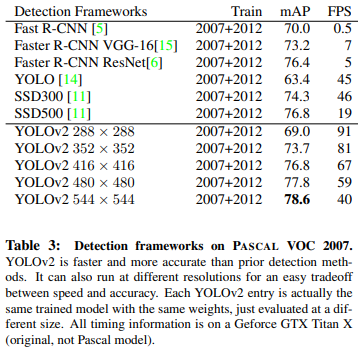

### Further Experiments

- YOLOv2를 VOC2012 data로 학습시켰을 때 다른 SOTA detection system과 비교
- YOLOv2는 다른 모델들에 비해 속도도 빠르면서 성능도 높다.

    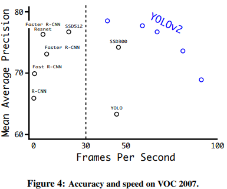

- 

    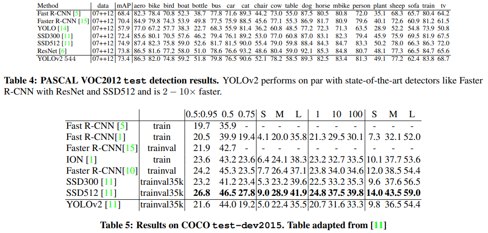

# Faster

- YOLOv2가 정확하게 detection하는 것도 중요하지만 object detection에서 속도도 중요한 요소이기 때문에 속도를 개선하는 것도 중요함
- 기존의 VGG를 feature extractor로 사용하는 것도 좋지만 모델 complexity가 크기 때문에 속도 측면에서 문제가 될 수 있음

### Darknet-19

- YOLOv2의 backbone으로 사용하기 위해 새로운 classification model Darknet-19를 제안함. VGG랑 비슷하게 3x3 filter를 사용하고 pooling layer 이후 채널 수를 2배 늘리는 구조. 그러나 feature representation을 압축하기 위해 3x3 conv 사이에 1x1 conv를 추가하였으며 prediction에서 global average pooling을 사용함
- Darknet-19는 19개의 conv layer, 5개의 max pooling layer로 구성되어 있음

    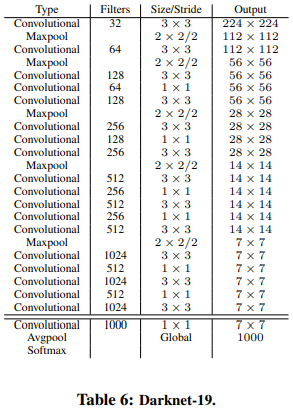

### Training for classification

- 네트워크를 ImageNet 1000 class classification dataset으로 160 epochs까지 학습시킨다.
- 학습 이미지에 대해 random crop, rotation, hue, saturation, exposure shift 등의 data augmentation을 적용하였다. 입력 이미지는 224x224로 들어감
- 초기 학습 이후, 448x448로 resolution을 키우고 fine-tuning함

### Training for detection

- classification data로 학습된 네트워크를 detection model로 쓰기 위해 modify함. 마지막 conv layer를 없애고 filter 1024개 쓰는 3x3 conv layer 3개와 1x1 conv를 추가함
- 각 grid cell에서 5개의 box를 predict하며 box는 5개의 coordinate 값과 20개 class에 대한 확률 값을 가짐

# Stronger

- dataset의 한계로 detection model은 상대적으로 적은 수의 class만 찾을 수 있는 문제가 있었음 이를 보완하여 9000개 class까지 detection할 수 있는 방법을 제안함. 이 모델을 YOLO 9000이라 부름
- classification data와 detection data를 jointly하게 학습시킬 수 있는 메커니즘을 제안함
- detection data가 들어오면 loss function 전체를 사용해서 back-propagation하고, classification data가 들어오면 classification loss 부분만 계산하여 back-propagation함
- 그런데 classification dataset은 detection dataset에 비해 label이 훨씬 다양하고 세부적으로 구분했다는 차이가 있음. ImageNet은 dog의 종류만 100개가 넘게 있지만 COCO dataset은 그냥 dog만 있음
- 일반적으로 classification에서 dataset에 존재하는 모든 카테고리 수 만큼 softmax layer로 확률값을 계산하며, softmax를 사용하는 것은 이러한 class들이 서로 mutually exclusive이라는 걸 가정함
- 그러나, ImageNet과 COCO dataset을 combine할 때 문제가 생김. "Norfolk terrier"와 "dog" class는 서로 mutually exclusive 관계가 아니기 때문에 단순하게 softmax layer를 사용할 수가 없음
- 따라서 "Norfolk terrier"와 "dog"가 mutual exclusion 관계가 아니라는 것을 가정할 수 있는 multi-label model을 이용하여 combine함

### Hierarchical classification

- ImageNet은 WordNet이라는 language database를 차용해서 만든 것. WordNet은 그래프를 이용한 모델로 concept간의 얼마나 관계가 있는지 구조화한 모델임. 예를 들어 "Norfolk terrier"와 "Yorkshire terrier"는 "terrier"의 하위개념이며, "terrier"는 "hunting dog"의 하위개념이고, "hunting dog"는 "dog"의 하위개념.
- WordNet의 전체 그래프 구조를 사용하는 것 대신에 문제를 좀 더 간결화하기 위해 ImageNet의 concept들로부터 hierarchical tree를 만듦
- hierarchical tree를 만들기 위해 ImageNet에 있는 visual 명사들을 분석함. ImageNet에 있는 visual noun들이 WordNet 그래프에서 어떤 path들을 가지는지 분석한 뒤, hierarchical tree의"physical object"라는 root node부터 시작하여 tree를 구축함.
- 예를 들어, 존재하는 class들을 뜯어보면 특정 class들을 하나의 synset(유의어 집단)으로 묶을 수 있음. 이러한 synset들은 그래프에서 하나의 path만 가지기 때문에 이러한 경로 정보를 tree에 반영하였음. 다시 말해, "Yorkshire terrier", "Norfolk terrier" 등의 class들은 "terrier"로 가는 하나의 path를 가지고 있기 때문에 이러한 정보를 트리로 구축한 것
- 이런식으로 트리를 구축하다가 만약 어떤 concept이 root로 가는 경로가 2가지 생기는 경우, 2 path중에서 더 짧은 path만 사용함. (일단 논문의 내용을 이렇게 이해했는데 잘못 이해했을 수도 있음)

    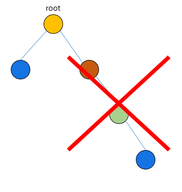

- 최종 결과는 visual concept들을 hierarchical model로 표현한 WordTree가 됨. 이렇게 구축한 WordTree를 이용하여 classification을 하기 위해 주어진 sysnet에대한 hyponym(하위어)들의 조건부 확률을 이용함. 예를 들어 "terrier"라는 node를 predict할 때, 아래와 같이 "terrier" synset에 존재하는 hyponym들에 대한 조건부확률을 구하는 것.

    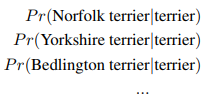

- 만약 특정 node에 대한 absolute probability를 계산하고자 한다면 root node부터 해당 node까지 조건부 확률값을 모두 곱하면 됨. 예를 들어, "Norfolk terrier"의 확률값을 구하고 싶다면 아래와 같이 root node까지 가는 경로의 모든 조건부 확률 값을 곱하여 계산함

    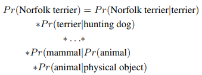

- Classification에서 이미지에 하나의 object만 있다고 가정하기 때문에 Pr(physical object)=1

- 제안하는 방법을 검증하기 위해 Darknet-19 모델에 ImageNet 1k class를 사용한 WordTree를 이용하여 training함. WordTree1k를 만들기 위해 노드를 추가하다보니 label이 1000개에서 1369개까지 확장됨
- 만약 ground truth로 "Norfolk terrier" 이미지가 들어오면 "Norfolk terrier"의 상위 노드들인 "dog", "mammal" 등의 라벨에 대한 확률값도 같이 계산함
- 조건부 확률을 구하기 위해 제안하는 모델은 1369 차원의 vector를 predict하게 되며, 각 synset에 대해 개별적인 softmax를 적용

    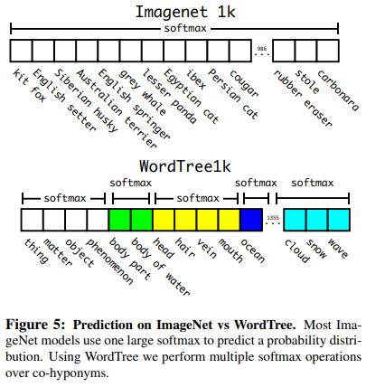

- "dog" 이미지가 들어올 때 "dog"는 맞는데 어떤 품종인지 구분이 어렵다면 "dog"로 predict하게 됨

- COCO dataset과 ImageNet dataset을 조합하여 구축한 Word Tree

    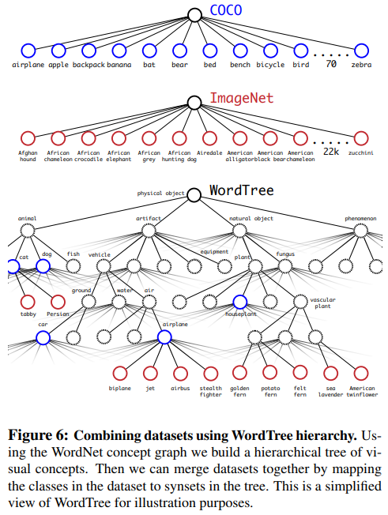

### Joint classification and detection

- WordTree를 구축하는 방법을 통해 COCO dataset과 ImageNet dataset을 조합하여 9000개 class를 가지는 dataset을 만듦.
- 제안하는 방법을 evaluate하기 위해 imagenet detection challenge에 있는 class들을 몇 개 더 추가하였다. 총 class는 9418개이며 ImageNet dataset이 너무 크기 때문에 COCO dataset을 oversampling하여 imageNet과 COCO의 비율을 4:1로 맞췄다.
- 이 dataset을 이용하여 학습시킨 모델이 YOLO9000. YOLO9000은 YOLOv2 아키텍처를 기반으로하지만 anchor box를 3개만 사용한다.
- detection image는 전체 loss를 이용하고, classification image는 classification loss만 사용하며 같은 level이나 상위 level에 대해서만 loss를 계산함. 만약 "dog"로 라벨링된 이미지가 들어올 때 "German Shepherd", "Golden Retriever"에 대해선 error값을 줌
- 제안하는 joint training을 통해 YOLO9000은 COCO data를 이용해 object의 위치를 찾는 법을 학습할 수 있고 ImageNet data를 통해 wide variety 클래스들을 분류할 수 있음
- YOLO 9000을 ImageNet detection task로 evaluate 해봄. ImageNet detection task에서 COCO와 겹치는 object는 44개뿐이며 나머지 156개는 YOLO9000 본 적 없는 class임. 19.7 mAP가 나왔으며 본 적 없는 156개의 class를 포함했을 때 16.0 mAP가 나옴. YOLO9000은 해당 데이터셋으로 학습되지 않았음에도(실제로는 겹치는 44개가 있기 때문에 partial supervision) DPM보다 높은 성능을 보임

# Conclusions

- real-time detection system YOLOv2, YOLO9000을 제안한다. YOLOv2는 다른 object detection system보다 빠르며 성능도 더 좋다.
- YOLO9000은 detection과 classification을 결합하여 9000개 이상의 클래스를 detection할 수 있는 모델로 데이터셋을 combine하기 위해 WordTree를 구축하였다. classification과 segmentation에서도 useful할 수 있음
- 논문에서 사용한 다양한 technique(multi-scaling, anchor box 등등..)들을 통해 일반화 성능을 높였음.

